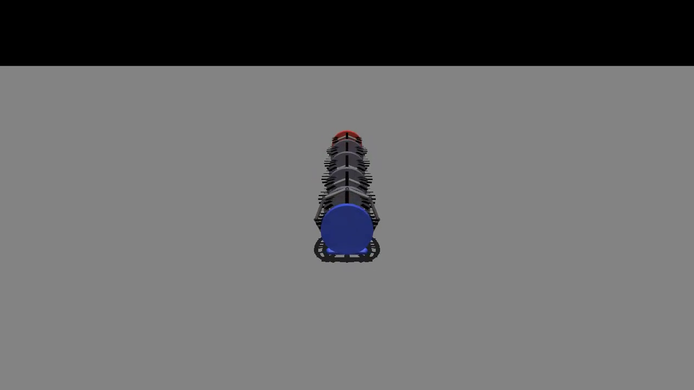
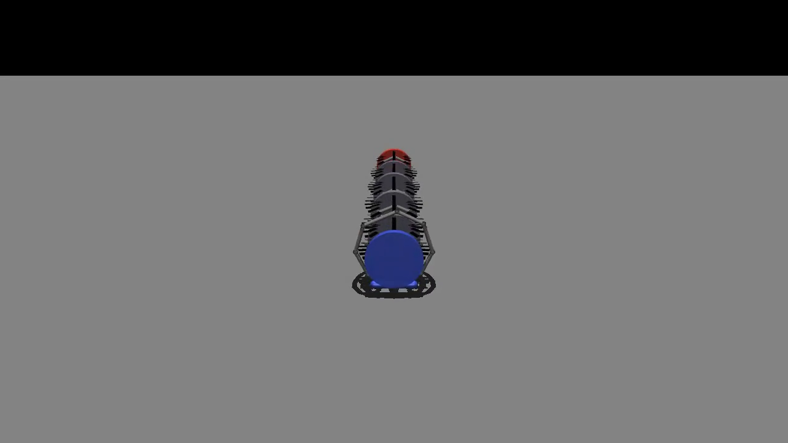
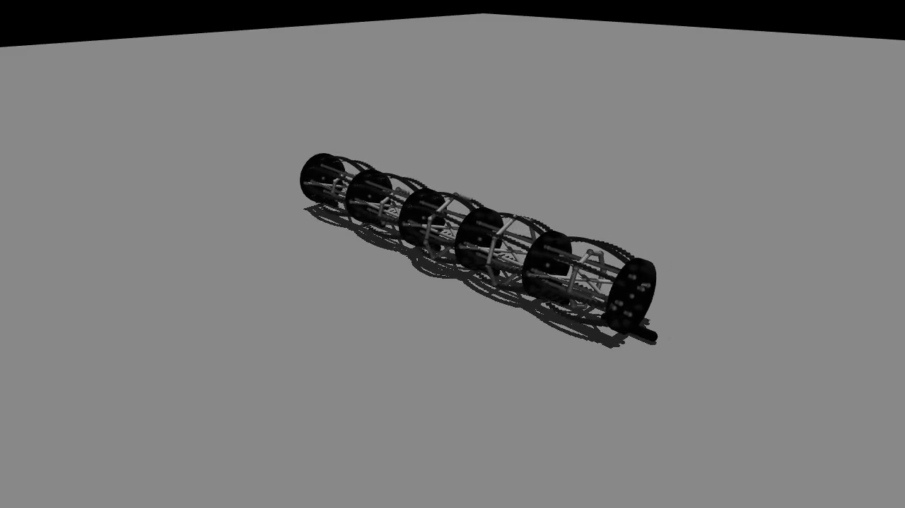
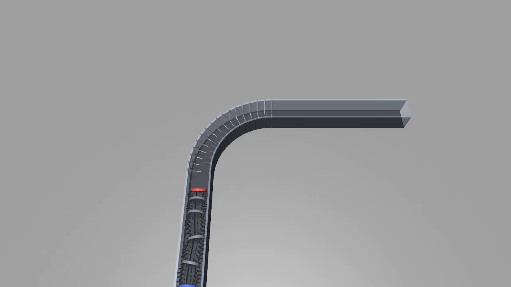
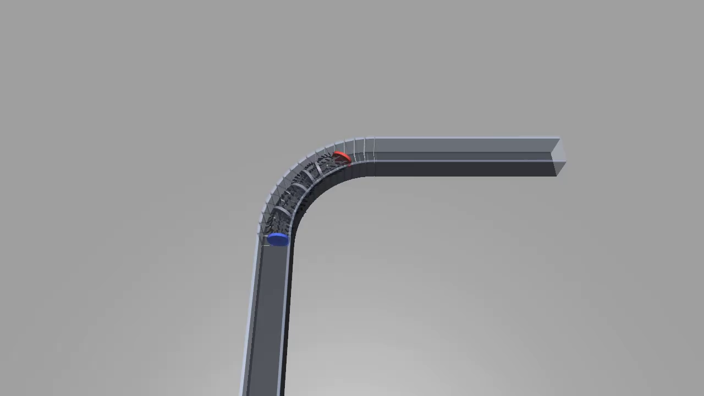
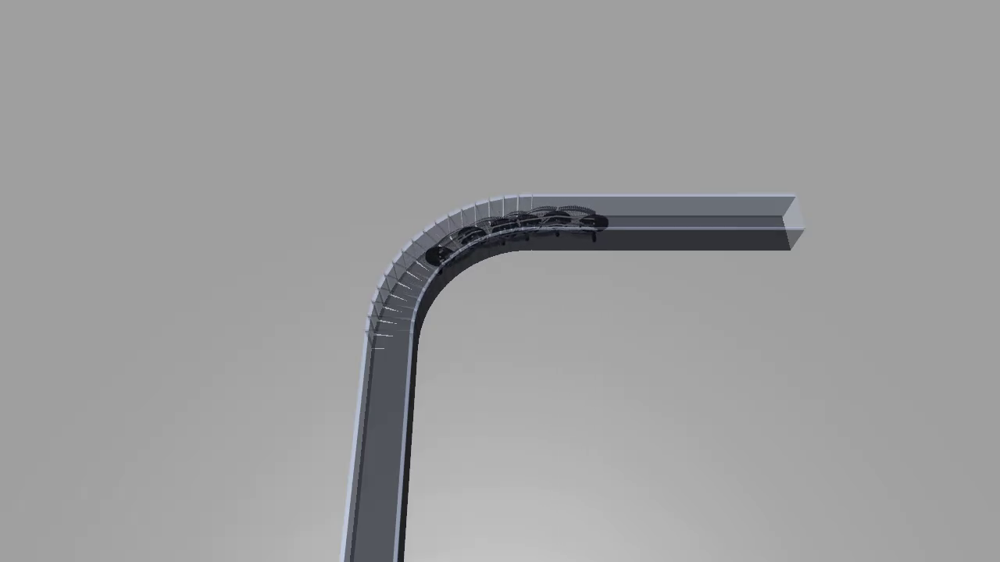
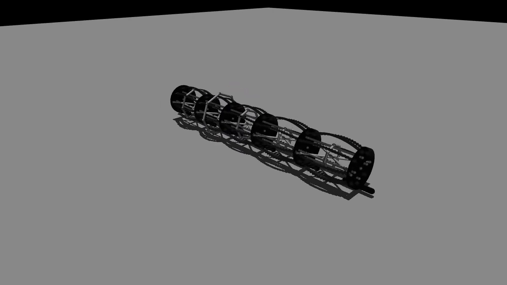

# Earthworm-like Pipe-Crawling Robot Simulation

MuJoCo simulation of a 5-segment metameric earthworm-like robot with spring steel strip structures, capable of rectilinear locomotion, active circular turning, and passive 90° pipe navigation.

## Demo

### Rectilinear Locomotion (Open Field)


Discrete retrograde peristalsis gait `{0,0,2|1}` — contraction wave propagates from head to tail.

| Early | Mid | End |
|:---:|:---:|:---:|
|  |  |  |

### Pipe Crawl with 90° Bend


Passive turning — rectilinear gait drives forward, pipe walls redirect heading through the bend.

| Entry | Bend | Exit |
|:---:|:---:|:---:|
|  |  |  |

### Circular Locomotion (Active Turning)


4-state gait with diagonal steer tendons — State 2 (left bend) and State 3 (right bend) create active heading change via asymmetric extension.

### Spring Steel Strip Structure



8 spring steel strips per segment with dynamic bow deformation — strips compress when the segment contracts.

## Features

- **Rectilinear locomotion** — Zhan/Fang 2019 discrete retrograde peristalsis gait `{0,0,2|1}`
- **Active circular turning** — 4-state gait with diagonal steer tendons (State 2/3 left/right bend)
- **Passive pipe turning** — 90° bend navigation using wall contact (no active steering)
- **Spring steel strip rendering** — Flat BOX geoms with body-axis-stable orientation and dynamic bow
- **Cable composite physics** — MuJoCo cable composites for inter-plate spring steel mechanics

## Quick Start

```bash
# Open-field straight crawl
python src/v3/worm_v4.py --video

# Circular locomotion (active turning)
python src/v3/worm_v4.py --turn left --video
python src/v3/worm_v4.py --turn right --video

# Pipe crawl with 90° bend
python src/v3/worm_v4.py --pipe --video

# Headless (no video)
python src/v3/worm_v4.py
python src/v3/worm_v4.py --turn left
python src/v3/worm_v4.py --pipe
```

## Requirements

- Python 3.10+
- `mujoco` >= 3.0
- `numpy`
- `mediapy` (for video recording)

## Project Structure

```
src/
  proto/          # Early prototypes (single segment tests)
  v1/             # V1 — basic 5-segment worm
  v2/             # V2 — improved cable model
  v3/
    exp_runner.py # Model XML generator (cable composites, plates, muscles)
    worm_v4.py    # Main simulation script (current)
docs/             # Design notes and analysis
record/v4/
  videos/         # Demo videos and GIFs
  frames/         # Keyframe snapshots
```

## Design

Each segment consists of:
- **2 acrylic plates** (cylinder geoms) — structural discs
- **8 spring steel strips** (cable composites) — passive radial elasticity
- **4 axial muscles** (tendons at 0°/90°/180°/270°) — longitudinal contraction
- **2 diagonal steer tendons** (cross-body) — lateral bending for turning
- **1 ring muscle** — radial contraction

### 4-State Gait: Zhan/Fang 2019 `{n₂, n₃, n₁ | nP}`

| State | Action | Muscles | Effect |
|-------|--------|---------|--------|
| 0 | Relaxed | Ring ON | Slim profile, extends forward |
| 1 | Anchored | All axial ON | Contracted, grips ground |
| 2 | Left bend | Left steer ON | Extends at angle (left turn) |
| 3 | Right bend | Right steer ON | Extends at angle (right turn) |

- Rectilinear `{0,0,2|1}`: gait `[0,0,0,1,1]` — straight crawl
- Circular left `{1,0,2|1}`: gait `[2,0,0,1,1]` — left turn
- Retrograde peristalsis: contraction wave travels head → tail

### Pipe Locomotion

Purely passive turning — the rectilinear gait drives the worm forward, and pipe walls redirect heading through the 90° bend. Key parameters:
- `plate_stiff_x = 0` (free lateral motion, guided by walls)
- `plate_stiff_yaw = 0` (free heading rotation for turning)
- `bend_stiff = 2e7` (softer cables allow body flex through bend)

## References

1. Zhan X, Fang H, Xu J, Wang KW. **Planar locomotion of earthworm-like metameric robots.** *IJRR*, 2019. DOI: 10.1177/0278364919881687
2. Zhou Q, Fang H, Xu J. **A CPG-Based Versatile Control Framework for Metameric Earthworm-Like Robotic Locomotion.** *Advanced Science*, 2023. DOI: 10.1002/advs.202206336
3. Fang H, Wang C, Li S, Wang KW, Xu J. **Design and experimental gait analysis of a multi-segment in-pipe robot.** *SPIE*, 2014. DOI: 10.1117/12.2044262
4. Riddle S, et al. **CMMWorm-SES: A MuJoCo soft worm robot model.** *Bioinspir. Biomim.*, 2025. Code: [github.com/sriddle97/3D-Soft-Worm-Robot-Model](https://github.com/sriddle97/3D-Soft-Worm-Robot-Model)

## License

MIT

## Author

Hongsen Pang ([@Kitjesen](https://github.com/Kitjesen)) — BSRL Lab
