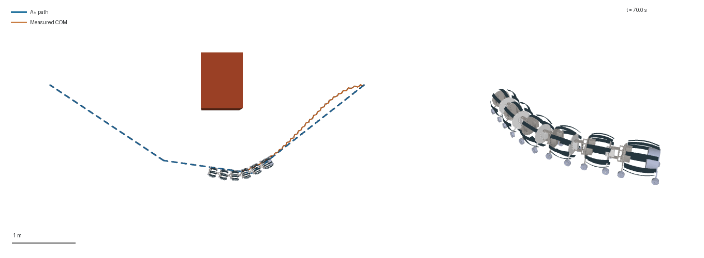

# 小摆幅蛇形波：减轻整机过度卷曲

2026-10-02。此前动画显得猛烈，主要因为约 38° 是**每个关节**的目标摆幅，多个串联关节同向弯曲时，沿链累计角可超过 100°；此外动画把 62.4 s 的物理运动压缩到约 17.6 s 运动播放，约 3.55 倍速。原参数来自已有速度优化结果，并没有以动作自然、关节速度小为目标。

这次改为更小的实际控制输入，重新跑完整接触动力学与同一条 A* 路径，再重放真实状态。推荐汇报展示 **15° 组**，以下为 70–85 s 的 **1× 真实速度**片段，含 1.2 s 末帧保持：



## 控制修改

| 参数 | 原演示 | 20° 组 | 15° 组 |
| --- | ---: | ---: | ---: |
| 单关节波幅 | 37.96° | 20° | 15° |
| 波频率 | 0.60124 Hz | 0.4 Hz | 0.4 Hz |
| 统一转向偏置上限 | 6.88° | 2.86° | 2.01° |
| 起步 | 1 s 线性 | 2 s 半余弦 | 2 s 半余弦 |
| 前视距离 | 0.55 m | 0.65 m | 0.65 m |

保留原空间相位、模型、摩擦、位置伺服增益、A* 场景与到达判据。摆幅、频率、偏置和起步一起改变，所以这是温和控制配置的比较，不能将所有差异单独归因于摆幅。

## 实测运动与路径跟踪

| 指标 | 原演示 | 20° 组 | 15° 组 |
| --- | ---: | ---: | ---: |
| 保存帧中的最大实际关节角 | 42.33° | 23.56° | **17.60°** |
| 保存帧中的最大实际角速度 | 163.02°/s | 62.25°/s | **47.39°/s** |
| 沿串联关节的最大累计偏转 | 110.72° | 63.01° | **46.73°** |
| 到达目标的物理时间 | 62.434 s | 118.194 s | 158.082 s |
| CPU 计算时间，不含渲染 | 18.942 s | 36.443 s | 64.923 s |
| 质心横向误差 RMS | 4.53 cm | 6.91 cm | 7.35 cm |
| 最大质心横向误差 | 11.41 cm | 14.69 cm | 15.13 cm |
| 最大摆动伺服力矩 | 16.17 N·m | 8.91 N·m | 7.95 N·m |
| 检测到的障碍接触 | 0 | 0 | 0 |
| 到达 15 cm 目标区域 | 是 | 是 | 是 |

关节运动峰值来自原始 `qpos/qvel`，通常每 0.1 s 保存，可能低估连续时间峰值；累计偏转是 5 个串联 yaw 角逐项累加后取最大绝对值。接触计数仍为运行时每 2 ms 检查全部 36 个机器人接触几何。独立重放、质量加权质心、整机越障、路径间距和源文件哈希均通过，未放宽验收阈值。

15° 组的实际质心采样轨迹长 6.521 m，净位移 4.830 m；较原版速度降低、跟踪误差略增，但关节角度、速度与力矩明显减小。这一配置完成了同一条 5.841 m 绕障路径。仿真仍在第一次进入 15 cm 目标区域时结束，没有额外测试停稳保持。

[15° 组原始指标](gentle_15deg/summary.json) · [15° 验收与关节统计](gentle_15deg/validation.json) · [20° 对照](gentle_20deg/summary.json) · [原 A* 方法与完整场景](REPORT.zh-CN.md)

## 复现与播放

当前程序默认 20° 温和配置，推荐展示的 15° 配置显式指定：

```powershell
python src/v6/track_astar_v6.py --self-check
python src/v6/track_astar_v6.py --output record/v6/astar_new/gentle_15deg --duration 600 --yaw-amplitude-deg 15 --yaw-frequency 0.4 --max-bias 0.035
python src/v6/check_astar_tracking_v6.py record/v6/astar_new/gentle_15deg
python src/v6/render_astar_tracking_v6.py record/v6/astar_new/gentle_15deg --start-time 70 --end-time 85 --frames 151 --playback 15 --prefix robot_tracking_realtime
```

[完整路径动画](gentle_15deg/robot_tracking.gif) 使用约 2× 速度，共 480 帧、播放 80.24 s，仅便于查看全程；上面的 1× 片段用于判断实际动作。渲染清单记录选取时间、播放倍数和原始数据哈希，重放不修改物理位置。

原大摆幅轨迹保持不变。其执行代码对应 Git 提交 `52e08ed`；在当前代码中验收旧结果使用 `--source-revision 52e08ed`，仅从该提交读取并核对历史源文件哈希，不执行历史代码。新默认参数不用于精确复现旧结果。

本次仍为完整 V6 MuJoCo 带轮导航模型，钢带只参与可视化；这些结果不是 Sano 钢带接触模型的运动验证。
