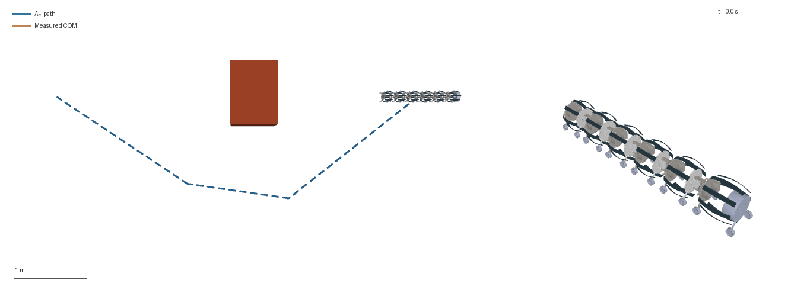
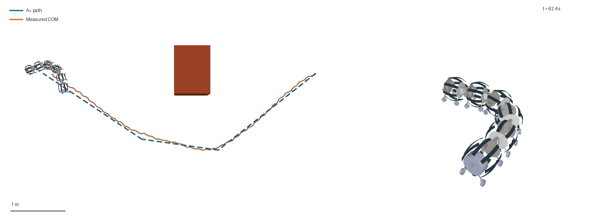
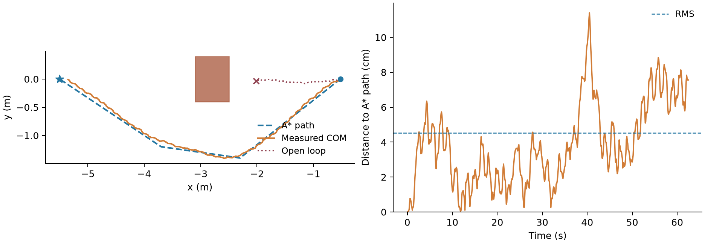

# A* 规划与整机米级路径跟踪

2026-10-02。机器人在真实 MuJoCo 接触动力学中绕过箱体障碍，到达目标区域：A* 规划路径 5.841 m，实际质心采样轨迹 6.001 m，净位移 4.829 m；横向跟踪误差 RMS 4.526 cm，最大 11.408 cm。62.434 s 的物理运动在本机 CPU 上计算了 18.942 s，不含后续渲染。此次为一个固定场景的成功演示，不是多场景成功率统计。

**模型范围：本次使用原项目的完整 V6 MuJoCo 机器人，不是 Sano 钢带求解器。** V6 有 6 个伸缩关节、5 个摆动关节、24 个被动自由滚轮；钢带由已有 `inject_strips` 根据真实隔板位姿与压缩量绘制，尚不贡献 Sano 弹性能、绳索张力或钢带接地力。这次验证的是“规划—反馈转向—接触推进—轨迹验收”闭环。此前的 [0.20 mm Sano 钢带计算](../../../ribbon_bench/stiff_snake_20261002/REPORT.zh-CN.md)继续作为另一套材料/接触基准，两者的速度与钢带刚度不能直接比较。



## 1. 为什么采用这个计算层

此前五模块 N9 Sano/CUDA 模型计算 4 s 需要约 30 min，已经验证了钢带变形、绳索和钢带接触，但不适合交互调试几十秒以上的导航控制。已有 V6 MuJoCo 模型能快速推进完整的带轮机器人，保留惯性、重力、关节位置伺服、被动轮转动、接触与摩擦。先在这一层验证 A* 跟踪，可以把导航代码和材料求解器的问题分开定位。

此次没有用预设位移拖动机器人，没有把先前动画平移到路径上。程序只设置 `data.ctrl` 的 5 个摆动关节目标；自由根的位置、姿态与各关节运动由 `mj_step` 积分产生。保存原始 `qpos/qvel` 后，渲染器重放这些状态。

## 2. 场景与机器人

| 项目 | 配置 |
| --- | --- |
| 整机 | 原 longworm2 CAD/URDF；6 slide、5 yaw、24 wheel |
| MuJoCo 总质量 | 4.2208 kg，包含原模型每个可视网格的 0.001 kg 质量 |
| 地面 | 原项目 `flat` 平面，原模型摩擦参数 |
| 障碍 | 实际参与碰撞的 box；中心 (-2.8, 0) m；长宽高 0.60 × 0.80 × 0.50 m |
| 起点 | 稳定 1 s 后全机质心约 (-0.521849, 0) m |
| 目标 | 全机质心 (-5.5, 0) m；到达半径 0.15 m |
| 规划区域 | X ∈ [-6.8, 1.0] m，Y ∈ [-2.8, 2.8] m |
| 动力学步长 | 0.002 s |
| 反馈控制周期 | 0.020 s |
| 原始状态保存 | 通常每 0.100 s；最后不足整周期也保存，共 626 帧 |

V6 行进方向起始为 -世界 X，朝向用 `back6_Link - base_link` 的头尾连线计算。5 个 yaw 的轴是 URDF 原有的 -Z，正角度并不对应正世界转向，必须先实测符号。

接触几何为 **36 个**机器人胶囊/轮子圆柱，含 base、6 back、5 front 和 24 wheel。CAD 网格与钢带只用于显示，并不是这些接触几何。

## 3. 转向校准

复用 `runs/cmaes_flat_serpentine/best_gait.json` 中的连续时间蛇形波，伸缩目标固定为零。对摆动关节统一叠加 -0.10、0、+0.10 rad 偏置，各跑 20 s 无障碍仿真，按 5–20 s 区间拟合整机头尾朝向变化率。

| 偏置 | 朝向角速度 | 沿整机朝向的平均速度 | 估计转弯半径 |
| ---: | ---: | ---: | ---: |
| -0.10 rad | +0.16420 rad/s | 84.80 mm/s | 0.516 m |
| 0 | +0.00427 rad/s | 84.55 mm/s | 19.80 m |
| +0.10 rad | -0.16698 rad/s | 87.58 mm/s | 0.525 m |

扣除零偏置漂移后，转向增益约为 -1.60 至 -1.71 (rad/s)/rad，所以正世界转向误差需要负关节偏置。三组均稳定；原始 0.02 s 采样记录保存在 [steering_calibration.json](steering_calibration.json)。校准采用 1 s 半余弦启动；导航演示采用 1 s 线性摆幅启动，两者稳态波形相同。

## 4. A* 怎么规划

采用 0.10 m 网格、8 邻接、欧氏启发函数与实际边长代价。机器人规划包络取以质心为中心的 0.70 m 圆，再加 0.15 m 跟踪余量，总膨胀距离 0.85 m。占据判断额外加半个网格对角线，避免只检查网格中心漏掉边缘；禁止对角穿过阻塞角点。

得到网格路径后，仅做视线可达的直线捷径，不使用可能切入障碍的未验收样条。每条捷径按 0.025 m 间隔检查，并多留半个采样间距，利用距离函数的 1-Lipschitz 性质覆盖采样点之间的线段。导航路径为：

```text
(-0.521849, 0) → (-2.3, -1.4) → (-3.7, -1.2) → (-5.5, 0) m
```

A* 展开 718 个网格节点，捷径路径长 5.840689 m。独立密集检查也确认规划路径没有进入膨胀区。该规划是宽阔场景下的二维圆包络 A*，没有描述窄通道内整条关节链的配置空间或限制路径曲率；实际是否能绕过拐角，仍由动力学闭环和全机接触检查验收。

## 5. 机器人怎样跟踪

每 20 ms 读取实际质心与头尾朝向，将质心投影到路径，选取路径上前方 0.55 m 的目标点。朝向经过 0.4 s 低通，计算目标方向与当前方向的角误差 `e`，统一关节偏置为：

```text
bias_command = clip(-0.12 × wrap(e), -0.12, +0.12) rad
```

偏置再经过 0.35 s 低通，与连续蛇形波相加。每个摆动关节目标为：

```text
q_target[j] = ramp(t) × 0.662530 × sin(2π × 0.601241 × t + 2π × 0.640409 × j / 5) + bias
```

有效频率保留原 CMA-ES 公式中的 `yaw_freq + coupling × slide_freq`；尽管此次不主动伸缩，该相位耦合项仍属于原保存步态。5 个关节由原 V6 位置伺服跟踪，增益 200 N·m/rad、被动阻尼 5 N·m·s/rad、力矩上限 20 N·m。此次最大实际偏置为 4.29°，保存帧中最大目标角约 41.56°。

这是简单反馈控制，没有训练新神经网络或强化学习策略。导航层使用理想的全局位姿反馈，实物需增加相应定位；不能把它视为原 80 维机载观测策略已经能自主导航的证明。

## 6. 实测结果与关掉反馈的对照

| 指标 | 反馈跟踪 | 同步态、关掉转向反馈 |
| --- | ---: | ---: |
| 终止原因 | 达到目标区域 | 首次障碍接触后终止 |
| 物理时间 | 62.434 s | 17.740 s |
| CPU 计算时间，含初始化/验收、不含渲染 | 18.942 s | 4.951 s |
| 实际质心采样轨迹长度 | 6.001 m | 1.573 m |
| 净位移 | 4.829 m | 1.492 m |
| 最终距目标 | 0.14985 m | 3.48653 m |
| 质心横向误差 RMS | 0.04526 m | 0.50303 m |
| 最大横向误差 | 0.11408 m | 0.89438 m |
| 运行中检测到障碍接触的步数 | 0 | 1，立即停止 |
| 最大摆动伺服力矩 | 16.173 N·m | 16.354 N·m |

最终反馈组质心为 (-5.350411, -0.008911) m。0.15 m 是预先定义的到达区域；仿真在第一次进入区域时结束，**没有额外验证停车后的保持精度**。0.1 s 采样的轨迹长度会略低估高频摆动弧长，误差统计也使用保存帧；以上是到达与跟踪结果。

反馈组逐个检查全部 36 个接触几何与障碍，每 2 ms 检查 MuJoCo 接触，未检测到障碍接触。几何间距与全机包络每 50 ms 查询一次，最小净间距 0.596812 m、最大包络半径 0.573829 m，低于预设 0.70 m；这些极值是离散采样值。终点时全机已越过障碍，而非只有一个参考点到达。

原始轨迹独立重放后，重新核对质量加权质心、全部 body 位姿、规划路径、误差与终点判据；详见 [validation.json](closed_loop/validation.json)。独立质量加权质心误差不超过 4.44×10⁻¹⁵ m，保存的所有 body 坐标重放误差为零。源代码在运行开始时取 SHA-256，结束时确认未改变，执行环境、模型 XML 哈希与各采样周期都记录在 [summary.json](closed_loop/summary.json)。XML 哈希针对构建时的 LF 文本；Windows 保存为 CRLF，验收同时记录原字节与 LF 规范化哈希，确认只存在换行序列化差异。跨平台验收源文件也仅允许 LF/CRLF 差异，不接受其他内容改变。





## 7. 保存文件和复现

代码复用原 `worm_v6.build_xml`、原 CAD、原 motor contract 与已保存 CMA-ES 步态，仅增加规划/反馈、校准、验收和重放入口。Python 3.12.14、NumPy 2.5.3、MuJoCo 3.13.0，Windows CPU 运行；未使用 GPU。这一速度来自不同的机械模型，不是 Sano 求解器已经加速到同样水平。

在仓库根目录、安装相应依赖后执行；新计算请换输出目录，脚本拒绝覆盖已有 `trajectory.npz`。

```powershell
python src/v6/calibrate_path_steering_v6.py --self-check
python src/v6/track_astar_v6.py --self-check
python src/v6/track_astar_v6.py --output record/v6/astar_new/closed_loop --duration 110
python src/v6/track_astar_v6.py --output record/v6/astar_new/open_loop --duration 110 --open-loop
python src/v6/check_astar_tracking_v6.py record/v6/astar_new/closed_loop
python src/v6/render_astar_tracking_v6.py --self-check
python src/v6/render_astar_tracking_v6.py record/v6/astar_new/closed_loop --compare record/v6/astar_new/open_loop
```

保存的 `scene.xml` 保留原执行时的网格资源路径；验收/重放只在内存中将该路径映射到当前仓库 `meshes`，不修改存档 XML 或原始轨迹。

动画从 626 个原始状态中选取 160 帧，播放约 18.8 s，包含末帧约 1.2 s 额外保持。左侧全局图保留实际障碍与轨迹，右侧 CAD 近景隐藏障碍的可视几何以看清关节；这一显示选择不影响碰撞计算。所有选帧位姿重放一致、原始文件哈希不变，详见 [render_manifest.json](closed_loop/render_manifest.json)。

- [closed_loop/trajectory.npz](closed_loop/trajectory.npz)：626 个真实状态，`qpos/qvel`、全机质心、所有 body 坐标、关节目标、偏置、前视目标、A* 路径。
- [closed_loop/summary.json](closed_loop/summary.json)：最终指标、参数、源文件与 XML 哈希、执行环境。
- [open_loop/summary.json](open_loop/summary.json)：关掉转向反馈的撞障对照；保留其轨迹，不当作成功结果。
- [steering_calibration.json](steering_calibration.json)：3 组实际转向标定及全部采样。
- PNG/GIF：保存状态的重放。钢片形状沿用 V6 可视模型，不应拿来分析钢带应力或接触变形。

## 8. 与后续 Sano/RL 的关系

这次已跑通 A* 路径、实际关节反馈转向、整机米级接触运动和原始状态验收。接下来可把转向片段放回 Sano 求解器，验证钢带接地条件下是否仍有足够的转向能力；V6 的转向增益不能直接用于 Sano。较长的 Sano 计算需要先优化或建立经过验证的代理，随后再做 A* 跟踪的材料模型对照。

目前仍缺钢带自接触/塑性、实物参数标定、障碍场景泛化、窄通道规划以及真实定位误差测试。论文可将本例作为规划与控制接口的可运行演示；材料模型的可信度、RL 优越性和硬件导航效果需要各自的对照实验。
