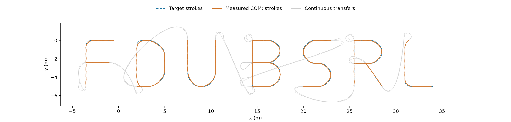
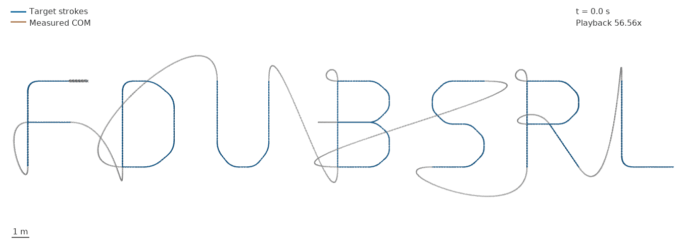
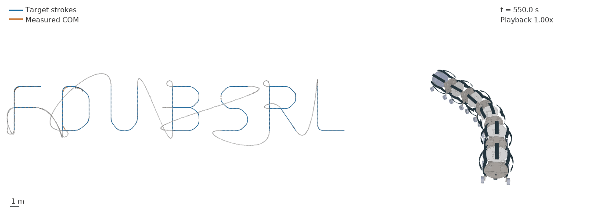
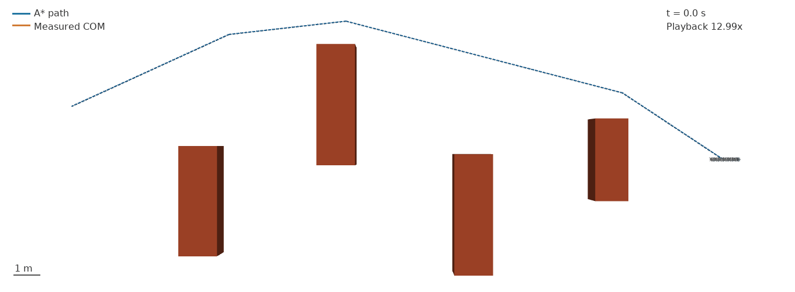
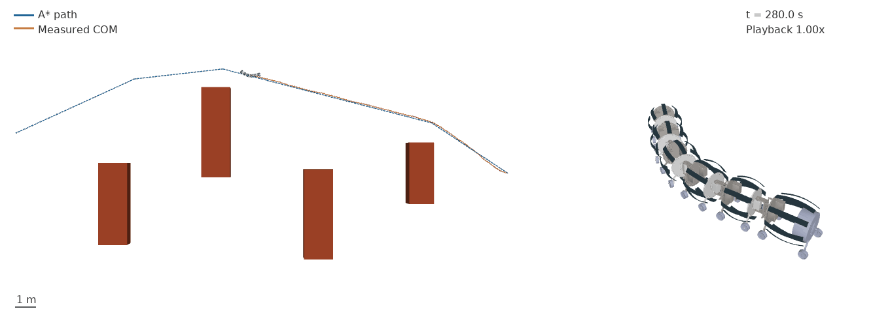

# FDU BSRL 连续轨迹与长距离 A*：模型、数据和播放速度

日期：2026-10-02。此目录属于 `codex/ribbon-publication` 分支。

## 1. 播放速度与摆动幅度要分开判断

原动画约以 3.55 倍速播放，因此屏幕上观察到的运动速度和关节角速度也约为物理时间下的 3.55 倍；角度、形状和位移不会因倍速而增大。这能解释明显的快速甩动感，但不能仅凭观感断言它是唯一原因。原大幅步态的单关节实测峰值约 42.33°、五关节累计偏转约 110.72°，其弯曲幅度本身也确实较大。

为隔离播放速度的影响，此次从**原始同一条物理轨迹**截取 20–30 s，以 1×回放，不改变控制或关节状态：[原大摆幅 1×](../astar_tracking_20261002/closed_loop/original_wave_1x.gif)。可与[之前的 15°指令、1×回放](../astar_tracking_20261002/gentle_15deg/robot_tracking_realtime.gif)分别观看；两种步态的参数不同，不能将两者差异全部归因于幅度。

新渲染器默认按真实物理时间播放。长路线总览需要压缩数分钟的记录，因此明确标注 `Playback` 倍率，并省去加速的关节特写；关节特写另提供 1×片段。每段 GIF 末帧额外停留 1.2 s，不计入运动倍率。所有画面从保存的 `qpos/qvel` 经 `mj_forward` 重放，未搬移旧动画或重置机器人位置。

## 2. 这次究竟用了哪个机器人模型

**完整 V6 MuJoCo 带轮机器人**，模型源于仓库 `meshes/longworm2/longworm2.SLDASM.urdf`，由 `src/v6/worm_v6.py` 构建：6 个伸缩模块、5 个相邻模块间的蛇形偏航关节、24 个被动轮，36 个机器人碰撞几何体，总质量约 4.2208 kg。

| 层次 | 本次实现 | 能支持的结论 |
|---|---|---|
| 整机运动 | MuJoCo 刚体动力学、轮地接触和摩擦、CAD 质量与惯量 | 当前模型能否靠关节驱动连续移动与转向 |
| 伸缩模块 | 原标量滑动弹簧，刚度 300 N/m，滑动关节目标为 0 | 被动伸缩近似；不是独立钢片弹性求解 |
| 钢片外观 | `inject_strips` 根据隔板间距画抛物线钢带 | 显示模块外形；不能用于解释应力、钢片恢复力或折叠 |
| 摆动控制 | 20°正弦幅度、0.4 Hz，沿用 CMA-ES 步态的空间相位，2 s 平滑启动 | 本次为确定性步态与反馈控制，不是新训练的 RL 策略 |
| 导航 | 目标路径、质心位置及首尾连线航向反馈，调整摆动中心偏置 | 理想全局定位下的跟踪；实机仍需定位和标定 |

**本次没有使用 Sano ribbon 求解器，也没有神经网络替代 Sano。** 先前的 [Sano/CUDA 钢片动力学实验](../../../ribbon_bench/stiff_snake_20261002/REPORT.zh-CN.md)是另一个模型：CAD 模块 2–6、40 条独立钢带、20 根绳索、10 个刚体、4 个偏航关节，求解钢片/隔板与地面的接触。它尚未完成与本次完整 V6 轮地模型的合并。本次 CPU 计算速度不能作为钢片求解器的加速结果。

## 3. FDU BSRL 字母轨迹

每个字母约高 5 m、宽 3 m；FDU 和 BSRL 之间额外留出间隔。共有 12 段笔画，用圆滑转角形成目标字形。笔画之间以连续曲线连接，机器人实际走完转场，未瞬移到下一笔。含转场的目标总长 **164.930 m**，共 1151 个路径点。

字母是预先指定的有序路径，**不是由 A* 生成字形**。为避免路径自交处直接跳到后面的笔画，控制器在当前进度附近寻找目标；仍可能在转场的小回环处切弯。验证程序单独报告进度投影跳跃，并检查较大的跳跃是否仅发生在灰色转场、12 段笔画是否均被访问。

蓝色表示目标笔画，橙色表示相应阶段的实际质心轨迹，灰色表示目标及实际转场。这里的“笔画”是质心行走轨迹，不是整条蛇身同时摆成字母。有限转弯半径使实际轨迹偏离理想转角；到达终点不等于零误差描线。

字母组已到达终点，独立重放 **33940 帧**通过检查。12 段笔画均被访问；世界坐标中的刚体位置重放误差为 0，独立质量加权质心误差最大约 3.55×10⁻¹⁴ m。到达判据允许最后 15 cm，不表示精确走到数学端点。

| 指标 | 实测结果 |
|---|---:|
| 目标长度（含转场） | 164.930 m |
| 实际质心采样弧长 | 185.117 m |
| 物理时间 | 3393.866 s（56 分 33.9 秒） |
| CPU 墙钟时间 | 1272.765 s（21 分 12.8 秒） |
| 各笔画阶段合计 RMS 误差 | 4.32 cm |
| 笔画阶段最大误差 | 38.03 cm（L 的进入阶段） |
| 全过程有序进度对应目标点 RMS / 最大误差 | 11.48 / 79.08 cm |
| 全过程到任意目标路径的最近距离 RMS / 最大值 | 10.11 / 73.47 cm |
| 到达终点时距离 | 14.99 cm |
| 实际单关节采样角度峰值 | 29.38° |
| 偏航执行器峰值力矩 | 11.547 N·m |

“有序误差”用当前进度对应的目标点计算；“最近距离”可匹配交叉处的其他笔画，因此后者可能偏小。报告同时保留两者。笔画统计按当前进度所属的笔画分组，并非以目标上的每一毫米均匀采样；它不能单独证明全路径的几何覆盖精度。

在 160.0、383.8、1705.4、3204.6 s 出现 4 次 ≥0.25 m 的进度投影跳跃，均位于灰色转场。最大路径弧长跳跃为 0.625 m；这是转场切弯导致目标投影切换，**不是机器人坐标瞬移**。笔画进入阶段仍有较大的局部误差，故该结果应表述为“完成连续字母跟踪演示，转场仍需改善”，不能表述为“精确描线通过”。字母场景没有障碍，零障碍接触不是额外的避障证据。







## 4. 长距离 A* 避障

场景中放置四个真实碰撞箱，目标质心坐标为 (-25, 2) m。A* 在 0.1 m 网格上搜索，将障碍按机器人包络 0.70 m 加跟踪余量 0.15 m 膨胀，再进行可见性简化。最终路径有 5 个点；规划器选择从障碍上方绕行，并非强迫机器人绕每个箱子做蛇形穿桩。

| 指标 | 实测结果 |
|---|---:|
| 目标路径长度 | 26.192 m |
| 实际质心采样弧长 | 28.603 m |
| 首尾质心净位移 | 24.410 m |
| 物理时间 | 519.518 s（8 分 39.5 秒） |
| 本次 CPU 运行墙钟时间 | 189.846 s |
| 到路径的 RMS / 最大距离 | 6.42 / 12.91 cm |
| 终点距离 | 15.00 cm（到达判据为 ≤15 cm） |
| 检测到的障碍接触步数 | 0 |
| 采样最小几何间隙 | 0.690 m |
| 偏航执行器峰值力矩 | 8.979 N·m |

实际质心弧长包含摆动造成的小幅曲折，大于规划长度；它是 0.1 s 采样的轨迹长度，不是 2 ms 连续轨迹的精确弧长。障碍接触每 2 ms 检查；几何间隙及包络每 50 ms 采样，不能把采样极值解释成连续时间的严格极值。独立检查重放全部 5197 帧，重新验证质心、刚体位置、路径间隙、执行器限幅及源文件散列，结果通过。





## 5. 可复现过程

本次环境：Windows、Python 3.12.14、NumPy 2.5.3、MuJoCo 3.13.0；本地 CPU。两组都采用 2 ms 动力学步长、20 ms 控制周期、100 ms 保存周期。程序只写关节控制目标，根部位置由 `mj_step` 积分产生。

在仓库根目录执行（重新运行请更换输出目录，以免覆盖已有结果）：

```powershell
python src/v6/make_navigation_demos.py
python src/v6/track_astar_v6.py --route-json record/v6/navigation_demos_20261002/letters_route.json --output record/v6/navigation_demos_20261002/letters --duration 4500 --yaw-amplitude-deg 20 --yaw-frequency 0.4 --gain 0.3 --lookahead 0.45 --max-bias 0.15
python src/v6/track_astar_v6.py --route-json record/v6/navigation_demos_20261002/long_route.json --output record/v6/navigation_demos_20261002/long_distance --duration 1200
python src/v6/check_astar_tracking_v6.py record/v6/navigation_demos_20261002/letters
python src/v6/check_astar_tracking_v6.py record/v6/navigation_demos_20261002/long_distance
python src/v6/render_astar_tracking_v6.py record/v6/navigation_demos_20261002/letters --frames 360 --playback 60 --prefix overview --overview-only
python src/v6/render_astar_tracking_v6.py record/v6/navigation_demos_20261002/letters --start-time 550 --end-time 565 --frames 151 --prefix realtime
python src/v6/render_astar_tracking_v6.py record/v6/navigation_demos_20261002/long_distance --frames 240 --playback 40 --prefix overview --overview-only
python src/v6/render_astar_tracking_v6.py record/v6/navigation_demos_20261002/long_distance --start-time 280 --end-time 292 --frames 121 --prefix realtime
```

目录中的 `route.json`、`scene.xml`、`trajectory.npz`、`summary.json` 保存输入场景和原始结果；`validation.json` 保存独立检查；`*_render_manifest.json` 保存画面采样索引、播放时长、重放误差和散列。绘图只改地面可见范围及材质，不改碰撞模型；MuJoCo 的平面碰撞本来就是无限平面。

## 6. 已发现的问题与下一步

1. **转场曲率约束不足。** 连续 Bezier 曲线不自动满足机器人最小转弯半径。小回环会切弯；下一步应先约束连接曲线的曲率，再评价跟踪器，不应仅把关节偏置调大。
2. **定位和模型仍理想化。** 当前使用真实仿真质心与航向；未加入里程计误差、地形起伏、摩擦不确定性或动态障碍。
3. **到达后未测试驻留。** 实验达到终点容差即结束，未验证刹停、稳定保持或返航。
4. **钢片力学和导航尚未统一。** 可先用此快速 V6 模型测试导航/控制结构，再把经过校验的钢片能量与恢复力模型接入，并重新标定轮地/钢片接触。没有完成这一步前，不能把本次路线表现解释为 Sano 钢片机器人的性能。
5. **论文可用证据。** 保存真实状态、清楚区分物理时间和播放时间、分离笔画与转场误差、公开失败或切弯位置，能构成可复现的导航基线；仅凭动画尚不足以证明仿真实物一致或 RL 优于反馈控制。
