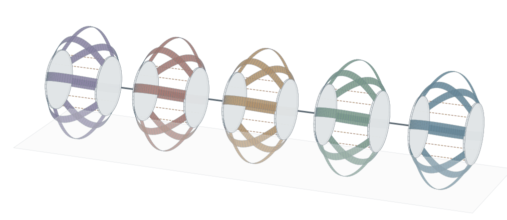
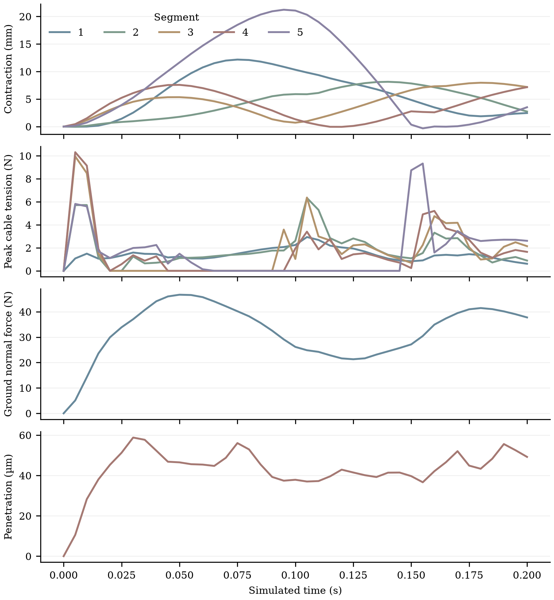

# 五体节 Sano 钢带动力学演示

日期：2026-10-02。目标是用当前物理计算核心计算五个体节的收绳、钢带形变和地面接触，得到可复现的轨迹和汇报图。本次扩展的是 `full_robot.py` 的联立动力学求解器；动画读取其保存的节点、材料方向和刚体姿态，不指定端板的运动轨迹。本次结果新生成于 Sano/CUDA 物理核心，旧 MuJoCo 动画不作为本次结果或验收依据。

## 模型与输入

| 项目 | 本次配置 |
| --- | --- |
| 机器人范围 | CAD 的第 2–6 体节，共 5 节 |
| 钢带 | 每节 8 片，共 40 片；每片 33 个节点、32 条边 |
| 端板与连接 | 10 块实体端板；4 个体节间偏航关节锁定在 0°，合并为 6 个动力学刚体 |
| 绳索 | 每节 4 根，共 20 根；理想直线、只受拉，等效轴向刚度 20,000 N/m |
| 钢带截面 | 宽 16 mm、厚 0.15 mm |
| 钢材输入 | 杨氏模量 200 GPa、泊松比 0.3、密度 7,850 kg/m³ |
| 初始钢带几何 | 沿用项目 CAD 孔位、固定折线夹持及 50.5 mm 无应力拱高假设 |
| 地面 | 水平面，重力 9.81 m/s²；单边罚接触，摩擦系数 0.4。钢带法向／切向罚刚度密度为 10⁸ / 2×10⁷ N/m²，乘边长积分权重；端板对应总罚刚度为 10⁸ / 2×10⁷ N/m，均分给表面采样点 |
| 驱动 | `axial-wave`：各节四根绳同量收绳，节间相位差 72°，最大自由长度缩短指令 8 mm |
| 时间 | 40 个主时间步，主步长 5 ms；实际模拟 0.2 s，保存初始状态及每个主步，共 41 帧；每个命令子步最多收绳 0.5 mm |
| 计算平台 | RTX 5090，Torch CUDA FP64；CPU 参考路径保留 |

**8 mm 是收绳指令幅度，不是强制的端板位移。** 钢带弹性、绳索张力、惯性和地面反力共同决定实际收缩量。驱动前 20% 周期平滑增幅；本次并非先在重力下求静态平衡，初始整体抬高至最低钢带表面距地面约 20 µm，再从零速度开始动力学积分。

相邻体节的后板和前板仍保持 CAD 中约 74.5 mm 的连接间距；锁定关节只合并它们的动力学坐标，没有删除或重合两块实体板。每块端板及其锁定轮的 CAD 质量、质心和惯量各计入一次，使用平行轴定理合并。

## 钢带怎样算，运动怎样产生

Sano 是项目中 Discrete Elastic Ribbons 库使用的窄带弹性能模型。钢带用中心线节点位置及每条边的扭转角描述，宽度方向随材料坐标运输和扭转更新；求解器据此计算弹性能、能量梯度及切线刚度。它不是把钢片切成 32 块彼此独立的刚体，也不是神经网络。

每次隐式 Euler 时间步联立求解形如下面的动力学残差：

\[
M\frac{q_{n+1}-q_n-\Delta t\,v_n}{\Delta t^2}
+\nabla E_{\mathrm{steel}}+\nabla E_{\mathrm{cable}}
-f_{\mathrm{gravity}}-f_{\mathrm{contact}}=0.
\]

刚体部分同时包含平移惯性、转动惯量和角速度项。钢带两端夹持坐标由所属刚体姿态约束；中间连接刚体同时承受左右体节的钢带和绳索载荷。因此一节收缩能够改变相邻节的受力和接触，五节是在同一系统内求解的。

地面接触使用每条钢带边 12 个表面采样点，端板使用两侧圆周各 24 个采样点。接触点随当前钢带形变重新生成；法向只在穿透时产生反力，切向弹性历史在摩擦锥内表示黏着，超过库仑限值时更新滑移，离地后切换为分离。接触力通过几何 Jacobian 回传到钢带和刚体自由度，再进入下一次 Newton 评估。

每片钢带的 33 个节点位置和 32 个边角度共 131 个广义坐标，其中 14 个夹持坐标由刚体约束，剩余 117 个内部自由度。40 片共 4,680 个内部自由度，加 6 个刚体的 36 个自由度，共求解 4,716 个未知量。40 个内部块先消元，剩余 36 个自由度的 Schur 系统联立求解，然后回代所有钢带。CUDA 路径计算 Sano 应变导数、材料链式装配、钢带表面几何及接触、端板接触和局部线性求解。CPU 仍执行部分状态更新、夹持映射、绳索计算与系统装配，当前是 CPU/CUDA 混合求解。

## 本次完善的计算核心

1. 从单节扩展为五节联立系统，读取实际 CAD 第 2–6 节的端板和轮质量，保存端板—刚体映射与材料宽度方向，供绘图准确恢复每片钢带表面。
2. 钢带节点加入自重；绳索的 Hessian 加入刚体切线系统，使张力变化参与 Newton 更新。
3. 只在接受的时间步统计真实钢带弹性能，修复旧诊断中为了跳过重复前向计算而留下的零值；`energy_j` 是钢带与绳索弹性能之和，不是含动能、重力势能和摩擦耗散的总机械能。
4. 收绳命令过大时分成隐式子步；若某步迭代或接触切换失败，恢复原状态并二分时间和命令，最多递归 6 层；仍失败时整次主步回滚，不把部分成功状态当成完成结果。
5. 动画使用保存的物理轨迹、固定相机范围及真实尺度，五节用不同颜色区分；无上下多余标题。GIF 播放速度放慢便于观察，播放时长不是物理模拟时长。

## 实测结果

先用五节 N17、1 mm 指令、3 个 2 ms 主步做 CPU/CUDA 对照。整个 6 ms 轨迹的最大差异为：钢带广义坐标 `2.42e-14`（混合位置和角度单位）、刚体质心 `5.55e-16 m`、绳索张力 `2.22e-11 N`；接触状态计数完全相同。[对照数据](gpu_chain_20261002/parity.json) 已保存。CPU 在本机 Windows，CUDA 在远程 RTX 5090，因此这项检查验证数值一致性，不用其耗时计算加速比。

五节 N33、8 mm 指令的正式演示完成 0.2 s、41 帧。定义实际收缩为“初始两端板中心距离减去当前两端板中心距离”；各节初始中心距离均为 101 mm，不是钢带弧长。下表使用保存的主帧轨迹统计收缩：

| 仿真体节编号（对应 CAD） | 最大收缩 / mm | 达到最大值的时间 / s | 最终收缩 / mm |
| --- | ---: | ---: | ---: |
| 1（第 2 节） | 12.174 | 0.075 | 2.466 |
| 2（第 3 节） | 8.138 | 0.140 | 2.732 |
| 3（第 4 节） | 7.966 | 0.180 | 7.189 |
| 4（第 5 节） | 7.579 | 0.050 | 7.164 |
| 5（第 6 节） | 21.224 | 0.095 | 3.516 |

| 指标 | 本次实测 |
| --- | --- |
| 峰值绳索张力 | **11.360 N**；采用全部已接受子步的峰值 |
| 最大地面穿透 | **59.237 µm**；采用全部已接受子步的峰值 |
| 最大地面法向合力 | 46.696 N；仅主保存帧统计 |
| 最终钢带／绳索弹性能 | 0.137379 J / 0.000851 J |
| 模拟循环墙钟耗时 | **504.777 s（约 8 分 25 秒）**；不含初始化和动画渲染 |
| 线性 Schur 求解累计耗时 | 4.409 s，约为循环耗时的 0.87% |
| 接受的隐式子步 | 共 89 步，其中失败二分恢复增加 2 步 |
| 主保存帧最大残差绝对值 | `7.30e-6`；各位置／转动坐标分别对应力／力矩，未做统一量纲缩放 |

在 0.150 s 和 0.155 s 的主步各触发一次失败二分恢复，随后成功完成。终态采样点有 12 个黏着、34 个滑动、15,794 个分离；这些是离散表面点数量，不是接触物体数量。保存的节点、材料方向、刚体位姿及绳索路径全部有限，执行代码快照的 SHA-256 与结果元数据一致。

**需要记录的问题：首节和末节的最大实际收缩明显超过 8 mm 自由长度指令。** 当前包含惯性、松弛绳索、初始落地过程和体节耦合，尚不能仅凭这段轨迹确定过冲来源。后续需比较重力预平衡初态、标定阻尼和时间步收敛，确认不是接触离散或数值误差；不能把 21.224 mm 当作已经验证的可控收缩能力。

模拟 0.2 s 用时约 505 s，当前不具备实时性。线性求解仅占不到 1%，继续只加速矩阵求解无法显著降低端到端成本；应进一步剖析每次 Newton 评估中的材料、接触、CPU 装配和数据传输，再决定批量化与驻留 GPU 的优化顺序。

## 图、数据与复现





结果目录：[`gpu_chain_20261002/chain_n33_cuda_motion/`](gpu_chain_20261002/chain_n33_cuda_motion/)。`summary.json` 保存参数来源、源码哈希、每帧时间和诊断指标；`trajectory.npz` 保存 40 片钢带节点与材料方向、6 刚体位姿、10 端板映射及 20 绳索路径；`full_robot.snapshot.py` 是本次实际执行的求解器源码，`hardware.txt` 记录 GPU 型号。`robot_motion.png/.svg` 是终态图；指标图同时提供 PNG/SVG，汇报和论文排版可优先使用 SVG。指标图的张力和穿透曲线来自主保存帧；上表的对应峰值覆盖全部接受子步，因此两者峰值可以不同。

在 `ribbon_bench` 目录执行：

```bash
export PYTHONPATH=vendor/discrete-elastic-ribbon/src
python full_body_loads.py
python full_robot.py --self-check
python render_full_robot.py --self-check
python remote_run_wrapper.py --segments 5 --nodes 33 --gait axial-wave \
  --command-mm 8 --steps 40 --dt 0.005 --duration 0.2 \
  --max-command-step-mm 0.5 --solve-backend cuda \
  --output gpu_chain_20261002/chain_n33_cuda_motion
python render_full_robot.py \
  --input gpu_chain_20261002/chain_n33_cuda_motion \
  --output gpu_chain_20261002/chain_n33_cuda_motion/robot_motion.png
```

直接运行需要 NumPy 提供 `np.concat`。本次远程环境使用旧 NumPy，实际通过远程兼容脚本 `remote_run_wrapper.py` 在导入库前设置 `np.concat = np.concatenate`，其求解参数与上面相同。数值检查覆盖绳索导数与受力平衡、CAD 质量聚合、单节／两节 Schur 与完整线性系统一致性、连接刚体共享及失败状态回滚；这些是代码一致性检查，不等于实验验证。

## 当前能说明什么，下一步验证什么

本次演示可用于说明“收绳输入如何通过弹性、惯性和接触改变五节机器人形状”，以及最新物理核心怎样联立计算。**目前没有验证周期净前进量或可靠爬行能力。** 五节相位驱动本身也不是已经优化好的步态。

当前边界：体节间偏航关节锁定；轮质量已计入，但轮的碰撞形状、旋转和单向离合机制未模拟；钢带和地面采用离散采样，没有连续碰撞检测（CCD）；接触切线省略部分几何二阶项，属准 Newton 近似；绳索没有绕导孔摩擦、柔性绳体惯性和舵机动态；阻尼、钢材参数、初始拱形、夹持折弯及装配预紧尚未实验标定；本次没有物体之间或钢带自身碰撞。

对论文最有价值的下一步是：在相同输入下验证网格和时间步收敛、CPU/CUDA 轨迹一致性、接触穿透与反力敏感性；再用单片和单节实测收缩—张力数据校准材料与夹持条件。随后加入真实轮接触／离合或方向摩擦，运行多周期并报告净位移、速度、耗能和接触状态变化，才能把“形变演示”推进为“运动预测”。
