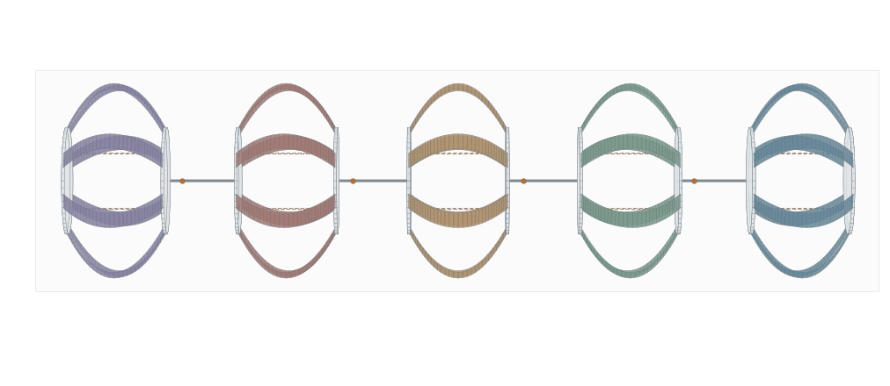
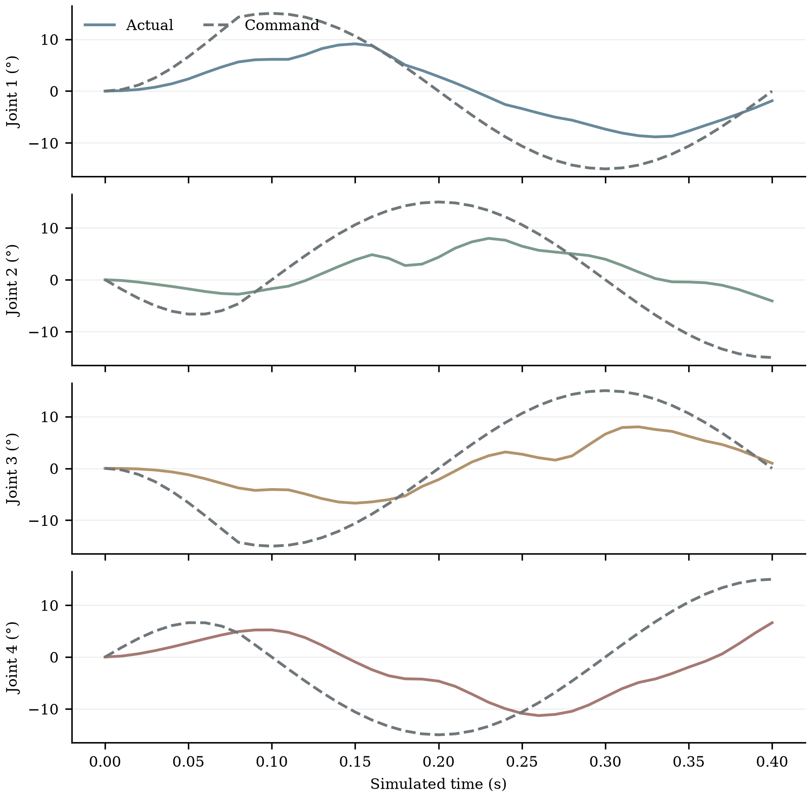
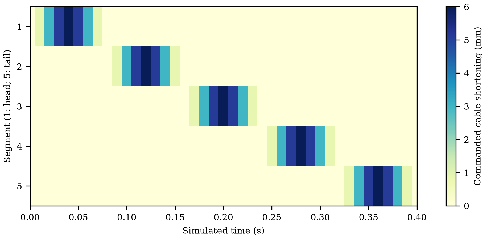
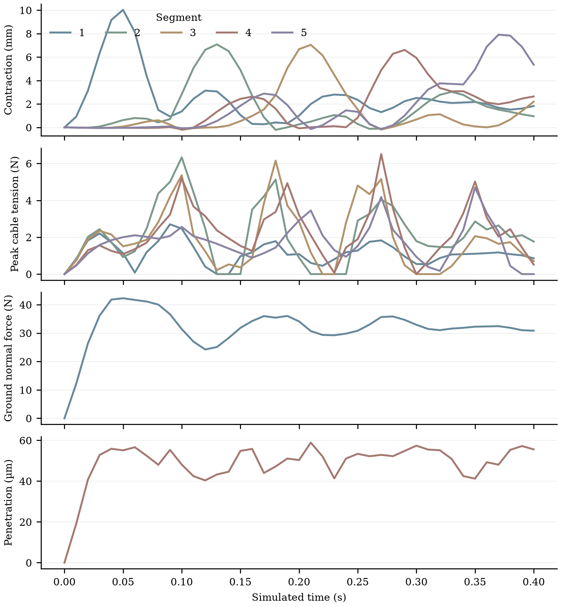

# 四个中间摆动关节与向尾部传播的蠕动波

日期：2026-10-02。本次在现有 Sano 钢带／CUDA 动力学核心上释放五体节机器人中间的四个 CAD 摆动关节，并加入依次从头部传向尾部的收绳脉冲。目标是计算钢带、端板、绳索、关节驱动力矩和地面反力相互影响的真实轨迹，保存可用于汇报的图和原始结果。

本次已完成 0.4 s 的五体节 N33 仿真：四个中间关节实际摆动，收缩峰值依次从头部传向尾部，代码快照和保存轨迹检查通过。**包含钢带质量的整机质心沿头部方向净前移 1.271 mm，因此本次完成的是向尾部传播的蠕动波，还不是整机后退爬行。** 波传播方向由输入时序定义，整机运动方向由力学、接触和摩擦共同决定；这两个结果必须分别报告。

## 为什么上一版看不到中间摆动

上一版保留了 CAD 第 2–6 节的 10 块实体端板，但将每一对相邻后板／前板的摆动关节锁在 0°，合并成 6 个动力学刚体。两块实体板的 CAD 间距和质量仍在，关节没有独立旋转自由度。因此五节能收缩和整体弯曲，但不能显示中间舵机关节的相对偏航运动。

本次的 `--unlocked-joints` 使用 10 个独立刚体，四个关节分别连接 `back2_Link → front3_Link`、`back3_Link → front4_Link`、`back4_Link → front5_Link`、`back5_Link → front6_Link`。每块板及其零限位锁定轮的质量、质心和惯量只计入一次，没有把相邻的板合并，也没有在绘图阶段追加摆角。

## 配置与规模

| 项目 | 本次正式演示配置 |
| --- | --- |
| 机器人 | CAD 第 2–6 节；图中头部为第 2 节，位于右侧；尾部为第 6 节，位于左侧 |
| 钢带 | 每节 8 片，共 40 片；每片 33 个节点、32 条边 |
| 钢带材料／截面 | Sano 窄带弹性能；钢材 200 GPa、泊松比 0.3、密度 7,850 kg/m³；宽 16 mm、厚 0.15 mm |
| 钢带内部自由度 | 每片 117，合计 4,680；两端夹持坐标随所属端板姿态变化 |
| 端板／关节 | 10 个刚体，60 个位姿增量坐标；4 个 revolute 关节，每个 5 条几何约束，共 20 条 |
| 有效刚体自由度 | 60 − 20 = 40；这里不含钢带内部自由度 |
| Newton 未知量 | 4,680 + 60 + 20 个约束乘子 = **4,760**；消元钢带内部块后解 80×80 Schur 系统 |
| 绳索 | 每节 4 根，共 20 根；理想直线、仅受拉，等效刚度 20,000 N/m |
| 收绳输入 | `backward-wave`；局部 cos² 脉冲；同一体节四根绳索同量缩短，峰值自由长度指令 6 mm |
| 波周期／时间 | 周期 0.4 s，模拟 0.4 s；40 个主步，主步长 10 ms；初始帧加 40 帧，共 41 帧 |
| 命令子步 | 单个子步收绳变化最多 1 mm；关节目标变化最多 2°，求解失败时回滚并二分重试 |
| 关节输入 | 四个关节的相位正弦目标，幅度 15°，相邻关节相位差 90°；前 20% 周期平滑增幅 |
| 关节 PD | kp = 1 N·m/rad，kd = 0.03 N·m·s/rad，电机力矩截断 ±0.5 N·m；当前为可调数值参数，尚未按真实舵机标定 |
| 地面 | 水平面、自重与惯性；单边罚接触，库仑摩擦系数 0.4，含黏着／滑移／分离状态历史 |
| 接触采样 | 每条钢带边 12 点；每块端板两侧圆周各 24 点。N33 共 15,840 个候选表面点，随当前形变／姿态更新 |
| 计算平台 | 远程 RTX 5090；FP64；当前 CPU/CUDA 混合求解 |

33 个节点是数值离散精度，不是将钢片切成独立刚体。节点的中心线位置和边扭转角一起描述连续带状材料；材料方向随几何运输及扭转更新，进而计算弹性能、恢复力和切线刚度。6 mm 是绳索自由长度的缩短指令，15° 是舵机目标；端板实际收缩和实际关节角由联立受力与动力学求出。

钢带法向／切向罚刚度密度沿用 10⁸／2×10⁷ N/m²，乘以边长积分权重。端板对应总罚刚度 10⁸／2×10⁷ N/m，均分给其圆周样本。轮的质量已经计入，但本次轮的接触几何、轮自转和单向离合仍未建模。

## 四个关节怎样进入物理求解

`full_body_loads.py` 读取 URDF 的 `front3` 至 `front6` 关节原点、轴和限位，将支点转换为各自刚体质心坐标系中的局部力臂。支点来自 CAD 的关节原点，不能用相邻板中心的中点替代。关节轴是 CAD 的 **(0, 0, −1)**；有符号摆角按这根轴计算，正角度从全局 +Z 方向俯视时表现为顺时针旋转。

`revolute_joints.py` 对每个关节加入三条“父子支点重合”约束和两条“父子转轴方向一致”约束。第五条约束后的剩余转动正是关节绕轴的自由偏航角。约束通过 Lagrange 乘子求反力和反力矩，与钢带、绳索及地面反力同一时间步联立：

\[
r_{\mathrm{inertia,steel,cable,gravity,contact,motor}}(q,p)
+J(p)^T\lambda=0,\qquad g(p)=0.
\]

关节电机采用有力矩上限的 PD。父子刚体分别承受大小相等、方向相反的轴向力矩，电机不会凭空给整机施加外部推进力。候选角速度由当前隐式位姿和上一帧位姿求得，阻尼参与时间步求解。实际角度、目标、力矩、支点误差、轴误差和限位超出量均写入结果。

四个摆角没有在仿真后修改模型或动画。40 片钢带、20 根绳索、10 个刚体与 20 个关节约束乘子在同一个 Newton 系统内求解；每个钢带内部块消元后，全部关节和刚体仍在同一个 80×80 系统内相互耦合。

CAD 摆角限位是 ±1.57 rad。当前超限后激活 10 N·m/rad 的柔性角止挡，允许有限超出量并记录，不是严格的硬限位不等式。切线采用准 Newton 近似：省略约束乘子对应的几何二阶项和电机角度二阶导数，电机阻尼切线使用 1/Δt 近似；力矩饱和区的一阶增益设为零。

## 向尾部传播的波怎样定义

五个体节按头部至尾部编号 1–5，对应 CAD 第 2–6 节。每个脉冲在其峰值附近的一个体节时间槽内按 cos² 平滑收缩，槽外为零；同一体节的四根绳索共享该脉冲。周期内峰值依次为：

| 体节编号 | CAD 体节 | 收绳峰值时刻 / s |
| --- | --- | ---: |
| 1（头部） | 2 | 0.04 |
| 2 | 3 | 0.12 |
| 3 | 4 | 0.20 |
| 4 | 5 | 0.28 |
| 5（尾部） | 6 | 0.36 |

因此从图中右侧头部向左侧尾部观察，应看到依次传播的收绳输入。实际收缩可能有相位滞后、过冲和跨体节耦合；要同时查看命令热图和实际端板距离曲线，不能用输入峰值代替实际形变峰值。

本次从零速度和既有无应力拱形启动，整体初始高度使最低钢带表面距地面约 20 µm；没有先做重力预平衡。初始落地过渡会影响前一周期结果。

## 检查与实测记录

以下自检已经通过：

- 关节约束 Jacobian 的独立有限差分最大绝对误差为 **2.49×10⁻¹⁰**；覆盖平移和世界左乘旋转坐标。
- 正确恢复绕负 Z 轴的有符号角；连接状态下约束反力保持总力和总力矩平衡，电机力矩为作用反作用对。
- 隐式 PD、力矩饱和切线和柔性限位分支通过检查。
- 真实五体节 CAD 的参考状态生成 80×80 系统，支点距离误差最大 **8.7×10⁻¹⁹ m**，转轴误差与摆角均为零。

正式计算前用五体节 N17、20 ms 的短轨迹做 CPU/CUDA 对照，**数值一致性检查通过**。探测配置为 1 mm 输入、周期 0.2 s、4 个 5 ms 主步，保存初态加主帧共 5 帧。以下误差是同一输入全部保存帧的最大绝对差异，原始对照见 [`parity.json`](gpu_joint_wave_20261002/parity.json)：

| 对照量 | 最大绝对差异 |
| --- | ---: |
| 钢带广义坐标 q | 4.25×10⁻¹³；位置和角度的混合坐标，不能统一标为米 |
| 刚体质心 | 7.37×10⁻¹⁵ m |
| 实际关节角 | 3.80×10⁻¹⁴ rad |
| 真实关节支点 | 1.56×10⁻¹⁵ m |
| 绳索张力 | 1.44×10⁻¹¹ N |
| 关节电机力矩 | 1.28×10⁻¹³ N·m |
| 地面法向合力 | 4.18×10⁻¹² N |
| 接触状态计数 | 每个保存帧完全相同 |

CPU 循环墙钟时间为 **31.034 s**，CUDA 为 **19.065 s**。CPU 在本地 Windows，CUDA 在远程服务器，跨平台时间不能直接作为加速比。短轨迹对照验证了解锁关节后两条实现路径的一致性；它不替代 0.4 s 的 N33 正式演示，也不等于实验验证。

正式 N33 CUDA 计算完成 **0.4 s、41 个保存主帧**。[轨迹与代码审计](gpu_joint_wave_20261002/validation.json) 通过：六个执行源码快照的 SHA-256 均与仿真元数据一致，夹持节点及绳索连接点与刚体位姿一致，保存角度与独立重算角度一致。源码自检结果另存为 [`mechanics_self_checks.json`](gpu_joint_wave_20261002/mechanics_self_checks.json)。

关节目标峰值都是 15°，实际角度由受力平衡、惯性、地面接触和 PD 力矩共同决定。下表采用保存的主帧统计，实际峰值取绝对角度，跟踪误差取同一时刻实际角与目标角之差的最大绝对值：

| 关节编号（CAD 名称） | 最大实际摆角 / ° | 最大跟踪误差 / ° |
| --- | ---: | ---: |
| 1（front3） | 9.115 | 8.873 |
| 2（front4） | 7.980 | 12.380 |
| 3（front5） | 8.013 | 11.861 |
| 4（front6） | 11.291 | 12.950 |

电机峰值力矩为 **0.21834 N·m**，低于设置的 0.5 N·m 上限；保存帧中没有越过 ±1.57 rad CAD 限位，柔性止挡未激活。关节最大支点误差 **5.64×10⁻¹⁴ m**，最大转轴误差 **1.64×10⁻¹²**；这说明离散约束被求解满足，不代表加工、材料或实机模型具有同等精度。

实际收缩定义为初始端板中心距离减去当前两端板中心距离；各节初始中心距离约 101 mm。保存主帧中的实际响应如下：

| 体节编号（CAD） | 最大实际收缩 / mm | 输入峰值时刻 / s | 实际峰值时刻 / s |
| --- | ---: | ---: | ---: |
| 1（2，头部） | 10.027 | 0.04 | 0.05 |
| 2（3） | 7.079 | 0.12 | 0.13 |
| 3（4） | 7.044 | 0.20 | 0.21 |
| 4（5） | 6.608 | 0.28 | 0.29 |
| 5（6，尾部） | 7.907 | 0.36 | 0.37 |

五节实际收缩峰值按头部至尾部顺序出现，均比输入峰值晚 10 ms，即一个保存主步。10 ms 的保存间隔限制了峰值时刻的分辨率；不能据此声称连续时间滞后精确等于 10 ms。

| 指标 | 正式 N33 结果及统计范围 |
| --- | --- |
| 峰值绳索张力 | 全部接受子步 **7.339 N**；仅保存主帧 6.514 N |
| 最大地面穿透 | 全部接受子步 **61.225 µm**；仅保存主帧 58.883 µm |
| 峰值地面法向合力 | 42.267 N；仅保存主帧 |
| 隐式接受子步 | 138 步，其中失败二分恢复额外增加 43 步；43 是增加的子步数，不是失败主步数 |
| 保存主帧最大物理残差 | 8.67×10⁻⁶；平移／转动方程分别对应力／力矩，不能合称一种量纲 |
| 最大规范化残差 | 0.867，低于接受阈值 1 |
| 计算循环墙钟时间 | **2,037.688 s，即 33 分 57.7 秒**；不含构建模型和渲染 |
| 整机总质量 | 3.297003 kg，其中 CAD 刚体含锁定轮 3.184552 kg、钢带 0.112450 kg；理想绳索无质量 |
| 总质心位移（X、Y、Z） | **(+1.271287, −0.306845, −2.651951) mm**，覆盖钢带与刚体全部质量 |

整机质心按 CAD 刚体质量和钢带节点集中质量一起加权；只统计端板质心会忽略钢带随收缩迁移的质量。本次初始头部方向为 +X，总质心 X 位移为正，故分类为**净前移**；Z 位移包含初始落地过程，Y 位移显示少量横向运动。只算刚体会得到 +1.307 mm 的 X 位移，与包含钢带的 +1.271 mm 不同。不能因为输入名称叫 `backward-wave` 就改写这一测量结果；这个启动周期的净前移也不是已测得的稳定爬行速度。

本次需要保留的三个问题：

1. **关节跟踪尚不足。** 目标 15°，实际峰值约 8°–11°，最大瞬时跟踪误差约 9°–13°。当前 PD 没有实验标定，峰值力矩也未到上限，下一步需分析刚度、阻尼、驱动周期和载荷的共同影响，再调整控制；不能把目标角当作完成了 15° 的物理运动。
2. **头节收缩较大。** 6 mm 自由长度命令对应头节 10.027 mm 最大端板收缩，尾节也达到 7.907 mm。命令和端板距离不是同一个约束量，存在惯性、绳索松弛和体节耦合，但仍需用重力预平衡、时间步收敛及阻尼标定检验过冲来源，不能把它当作已验证的可控行程。
3. **波已传播，整机没有后退。** 当前只有初始落地后的一个周期，而且轮接触／自转／单向机制尚缺。下一阶段需要实现与实机一致的抓地机制和反向控制条件，再运行多个稳定周期；不能用修改图像或直接移动整机来代替物理求解。

这次 33 分 57.7 秒不能直接与上一版锁关节演示的 8 分 25 秒比较加速或减速：两次模拟时长、输入、刚体自由度、约束和恢复子步数量都不同。后续性能优化应在相同模型和输入上比较端到端耗时、Newton 次数、材料／接触装配、CPU/GPU 传输和线性求解占比。

## 图、原始数据与复现

正式结果目录：[`gpu_joint_wave_20261002/backward_n33_cuda/`](gpu_joint_wave_20261002/backward_n33_cuda/)。动画读取保存的物理轨迹，端板、钢带和关节采用真实尺度；图中没有顶部／底部多余标题。










静态终态图不能表示过程中最大摆角，需结合 GIF 和关节角曲线判断；0.4 s 末帧的四个实际角分别为 −1.866°、−4.089°、+0.989°、+6.615°。橙色点标示真实 CAD 支点，连接臂到两端板中心的长度不对称；关节角是两个端板坐标系绕 CAD 轴的相对角，不等于整体链的中心线折线夹角。柔性钢带同时允许各体节两端板的相对姿态变化，不能从中心线是否接近直线来判断关节有没有运动。

以下文件用于汇报与检查：

- `robot_motion.gif`、`robot_motion.png/.svg`：固定相机、真实尺度的五体节形变及四关节动画／终态；彩色点标示保存的真实 CAD 支点。
- `robot_motion_top.gif`、`robot_motion_top.png/.svg`：俯视，便于查看中间摆动。
- `robot_motion_joint_metrics.png/.svg`：四个关节实际角与目标角。
- `backward_wave.png/.svg`：从头部至尾部的收绳输入热图。
- `robot_motion_metrics.png/.svg`：各节实际收缩、绳索张力、地面法向合力与穿透。
- `summary.json`：参数、代码哈希、每帧诊断和计算时间；`trajectory.npz`：钢带、材料方向、10 刚体位姿、绳索路径和真实关节支点／角度。
- `full_robot.snapshot.py`、`full_body_loads.snapshot.py`、`revolute_joints.snapshot.py` 及其他保存的计算源码：本次实际执行版本；`hardware.txt` 记录 GPU；`solver.log` 保存逐帧运行输出。

GIF 的 10 fps 是放慢播放速度，不是求解器频率。41 个主帧对应 0.4 s 物理时间；渲染额外停留终态方便查看。主帧图的峰值可能与全部已接受子步的峰值不同，应以结果说明注明统计范围。

在 `ribbon_bench` 目录执行：

```bash
export PYTHONPATH=vendor/discrete-elastic-ribbon/src
python revolute_joints.py
python full_body_loads.py
python full_robot.py --self-check
python render_full_robot.py --self-check
python remote_run_wrapper.py --segments 5 --nodes 33 --unlocked-joints \
  --gait backward-wave --command-mm 6 --joint-amplitude-deg 15 \
  --joint-kp 1 --joint-kd 0.03 --joint-torque-limit 0.5 \
  --period 0.4 --duration 0.4 --steps 40 --dt 0.01 \
  --max-command-step-mm 1 --solve-backend cuda \
  --output gpu_joint_wave_20261002/backward_n33_cuda
python render_full_robot.py \
  --input gpu_joint_wave_20261002/backward_n33_cuda \
  --output gpu_joint_wave_20261002/backward_n33_cuda/robot_motion.png
```

远程旧 NumPy 通过已有 `remote_run_wrapper.py` 在导入库前设置 `np.concat = np.concatenate`。CUDA 路径继续使用现有 Sano 应变导数、材料链式装配、表面几何／接触及局部线性求解；CPU 保留部分状态更新、夹持映射、绳索、关节及系统装配。本次没有为了显示摆动改回旧 MuJoCo 动画。

下载结果后，可在同一目录用以下命令检查文件有限性、执行快照哈希和包含钢带质量的总质心位移。它直接读取已保存数据，不重新运行 34 分钟的求解：

```bash
python - <<'PY'
import hashlib, json
from pathlib import Path
import numpy as np
root = Path('gpu_joint_wave_20261002')
run = root / 'backward_n33_cuda'
audit = json.loads((root / 'validation.json').read_text())
summary = json.loads((run / 'summary.json').read_text())
assert audit['status'] == 'passed' and summary['status'] == 'completed'
for name, snapshot in audit['source_snapshots'].items():
    path = Path(snapshot['path'].replace('\\', '/'))
    digest = hashlib.sha256(path.read_bytes()).hexdigest()
    assert digest == snapshot['sha256'] == summary['metadata']['source_hashes'][name]
with np.load(run / 'trajectory.npz') as data:
    for name in ('q', 'body_com', 'body_R', 'width_directors', 'joint_angles_rad'):
        assert np.isfinite(data[name]).all(), name
    q, body_com = data['q'], data['body_com']
    nodes = (q.shape[-1]+1)//4
    xyz = q[..., :3*nodes].reshape(q.shape[0], q.shape[1], nodes, 3)
    rigid_mass, node_mass = data['body_mass_kg'], data['steel_node_mass_kg']
    total_mass = rigid_mass.sum()+q.shape[1]*node_mass.sum()
    com = (np.einsum('tbi,b->ti', body_com, rigid_mass)
           +np.einsum('tsni,n->ti', xyz, node_mass))/total_mass
    delta_mm = (com[-1]-com[0])*1000
    assert len(q) == 41 and q.shape[1] == 40
    assert np.allclose(delta_mm, audit['center_of_mass']['displacement_mm'], atol=1e-9)
print('Checks passed; total COM displacement (mm):', delta_mm)
PY
```

## 已知边界与对论文有用的后续工作

当前仍缺轮自转、真实轮碰撞形状与单向离合，缺连续碰撞检测（CCD）、钢带自接触和严格硬角止挡；绳索没有绕导孔摩擦和惯性，舵机没有实验辨识的动态与扭矩速度曲线。钢材、夹持、拱形、预紧、摩擦和阻尼还需实验标定。离散罚接触允许有限穿透，应报告穿透和反力对参数的敏感性。

有论文价值的下一步是用相同输入验证时间步／钢带网格／接触采样收敛，检查释放关节前后的形变及载荷变化；用真实舵机和单节收缩—张力数据标定 PD、材料和夹持，再加入轮接触／单向机制或经实验支持的方向摩擦。多周期结果应报告包含钢带的净位移、速度、能耗、关节跟踪误差、峰值载荷、接触状态和计算成本，区分“输入波可生成”“形变可预测”和“后退爬行已验证”。
