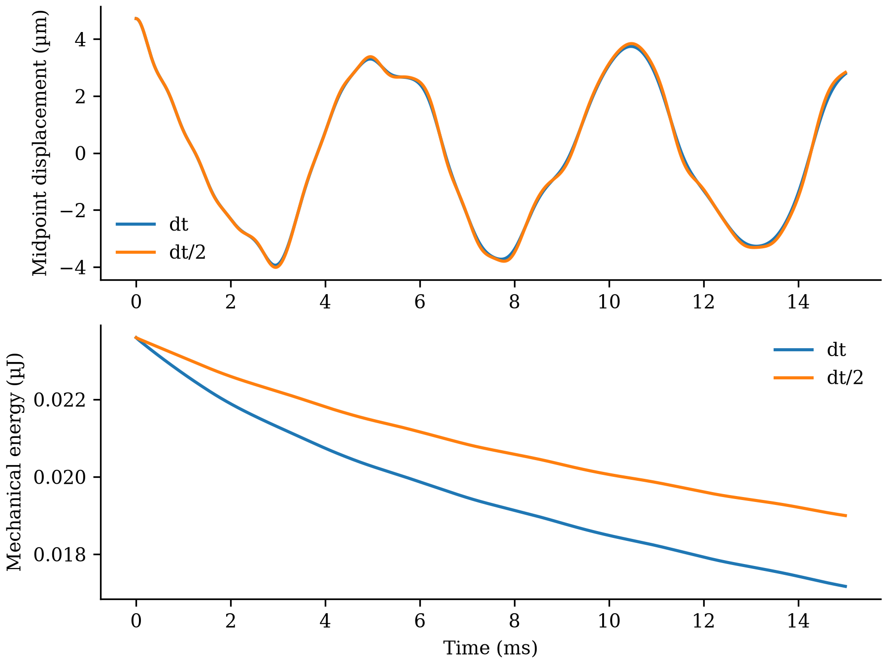

# 物理核心：当前选择与后续路线

更新日期：2026-10-01。本文记录工程决策与验证入口；已有准静态结果、模型假设和历史工况见 [完整技术报告](REPORT.zh-CN.md)。这里的验证是数值验证，尚不是实物实验验证。

追加完成的 [GPU 实测](GPU_PROBE.zh-CN.md)：RTX 5090 的 CUDA FP64 材料计算通过核验；大批材料吞吐有收益。整机热路径已加入优化的 NumPy 收缩和闭式 Sano batch，N33 单步 CPU/CUDA 为 7.18/7.51 s，当前默认可信基准仍保留 CPU。

## 当前采用的计算核心

以 **CPU 上的离散 Sano 弹性能及其闭式导数、带状线性求解、已接受 Newton 状态的计算复用**作为后续开发基准。保留原自动微分与稠密求解路径作对照，不先用神经网络替换材料模型。

- [fast_sano.py](fast_sano.py) 实现固定上游版本实际 `forward()` 的能量、梯度和 Hessian；自然应变、材料帧、几何导数及边界条件沿用原实现。“精确”指同一离散公式的闭式求导，不表示连续体解或实物响应没有误差。
- [actuate.py](actuate.py) 的 `--solver fast` 对单片自由度重排后使用带状求解，再通过 Schur 消元耦合八片钢带与后板的两个自由度。当前仍保留稠密矩阵装配；带宽从实际非零项获得，不截掉带外项。
- Newton 的正则化、线搜索与最终残差验收继续保留。缓存仅复用同一已接受状态的求值结果，不冻结后续状态的刚度。`--solver reference` 用于核对形状、材料方向、反力、张力、能量和残差。

闭式导数自检包含原自动微分、中心差分和真实钢带装配对照；八片完整路径的重复计时与一致性检查由 [benchmark_solver.py](benchmark_solver.py) 执行。正式记录入口是 [solver_benchmark_20261001/summary.json](solver_benchmark_20261001/summary.json)。该摘要已记录八片、33 节点、25 状态的三次重复比较全部通过：原实现中位耗时 **97.50 s**，加速实现 **29.50 s**，本次工况约 **3.31 倍**加速。节点分量最大差约 $1.34\times10^{-12}$ m，后端反力分量最大差约 $1.20\times10^{-8}$ N。该计时包含路径求解与检查点序列化，排除导入、初始化和绘图；不能外推为其他网格、动力学或接触工况的加速保证。

补充的[单线程对照](solver_benchmark_singlethread_20261001/summary.json)把 OPENBLAS/OMP/MKL/NUMEXPR 都设为 1，同一条25状态路径的一对实测为 **51.08 → 32.17 s，约1.59倍**，节点最大差 $2.15\times10^{-12}$ m。默认线程下的3.31倍包含小矩阵多线程开销的影响，不能概括为任意配置下都有3倍收益。单线程仅测了一对，尚不提供统计稳定性结论；两组都未运行其他本任务重计算。

## 本机与 GPU 决策

本机只读探测得到 AMD Radeon 890M 集成显卡；项目虚拟环境为 PyTorch `2.14.0+cpu`，CUDA 与 HIP 构建标识均为空，`torch.cuda.is_available()` 为假，JAX / jaxlib 尚未安装。

[JAX 官方安装矩阵](https://docs.jax.dev/en/latest/installation.html#supported-platforms)目前列出原生 Windows 的 CPU 支持，但不支持原生 Windows 的 AMD / NVIDIA GPU；WSL2 GPU 支持仍标为实验性。**这不构成 890M 可用 ROCm 的承诺**，具体型号、驱动和版本组合仍需另行确认。

上游 [DER JAX 带状求解源码](https://github.com/StructuresComp/discrete-elastic-ribbon-jax/blob/main/src/dismech_jax/banded_solve.py)使用 `jax.pure_callback` 调用主机端 `scipy.linalg.solve_banded`，因此不能将其直接视为全 GPU 求解器。当前八片、每片几十个节点的小系统也不保证适合 GPU；仅给张量加 `.cuda()` 不能迁移 NumPy / SciPy 求解流程。

随后已建立独立 DirectML 环境，并在 RTX 5090 / CUDA 12.8 / PyTorch 2.8 的隔离环境中完成材料与整条路径对照，详见 [GPU 实测与复现说明](GPU_PROBE.zh-CN.md)。本机和远程的原环境保留。CUDA FP64结果通过原物理残差；FP32在保存峰值状态的装配回放中未达到原力容差。当前混合路径的数值结果与 CPU 一致，但单环境仍未取得端到端加速；下一阶段需把独立环境状态、几何、装配和求解一并纳入批量设计，再评估端到端吞吐量。

## 动力学：先验证单片释放

[dynamic_strip.py](dynamic_strip.py)已完成单片钢带预载后撤载的基础动态数值验证，见[实际记录](dynamic_strip_demo/summary.json)与[实验说明](dynamic_strip_demo/README.md)。17节点、0.01 N预载产生4.722 µm初始中点位移；以5 µs和2.5 µs分别积分15 ms，共3000/6000步，两组均6次过零。步长减半的位移归一化RMS差为1.437%，最大机械能差/初始能量为7.752%，通过预设5%/10%门槛。求解耗时40.918/82.760 s，远未达到实时。



该实验使用节点平移质量与边扭转惯量、隐式 Euler 时间积分、质量比例黏性阻尼和 Sano 内力；夹持端始终固定。零输入静止、边界不漂移、弹性能与动能转换、机械能变化及时间步减半检查已通过。隐式 Euler 本身有数值耗散：较细步长下数值耗散仍约为物理黏性耗散的6.2倍，尚不能用该衰减拟合实物阻尼；后续需评估更低数值耗散的积分方法，并维持能量与步长验证。

它尚不包含绳索、运动刚板、重力或接触，也不能替代整个机器人的动力学验证。既有按加载参数排列的准静态 GIF 不包含惯性时间演化，不能用播放速度解释振动或爬行速度。

## 接触与摩擦的下一步

下一项优先工作是地面接触：先在可控制的小算例中加入重力与地面法向接触，检查静置、落地、穿透量和能量；再加入能区分黏着与滑动的切向摩擦，检查静摩擦保持、滑移阈值及摩擦耗散，最后接回钢带和驱动。

钢带接触几何需要使用实际宽度、厚度和材料方向构造的表面，不能仅检测中心线，也不能把当前绘图四边形当成已经实现的实体接触。后续还需处理钢带与刚板、钢带之间的接触，并明确绳孔摩擦和真实绳路是否进入模型。

现有 [cable_loads.py](cable_loads.py)只含理想单边拉伸绳和简化圆盘止挡势能；它不是地面摩擦或钢带自接触实现。现有前板固定、后板仅轴向位移与偏航两个自由度的台架，也不能自由爬行。研究爬行前必须开放机器人整体平移与转动，并求解对应的刚柔动力学和地面反力。

## 神经网络的使用顺序

1. **先预测求解初值。** 用网络预测节点、材料转角或低维状态，再由同一物理 Newton 求解器修正并验收残差。网络输出错误时仍有物理校正路径；该网络目前尚未训练。
2. **再考虑低维形变与能量代理。** 保留足够的内部形变坐标和速度，用可微能量的梯度产生保守内力，并核对反力、切线刚度、稳定分支与振动模态。仅学习后板两自由度的静态能量会消去内部振动自由度。
3. **动力学与接触单独处理。** 质量、阻尼、时间积分、接触约束及摩擦耗散不能由一个静态形状回归器自动补齐。现有静态数据没有提供惯性振动或摩擦历史，不能据此声称网络学会了这些行为；多稳态也不能简单假定为控制量到形状的唯一映射。

当前没有已训练并验收的神经网络替代器。上游仓库里的网络原型不等于适用于本机器人的权重、训练集或精度证明。闭式 Sano 已是明确的低维材料公式；替换该公式是否节省总体时间，必须结合装配、Newton 迭代和线性求解一起测量。

## 可复现实验入口

在已有项目虚拟环境和固定 vendor 的条件下，从 `ribbon_bench` 目录执行。输出目录使用新名称，保留原始证据；基准命令会拒绝已存在的目录。

```powershell
# 材料导数与装配自检；不写结果文件
.\.venv\Scripts\python.exe fast_sano.py

# 同一八片、33 节点完整绳驱路径：原实现与加速实现重复比较
.\.venv\Scripts\python.exe benchmark_solver.py --nodes 33 --steps 6 --repeats 3 --output solver_benchmark_reproduce

# 单线程对照；不要与其他性能测试同时运行
$env:OPENBLAS_NUM_THREADS = '1'
$env:OMP_NUM_THREADS = '1'
$env:MKL_NUM_THREADS = '1'
$env:NUMEXPR_NUM_THREADS = '1'
.\.venv\Scripts\python.exe benchmark_solver.py --nodes 33 --steps 6 --repeats 3 --output solver_benchmark_singlethread_reproduce

# 单片释放与时间步减半检查；输入值不是预先确认的输出结果
.\.venv\Scripts\python.exe dynamic_strip.py --nodes 17 --dt 0.000005 --duration 0.015 --force-n 0.01 --alpha 2 --output dynamic_strip_reproduce
```

上游固定版本为 [StructuresComp/discrete-elastic-ribbon，提交 c9d3411](https://github.com/StructuresComp/discrete-elastic-ribbon/tree/c9d341164e2927fc24b2c43dff97fcfb492cf700)。复现实验应同时保存参数快照、代码版本、依赖环境、残差和计时口径；以结果摘要中的通过状态为依据，不能把“脚本已提供”写成“物理行为已验证”。
