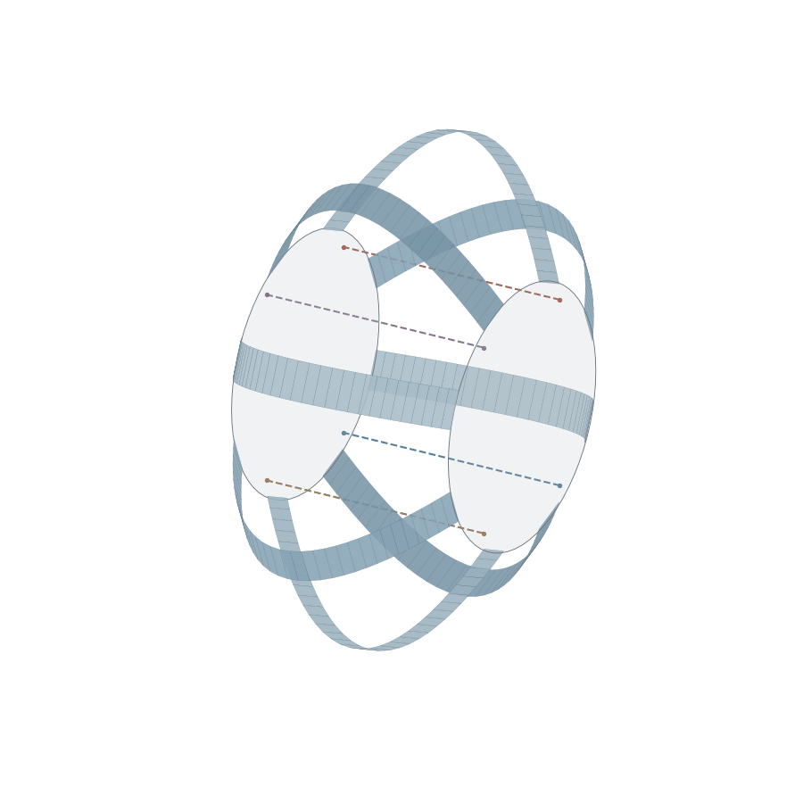
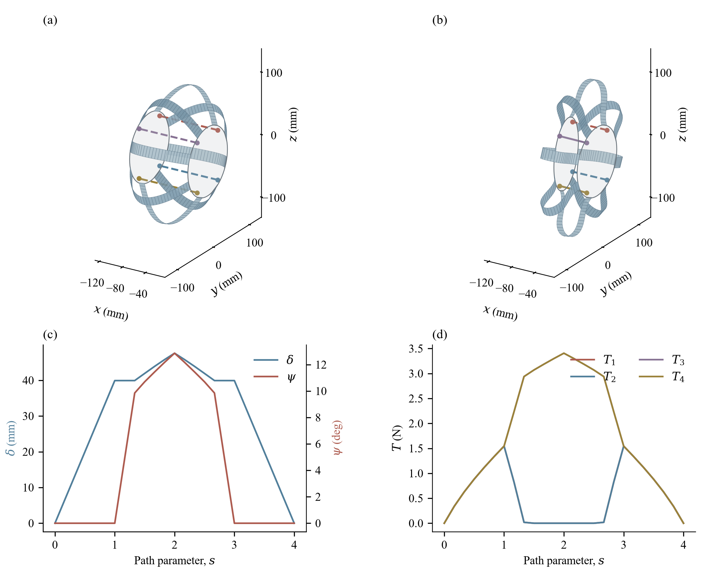
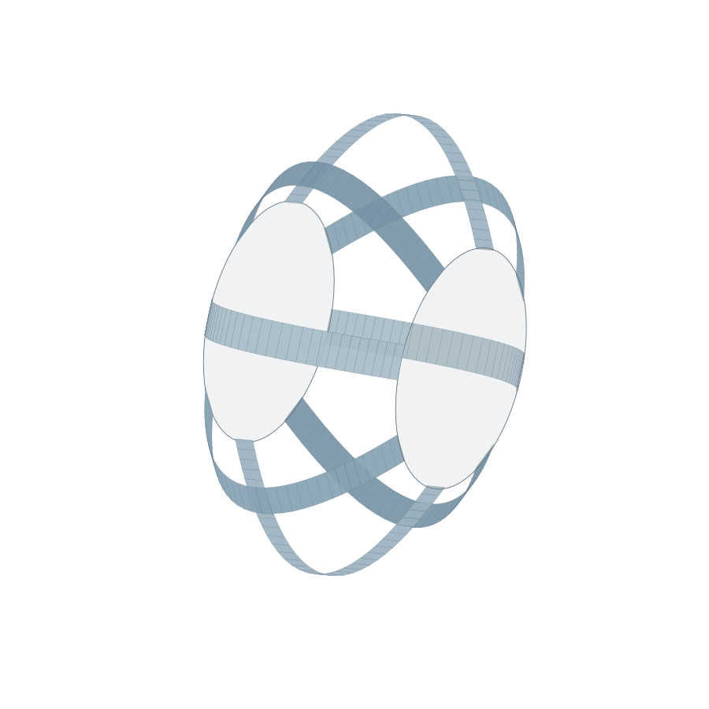
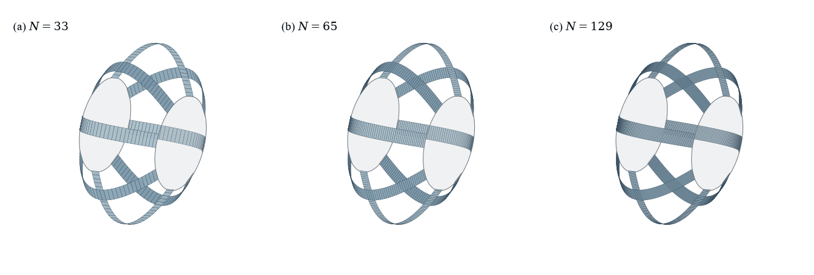

# 钢片蠕虫机器人：汇报说明与图像索引

更新日期：2026-09-30。本文汇总当前可用于汇报的结果，包含原论文图归档和后续完成的30°完整回程。**9套可视化对应8组结果文件**；其中网格比较图复用33、65、129节点三组结果。

建议先讲四绳驱动，再讲30°规定姿态对照，最后讲分辨率和验证。全部素材、数据和代码在当前仓库的 `ribbon_bench/` 内；文末提供逐项下载入口。

[一页汇报 PPT：离散方法与 Sano 模型](presentation/sano_ribbon_one_page.pptx) · [PNG 预览](presentation/sano_ribbon_one_page.png)。PPT 含原始 GIF、可编辑文字及带来源的演讲备注。

## 1. 这张动画是什么

**图A｜四绳驱动。** 前隔板固定，后隔板的轴向位置与绕世界Z轴的偏航角由力平衡算出。8片钢带，每片33个节点、32段；四条绳的放出长度逐步变化，钢带形状随之重新达到平衡。图中偏航是隔板倾转，不是绕机器人长轴X的扭转。

用户提供的GIF与此文件字节一致：900×900像素、25帧、5 fps、5秒循环，SHA-256为 `96a53b040e2ae8a03d92de99b9eec7d7f139fe72920ec3e5a82fad39573dc682`。

| 项目 | 本动画的实际结果 |
|---|---|
| 钢带与离散 | 8片Sano模型，每片33节点；内部位置与材料转角参与求解 |
| 控制输入 | 四根理想绳的放出长度；用40 mm／30°目标几何生成长度指令 |
| 实际峰值响应 | 压缩47.58545 mm，偏航12.86152° |
| 峰值处四根绳张力 | `[0, 0, 3.40685, 3.40685] N` |
| 后板活动范围 | 轴向平移、世界Z偏航两个自由度；其余四个刚体自由度由理想导向限制 |
| 最小隔板止挡间隙 | 38.209 mm，全程止挡接触未激活 |
| 保存结果 | 25个平衡状态；完成加载与回程 |

**图注可直接使用：**“八片离散弹性钢带与四根单边受拉绳耦合的准静态响应。前隔板固定，后隔板轴向位移及偏航由平衡方程求解。给定绳长指令下，实际最大压缩为47.585 mm、偏航为12.862°；两根绳各承受3.407 N张力。虚线表示松弛绳的端点路由，动画播放时间不代表真实运动时间。”

虚线对应近零张力，实线对应张紧状态。虚线仍画成直线只是为了标出连接位置，没有求松绳下垂曲线。图中的两块圆盘也是简化显示几何，未绘出完整CAD孔洞。

[静态结果图](publication/figures/fig08_cable_driven.png) · [矢量SVG](publication/figures/fig08_cable_driven.svg) · [原始结果](actuated_demo/results.json) · [验证记录](actuated_demo/validation.json)

## 2. 用什么实现

| 层次 | 使用的工具或模型 | 负责的内容 |
|---|---|---|
| 项目几何 | CAD导出的URDF、冻结参数JSON | 两隔板参考位置、钢带端部孔位、绳锚点及导向出口 |
| 钢带力学 | Discrete Elastic Ribbons／DisMech的Sano能量模型 | 伸长、两个方向的弯曲、扭转及模型中的非线性耦合 |
| 项目耦合求解 | Python，NumPy／SciPy，上游解析能量与导数 | 八片钢带、四根绳及后板两个自由度共同求平衡 |
| 数值方法 | Newton迭代、Schur消元、能量线搜索；回程试验加入切线预测 | 求每一载荷步的平衡状态，并检查实际残差 |
| 可视化 | Matplotlib的`mplot3d`、`Poly3DCollection` | 根据计算出的节点和材料方向绘制钢带、隔板、绳及曲线 |
| 动画与导出 | Matplotlib `FuncAnimation`、Pillow | 将已求解状态输出为GIF，同时保存300 dpi PNG和矢量SVG |
| 保存与追溯 | JSON、Markdown、Git和SHA-256 | 保存每个状态、参数、代码、图注及文件校验值 |

本套动画使用独立的Python准静态力学台架。仓库原有MuJoCo／强化学习流程是另一个整机仿真模块，本图没有调用其动力学来生成钢带形状。上游具有PyTorch依赖，本次选用的是解析Sano能量模型，不需要训练神经网络。

上游源码固定在提交 [`c9d341164e2927fc24b2c43dff97fcfb492cf700`](https://github.com/StructuresComp/discrete-elastic-ribbon/tree/c9d341164e2927fc24b2c43dff97fcfb492cf700)，以Git子模块保留。Python及依赖版本见[环境记录](publication/environment.json)。

## 3. 计算是怎样完成的

### 3.1 把钢片变成可计算的离散弹性带

每片钢带用一条三维中心线和每段的材料方向表示。33个节点对应32条边，节点决定位置，材料转角决定宽度方向如何随弯曲和扭转变化。宽度和厚度进入截面刚度，因此保留了薄钢片两个方向弯曲难易程度不同的特征。

当前主要输入为：宽16 mm、厚0.15 mm、杨氏模量200 GPa、泊松比0.3、暂定自然弓高50.5 mm。钢带初始抛物线被假定为无应力形状。**这些是当前模型参数和假设，仍需实物测量标定。** 两端各两个节点及端边转角随夹具运动；中间节点没有被指定为某条动画曲线。

这是中心线与材料方向的降维离散模型；当前没有在钢片宽度、厚度方向铺设完整壳／实体有限元网格。图上的细横线是离散段的显示边界，不代表真实钢片有32个铰链。

代码入口：[几何、材料与钢带构建](run.py)；详细能量及截面说明见[原阶段技术报告第3节](REPORT.zh-CN.md#3-钢带模型和离散边界)。

### 3.2 绳索只拉不推

对第 $j$ 根绳，计算两端点距离 $L_j$，与控制器给出的放出长度 $L_{0j}$ 比较：

$$
T_j=k\max(L_j-L_{0j},0),\qquad k=20000\ \mathrm{N/m}.
$$

跨度超过放出长度时产生张力，否则为松弛状态。张力和力矩通过连接点作用于后板，再由后板与钢带端部的夹持关系传入钢带。本阶段是四个独立理想收绳输入，尚未建立真实两个舵机和偏心舵盘到四条绳长的映射。

接触模块采用简化圆盘止挡的罚势能，罚刚度50000 N/m。本动画的间隙始终为正，所以这里展示的是未碰到止挡的收绳运动；接触激活及导数已做独立数值自检。代码：[绳与止挡模型](cable_loads.py)。

### 3.3 在每个输入下求平衡

将八片钢带的弹性能、绳弹性能和止挡接触能相加：

$$
\Pi(q,p;L_0)=\sum_{i=1}^{8}E_{\mathrm{Sano},i}(q_i,p)
+\sum_{j=1}^{4}\frac{k}{2}[L_j(p)-L_{0j}]_+^2+E_c(p).
$$

这里 $q$ 表示钢带内部位置和材料转角，$p=(d,a)$ 表示后板压缩和偏航。程序迭代更新这些未知量，使自由方向的势能梯度接近零，即残余力和力矩足够小。能量式中的Sano项采用上游完整解析模型，不把它替换成简单线性弯曲项。

耦合Newton求解先消去每片钢带内部的增量，形成只含后板两个未知量的Schur系统，再回代钢带增量；线搜索检查总势能下降。验收门槛为钢带自由位置残差不超过 $10^{-6}\ \mathrm N$、自由转角残差不超过 $10^{-7}\ \mathrm{N\,m}$；自由后板轴向残差不超过 $10^{-5}\ \mathrm N$、偏航力矩残差不超过 $10^{-6}\ \mathrm{N\,m}$。

规定隔板位姿时，后板坐标作为边界条件固定，其支承力由外部夹具承担；收绳驱动时，后板两个坐标也是待求未知量。两种模式使用不同的输入，不能把它们的偏转角混写为同一个驱动结果。代码：[耦合求解器](actuate.py)。

### 3.4 从数值状态生成这张GIF

求解器先将节点坐标、材料宽度方向、板位姿、绳张力等保存到JSON。绘图程序只读取这些已求解数据。

对每条边，两端节点为 $x_i,x_{i+1}$，单位宽度方向为 $m_{2,i}$；沿宽度两侧各偏移半个带宽，得到四个顶点：

$$
x_i-\tfrac{w}{2}m_{2,i},\quad x_{i+1}-\tfrac{w}{2}m_{2,i},\quad
x_{i+1}+\tfrac{w}{2}m_{2,i},\quad x_i+\tfrac{w}{2}m_{2,i}.
$$

Matplotlib把这四个点连接为一个带面。每片32个面，8片共256个面；显示表面没有再挤出0.15 mm实体厚度，但该厚度已用于力学刚度。隔板按求解位姿做刚体变换，绳按两端点位置绘制，张力决定实线或虚线。所有状态用同一相机、正交投影、白底配色输出。

最后，Pillow按5 fps保存GIF。**25帧的5秒循环是展示设置，不是“机器人用了5秒完成动作”。** 准静态方法能显示一系列变形状态，但本轮没有计算运动速度、加速度、惯性或回弹振动。

代码：[带面重建与论文样式](render.py) · [绳驱动画与张力曲线](render_actuated.py)。

## 4. 已完成的两个主要力学结果

### 4.1 四绳驱动：位姿是输出

给定的长度指令来自40 mm／30°的目标几何，但求解结果为47.585 mm／12.862°。这说明几何绳长与受载平衡之间存在差别，不能直接把目标姿态当成计算结果。

图中(a)、(b)为初态和最大实际偏航状态，(c)为实际压缩量和偏航角，(d)为四根绳张力。横轴 $s$ 是加载路径参数。模型的四绳非负张力检查还表明：当前布置无法维持已求得的40 mm／30°特定平衡分支；此结论不等于整个工作空间内30°都不可达。[目标受力检查](prescribed_30_refined/wrench_feasibility.json)

### 4.2 规定隔板位姿：40 mm／30°完整回程已验证

**图B｜规定隔板位姿。** 外部夹具规定压缩到40 mm、偏航到30°，随后退回0°并解压到0 mm；绳保持松弛。205个状态由原13个加载状态、4个原预测卸载状态和188个切线预测卸载状态组成，新增192个卸载状态均实际求解。

| 验证量 | 数值 |
|---|---:|
| 全路径最大自由节点力残差 | $7.421\times10^{-7}\ \mathrm N$ |
| 全路径最大自由转角力矩残差 | $1.567\times10^{-10}\ \mathrm{N\,m}$ |
| 终态节点相对初态最大差 | $1.770\times10^{-13}\ \mathrm m$ |
| 成功卸载片段合计耗时 | 416.576 s |
| 原加载历史耗时 | 446.913 s |

回程使用平衡切线预测为下一步提供初值，再调用原Newton校正器，保留原能量模型及残差门槛。原失败的28.75°→28.4375°步骤还做了单独正则化对照，收敛到相同平衡；这项对照只验证该困难步。未收敛迭代点的负曲率不直接作为物理分岔证据。

上述位置差是数值回到初态的误差，不是实物精度。时间为不同会话中成功片段的相加，不包含失败诊断或渲染。该GIF有205帧，播放41秒；加载和卸载采样密度不同，画面速度不能用来比较实际运动速度。

[完整回程静态图](prescribed_30_tangent_unload/preview.png) · [SVG](prescribed_30_tangent_unload/preview.svg) · [方法与复现](prescribed_30_tangent_unload/README.md) · [验证JSON](prescribed_30_tangent_unload/validation.json)

## 5. 分辨率比较怎么汇报

**图C｜分辨率和计算成本。** 三组均为8片钢带，规定20 mm压缩和5°偏航，共25个保存状态。每片节点从33增加到65、129，细节分辨率提高，计算耗时增加。

| 每片节点数 | 总轴向支承力峰值/N | 原求解耗时/s |
|---:|---:|---:|
| 33 | 3.53738 | 110.23 |
| 65 | 3.33294 | 553.52 |
| 129 | 3.24237 | 853.80 |

以上三组采用4进程，数值库每进程单线程，计时不含绘图。当前每端固定两个节点，节点加密时其物理夹持跨度也改变，因此本图只能用于**分辨率、响应与成本比较**，尚不能作为严格网格收敛证明。[静态比较图](publication/figures/fig05_mesh_comparison.png) · [计时记录](mesh_demo/timings.json)

## 6. 所有正式图和结果的下载索引

PNG为300 dpi静态图，适合直接插入汇报；SVG保留矢量图形和文字；GIF用于播放准静态状态序列。进入文件页后可使用GitHub的下载按钮或“Raw”保存。图上的说明已移至本页及原报告图注，引用时应保留对应工况说明。

| 编号与工况 | 静态PNG | 矢量SVG | 动画GIF | 原始结果 |
|---|---|---|---|---|
| 01：17节点，20 mm／5° | [PNG](publication/figures/fig01_baseline17.png) | [SVG](publication/figures/fig01_baseline17.svg) | [GIF](publication/figures/fig01_baseline17.gif) | [JSON](output/results.json) |
| 02：33节点，20 mm／5° | [PNG](publication/figures/fig02_mesh33.png) | [SVG](publication/figures/fig02_mesh33.svg) | [GIF](publication/figures/fig02_mesh33.gif) | [JSON](mesh_demo/n33/results.json) |
| 03：65节点，20 mm／5° | [PNG](publication/figures/fig03_mesh65.png) | [SVG](publication/figures/fig03_mesh65.svg) | [GIF](publication/figures/fig03_mesh65.gif) | [JSON](mesh_demo/n65/results.json) |
| 04：129节点，20 mm／5° | [PNG](publication/figures/fig04_mesh129.png) | [SVG](publication/figures/fig04_mesh129.svg) | [GIF](publication/figures/fig04_mesh129.gif) | [JSON](mesh_demo/n129/results.json) |
| 05：33／65／129节点比较 | [PNG](publication/figures/fig05_mesh_comparison.png) | [SVG](publication/figures/fig05_mesh_comparison.svg) | [GIF](publication/figures/fig05_mesh_comparison.gif) | 复用02、03、04 |
| 06：33节点，40 mm／15°完整路径 | [PNG](publication/figures/fig06_large_motion15.png) | [SVG](publication/figures/fig06_large_motion15.svg) | [GIF](publication/figures/fig06_large_motion15.gif) | [JSON](large_motion_demo/results.json) |
| 07：33节点，40 mm／30°原加载段 | [PNG](publication/figures/fig07_prescribed30_loading.png) | [SVG](publication/figures/fig07_prescribed30_loading.svg) | [GIF](publication/figures/fig07_prescribed30_loading.gif) | [JSON](prescribed_30_refined/loading_results.json) |
| 08：四绳驱动，实际47.585 mm／12.862° | [PNG](publication/figures/fig08_cable_driven.png) | [SVG](publication/figures/fig08_cable_driven.svg) | [GIF](publication/figures/fig08_cable_driven.gif) | [JSON](actuated_demo/results.json) |
| 09：33节点，40 mm／30°完整回程 | [PNG](prescribed_30_tangent_unload/preview.png) | [SVG](prescribed_30_tangent_unload/preview.svg) | [GIF](prescribed_30_tangent_unload/simulation.gif) | [JSON](prescribed_30_tangent_unload/results.json) |

01—06及08为25状态，07为13状态且只到加载末端，09为205状态。07的末帧跳回初帧只是循环播放；**汇报“30°完整回程”应使用09，而不能用07倒放代替。**

配套记录：[原七组数值汇总](publication/results_summary.json) · [原图与数据清单](publication/manifest.json) · [30°完整回程独立清单](prescribed_30_tangent_unload/manifest.json) · [重排前原图备份](publication/original_figures/)。原阶段的[完整技术报告](REPORT.zh-CN.md)及其归档副本保留当时“卸载未收敛”的历史结论；本页和09的记录反映后续完成情况。

## 7. 可直接用于汇报的讲述顺序

| 汇报页 | 展示内容 | 建议讲述重点 |
|---|---|---|
| 1：目标与模型 | 图A初态／四绳GIF | 单节机器人由8片钢带连接两隔板，研究变形及驱动所需平衡 |
| 2：实现方法 | 本页工具表与求解过程 | 中心线＋材料方向，Sano能量，钢带—绳—后板耦合Newton求解 |
| 3：驱动结果 | 08的静态图和GIF | 输入是四根绳长，47.585 mm／12.862°是输出；有两根绳松弛 |
| 4：大形变与回程 | 09的静态图／完整回程GIF | 外部规定位姿的40 mm／30°算例已完成205状态验证 |
| 5：分辨率与可信度 | 05比较图、残差表 | 已做离散与数值验证；夹持跨度变化使严格网格收敛仍待完成 |
| 6：下一步 | 待完成项 | 实物标定、真实舵盘与绳路、接触摩擦、动力学和地面爬行 |

**一分钟讲稿：**

> 我们为钢片蠕虫机器人的单节结构建立了八片离散弹性带模型。钢片用三维中心线和材料方向离散，保留伸长、弯曲和扭转的力学响应。给定隔板边界或四根绳的长度后，用Newton方法计算每个加载步的静态平衡，再把节点和材料方向还原成带面，生成论文图和动画。当前四绳驱动算例实际达到47.585毫米压缩和12.862度偏航；另一组外部规定位姿算例完成了40毫米压缩、30度偏转和完整回程，共205个平衡状态。我们已经核对了数值残差和回程误差，下一步需要通过实物测量标定钢片参数，并加入真实舵盘绳路、摩擦接触和动力学。

## 8. 汇报结论的适用范围

已经完成的是准静态力学与数值验证。当前还没有实物力—位移标定，也没有把预弯钢带的装配预载、塑性或滞回作为已知量输入。绳模型没有质量、下垂、穿孔滑移与摩擦，隔板受两自由度理想导向；接触仅为简化隔板止挡，未计算钢带互碰、绳—钢带、地面接触或动态爬行。

因此，本阶段可以汇报“建立了可复现的钢带—绳—隔板准静态耦合模型，完成了大形变和回程的数值验证”。关于真实舵机能否达到30°、驱动速度、爬行性能和实物精度，需要后续模型与实验给出证据。

复现与安装入口：[README](README.md)。图和结果可直接查看；重新计算需要按说明初始化固定版本子模块并安装依赖。
