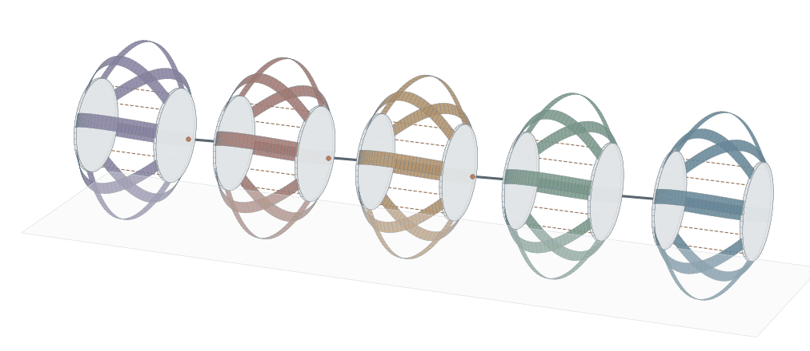

# 钢片蠕虫机器人：Discrete Elastic Ribbons 台架

**最新五体节演示（2026-10-02）：[四个中间摆动关节、向尾部传播的蠕动波及汇报图](JOINT_BACKWARD_WAVE.zh-CN.md)**。40 片钢带 × 33 节点、20 根绳索、10 个独立 CAD 刚体与四个 revolute 关节联立求解，包含惯性、自重和地面黏着／滑动／离地切换。关节由有限力矩驱动 15° 目标，实际峰值约 8.0°–11.3°；6 mm 收绳脉冲从头至尾依次传递。0.4 s 物理过程用了 33 分 57.7 秒，本启动周期总质心净前移 1.27 mm，尚未实现整机后退爬行。[上一版锁关节的计算](FIVE_SEGMENT_DEMO.zh-CN.md) 保留作对照。



**早期 GPU 实测：[RTX 5090 / DirectML 材料计算与完整路径对照](GPU_PROBE.zh-CN.md)**。CUDA FP64通过核验；大批材料调用可加速。该文保留早期混合路径的 CPU/CUDA 对照及计时口径，不代表上面五体节配置的运行时间。

**2026-10-01：[求解器加速、单片动力学与后续物理核心路线](PHYSICS_CORE.zh-CN.md)**。新增同一Sano公式的闭式材料导数、带状块求解及原版对照；`actuate.py`默认使用`--solver fast`，原路径可通过`--solver reference`运行。旧论文归档和数据保持原样，下面的历史耗时不代表新求解器速度。

**汇报入口：[图像、结果与实现说明](PRESENTATION.zh-CN.md)**，包含全部9套可视化、下载索引、方法说明和可直接使用的讲稿。
原阶段完整过程见 [REPORT.zh-CN.md](REPORT.zh-CN.md)，该报告保留当时卸载失败的历史；最新30°完整回程见[后续计算](prescribed_30_tangent_unload/README.md)。
论文插图集中保存在 `publication/figures/`：300 dpi PNG、保留文字的 SVG、原帧序列 GIF。
图中的工况说明已移至报告图注；`publication/` 同时保存源数据、参数、代码快照和 SHA-256 清单。
旧图保留在 `publication/original_figures/`。运行 `python publish_results.py` 可重新归档已经渲染的结果，不会重新求解物理。

使用作者的 Sano ribbon / Kirchhoff 能量模型，读取冻结的 `output/parameters.snapshot.json`
及 `publication/data/cad_reference.urdf`，求解项目钢片在隔板压缩、偏转和卸载下的准静态平衡。
规定隔板位姿模式下，八片钢片使用同一组隔板位姿，每片单独求平衡；收绳驱动模式下，八片与后板共同求平衡。几何来自项目孔位。

## 获取与安装

从仓库根目录进入本台架；需要 Python 3.12 和 Git。上游求解器作为固定提交的 Git submodule 保存。

```powershell
git clone --branch codex/ribbon-publication --recurse-submodules https://github.com/Kitjesen/worm-sim.git
Set-Location worm-sim/ribbon_bench
python -m venv .venv
.\.venv\Scripts\python.exe -m pip install -e .\vendor\discrete-elastic-ribbon tqdm pillow
.\.venv\Scripts\python.exe -m pip install torch --index-url https://download.pytorch.org/whl/cpu
```

已有克隆可在仓库根目录执行 `git submodule update --init --recursive`。Linux/macOS 可使用 `.venv/bin/python` 代替 Windows 解释器路径。具体已验证环境版本见 [publication/environment.json](publication/environment.json)；该文件是发布环境记录，不是跨平台锁文件。

只重画已有结果不需要运行求解器。正式结果、图像及报告引用的历史证据均保留；原论文归档中的30°工况仅加载段收敛，报告保留这一历史限制。`publication/manifest.json` 列出原论文图与数据；`probe_prediction/`、`refinement*/`、`mesh_demo/baseline*/`、`mesh_demo/serial*/`、`large_motion_30/` 和各 `checkpoint.json` 是历史诊断或中间记录，不另算完整正式工况。结果中的原绝对路径只作历史来源记录，运行脚本使用此目录内的冻结参数和 CAD 参考。发布适配仅调整路径、文档与归档，不改求解器数学。

## 后续计算：30°完整卸载

[独立结果与复现说明](prescribed_30_tangent_unload/README.md) 保存2026-09-30追加完成的205个平衡状态及完整回程图。平衡切线预测器配合原Newton校正器完成卸载，主 `actuate.py` 与原论文报告、8套图和归档清单保持不变。[失败诊断](prescribed_30_unload_diagnostic/DIAGNOSIS.md) 与真实恢复种子同时保留；新结果使用[独立SHA清单](prescribed_30_tangent_unload/manifest.json)。该结果仍是规定隔板位姿的准静态算例，不表示绳驱动能到达30°。

## 运行

在本目录用 PowerShell：

```powershell
.\.venv\Scripts\python.exe run.py --render
```

默认：8 片、每片 17 个节点，隔板压缩 20 mm 后偏航 5°，再按原路径卸载。
这里的量是**指定隔板运动**，不代表当前舵盘能够完成的实际行程。

只比较一片钢条的两种本构：

```powershell
.\.venv\Scripts\python.exe run.py --strips 0 --models sano kirchhoff --output comparison --render
```

网格加密：改用 `--nodes 25`、`--nodes 33`。发布副本不依赖其他工作区中的 `single_segment`。
可用 `--parameters output/parameters.snapshot.json` 重放冻结输入。

完整 8 片、33/65/129 节点的演示（三组依次运行，每组 4 个独立进程，数值库各用单线程）：

```powershell
$env:OPENBLAS_NUM_THREADS = '1'
$env:OMP_NUM_THREADS = '1'
$env:MKL_NUM_THREADS = '1'
$env:NUMEXPR_NUM_THREADS = '1'
foreach ($nodes in 33, 65, 129) {
    .\.venv\Scripts\python.exe run.py --parameters output/parameters.snapshot.json --nodes $nodes --workers 4 --output "mesh_demo/n$nodes"
    if ($LASTEXITCODE -ne 0) { throw "Mesh $nodes did not complete" }
}
.\.venv\Scripts\python.exe compare_mesh.py mesh_demo/n33/results.json mesh_demo/n65/results.json mesh_demo/n129/results.json
```

输出 `mesh_demo/comparison.gif` 与 `mesh_demo/preview.png`，三组均为实际求解的 8 片、25 个状态。
这比较的是分辨率与实测耗时；两节点夹持的物理跨度随网格变化，不能当作严格的网格收敛试验。
每完成一片写入 `checkpoint.json`，完整完成才更新 `results.json`；比较脚本会拒绝不完整的条带集合。

本机 AMD Ryzen AI 9 HX 370 的本次实测（每组 8 片、每片 25 个状态、4 进程）：

| 每片节点 / 段数 | 求解阶段 | 生成单组预览及 GIF |
|---|---:|---:|
| 33 / 32 | 110.2 秒（1 分 50 秒） | 12.3 秒 |
| 65 / 64 | 553.5 秒（9 分 14 秒） | 12.4 秒 |
| 129 / 128 | 853.8 秒（14 分 14 秒） | 13.6 秒 |

求解计时包含 worker 启动和导入，不包含主进程导入、绘图，也不是实时仿真的物理时长。
三组求解合计约 25 分 18 秒；三组各自图像与 GIF 加合成对比的生成时间共约 66 秒。
合成动画为 25 帧、5 fps、5 秒一轮，所有 GIF 都已逐帧解码检查。
详细计时及校验值见 `mesh_demo/timings.json`。三组最大自由节点力残差均小于 `1e-6 N`；
33、65 节点完整 8 片的串并行结果逐元素相同，129 节点未另做串行复跑。
这些是本次后台负载下的观测时间，不保证其他运行具有相同速度。

更大动作演示：8 片、每片 33 节点，压缩 **40 mm**、隔板偏航 **15°**。
沿用上面的单线程数值库环境设置：

```powershell
.\.venv\Scripts\python.exe run.py --parameters output/parameters.snapshot.json --nodes 33 --workers 4 --compression-mm 40 --yaw-deg 15 --output large_motion_demo --render
```

结果保存到 `large_motion_demo/`。这是指定隔板位姿下的准静态形变，
未加入接触或绳索约束，不能据此认定实物可达到这一行程。
本次完整求解用时 296.2 秒（4 分 56 秒）；8 片均完成 25 个状态，
最大自由节点力残差为 `5.17e-8 N`，动画为 25 帧、5 秒一轮。
校验值保存在 `large_motion_demo/validation.json`。

## 收绳驱动与隔板接触止挡

`actuate.py` 将 8 片 Sano 钢带与 4 根只受拉的理想绳共同求平衡。
前板固定，后板轴向位移和世界 Z 轴偏转为未知量；其余四个自由度由理想导向机构限制。
每根绳连接项目中的前板锚点与后板孔出口，使用 `T = k max(L-L0,0)`，
`k = 20000 N/m`，控制量为四根绳的放出长度 `L0`。松绳的虚线仅表示两端之间的路径，
没有模拟松绳下垂、过孔摩擦、两舵机偏心舵盘与收绳量的映射。

接触只包含简化同心实心圆盘的无摩擦止挡，罚刚度 `50000 N/m`；
接触势能及其力、力矩、雅可比实际进入平衡方程。它不包含钢片互碰、绳—钢片、地面或完整 CAD 接触。
所有这些算例仍是准静态：计算每个收绳量下的平衡位置，未计算速度、惯性或回弹振动。

## 整机动力学与地面接触

`full_robot.py` 是后续物理核心的首个闭环版本：八片彼此独立的 Sano 钢带、两块 CAD 质量/惯量刚体端板、四根张力单向绳、重力，以及带历史的 stick/slip/liftoff 平地接触在隐式 Euler 中联立求解。钢带接触使用实际 16 mm 宽、0.15 mm 厚的表面采样；端板使用圆周采样包络。Newton 采用八个局部钢带块与 12×12 Schur 补；`--solve-backend cuda` 会把 Sano 应变/导数、钢带与端板几何/接触以及局部线性代数放到 CUDA，CPU 只保留紧凑 Schur 接口与接受步提交。

完整过程、参数口径、问题和论文对照见 [FULL_SIMULATION_REPORT.zh-CN.md](FULL_SIMULATION_REPORT.zh-CN.md) 与 [FULL_SIMULATION_LOG.zh-CN.md](FULL_SIMULATION_LOG.zh-CN.md)。最新独立钢带基准位于 `gpu_full_robot_20261001/optimized_n9_cpu/`、`optimized_n17_cpu/` 和 `optimized_n33_cpu/`；N9/N17/N33 CPU 单步约 1.23/1.98/3.59 s，CUDA 单步约 1.64/2.41/4.01 s。旧 `fast_n*` 目录只用于追溯。

```powershell
$env:PYTHONPATH = 'vendor/discrete-elastic-ribbon/src'
.\.venv\Scripts\python.exe full_robot.py --self-check
.\.venv\Scripts\python.exe full_robot.py --nodes 9 --steps 1 --duration .002 --dt .002 --command-mm 0 --output full_robot_n9_independent_probe
.\.venv\Scripts\python.exe render_full_robot.py --input full_robot_n9_independent_probe --output full_robot_n9_independent_probe/full_robot_paper.png
```

在 RTX 5090 上将同一命令增加 `--solve-backend cuda` 可测当前 CUDA 混合物理核心；摘要会记录 `solve_backend`、`newton_dof` 和 `solve_seconds`。Sano 应变/导数、钢带与端板几何/接触和局部线性代数在 CUDA，CPU 只保留紧凑 Schur 接口与接受步状态提交；绳索和 Newton 收敛状态仍未完全设备驻留，因此仍不称为纯 GPU 求解器。

```powershell
# 沿用上面的 OPENBLAS/OMP/MKL 单线程设置
.\.venv\Scripts\python.exe actuate.py --nodes 33 --steps 6 --compression-mm 40 --yaw-deg 30 --output actuated_demo --render
.\.venv\Scripts\python.exe check_actuated.py
```

这里的 `40 mm / 30°` 用于生成目标几何对应的绳长，**不会强制后板到达该位置**。
本次 8 片 × 33 节点、25 状态的实际峰值为 **47.585 mm / 12.862°**，
两根绳各受拉 `3.40685 N`，另两根松弛；把目标几何长度当作放绳长度并不保证受载后达到目标。
这不是最大可达角度试验。最小板间止挡间隙为 `38.209 mm`，本轮接触未激活；
独立自检已覆盖接触激活、分离、解析导数和反力方向。
求平衡与写入检查点共 63.3 秒，不含模型初始化与绘图；详细误差见 `actuated_demo/validation.json`。

同样 40 mm / 30° 的规定隔板姿态对照使用：

```powershell
.\.venv\Scripts\python.exe actuate.py --prescribed --loading-only --nodes 33 --steps 6 --compression-mm 40 --yaw-deg 30 --output prescribed_30_repeat --render
```

`--prescribed` 会固定两块板的位姿并让绳松弛，结果中的板力/力矩为外部夹具所需反力，不能当作绳驱结果。
已有 `prescribed_30_refined/loading_results.json` 和动画仅包含验证通过的 13 个加载状态，
该原运行的0→40 mm→30°加载用时446.9秒；当时卸载未收敛，因此该目录未生成完整往返 `results.json`。
论文版动画移除了说明文字；对应报告图注明确标注仅加载，不倒放加载帧冒充卸载计算。上面的 `--loading-only` 命令只重复加载，
不尝试回程。此后的切线预测延拓已完成[205状态完整回程](prescribed_30_tangent_unload/README.md)，新结果单独保存，原加载段及失败记录保留。

目标受力检查：该 40 mm / 30° 平衡分支需要 `4.43534 N` 轴向力与 `0.437504 N·m` 偏转力矩。
允许正负张力时的精确解为 `[-3.40970, -3.40970, 5.64171, 5.64171] N`；
非负张力拟合和分离平面检查确认，当前四根理想绳不能维持这个特定目标平衡。
这不等于整个工作空间内 30° 不可达，也不能替代真实自然曲率、夹持和材料的实测标定。
可运行 `python check_target_wrench.py prescribed_30_refined/loading_results.json`，
检查报告为 `prescribed_30_refined/wrench_feasibility.json`。

求解使用各片原始 Sano 能量与梯度、局部 Newton 矩阵、两自由度 Schur 补及能量线搜索。
远离平衡时上游 Hessian 作为 Newton 近似使用，最终仍按真实自由节点力与板力/力矩残差验收。
规定偏转对照内部细分至不超过 0.5°，完整路径设定输出 25 个平衡态，仅加载模式输出 13 个。

数值检查：

```powershell
.\.venv\Scripts\python.exe check.py
.\.venv\Scripts\python.exe render.py --self-check
```

## 输出

- `output/results.json`：每一帧的节点、材料宽度方向、弹性能、两端支承力、自由自由度平衡残差。
- `output/parameters.snapshot.json`：本次读取的完整参数快照；结果同时记录参数及 URDF 的 SHA-256。
- `output/preview.png`、`output/simulation.gif`：已求解平衡形状与力/能量曲线。

没有人为指定钢片中间节点的形状。两端各两个节点及端边转角随夹具运动，其余自由度由能量模型求解。
每一步把隔板增量平滑分配给内部节点作为 Newton 求解初值，避免仅在末端集中大变形；最终内部节点仍自由求平衡。
此初值优化保持原能量、边界条件、残差门槛与载荷二分检查；可运行 `predictor_probe.py` 对照旧版 33 节点结果。
动画按加载进度播放，**不是实时运动或动力回弹录像**。

## 17 节点初版结果（保留）

已完成 8 片 Sano 模型、每片 17 节点、25 个加载状态，求解约 62 秒（不含绘图）。
自由节点最大力残差为 `3.87e-8 N`。零应力初态、刚体旋转能量不变、支承反力与能量差分一致性检查均通过。

当前参数下总轴向支承力峰值约 `4.06 N`，最大弹性能约 `49.8 mJ`；这是模型输出，未经实测标定。
第 0 片从 17 节点加密到 25 节点后，轴向力峰值从 `0.50742 N` 降到 `0.46163 N`（约 9%）。
进一步加密到 33 节点得到 `0.44217 N`，比 25 节点再下降约 4.2%；三组输入参数及 CAD 哈希一致。
两端各固定两个节点使物理夹持跨度也随网格变化，差异同时包含离散误差和边界条件变化，**尚未证明网格收敛**。
定量预测驱动力前，需要确定实物夹持范围并在加密时保持不变，同时测量钢片自然形状和截面参数。

## 力学范围

- 保留项目矩形截面、两个不同弯曲刚度和 Saint-Venant 扭转刚度。
- 重新等弦长采样原抛物线，满足上游共享单元长度的假设；两点夹持的有限跨度需随网格加密检查。
- Sano 参数使用项目泊松比：`zeta²=(1-nu)*w⁴/(60*t²)`，不沿用上游默认的 0.5。
- 项目宽 16 mm、厚 0.15 mm、弓高 50.5 mm 等仍是未实测假设。
- 当前安装抛物线仍假定无应力；未凭空推测拆下后的形状和装配预载。
- 支承力为外部夹具施加到钢片上的静态力；无重力、惯性或其他外载。
- **`run.py` 的规定姿态台架不求解绳索或接触；`actuate.py` 仅加入理想只拉绳与隔板止挡。** 两者均未计算孔口摩擦、钢片相互接触、地面接触或爬行。原 MuJoCo 仿真继续负责原有整机工作。
- 返回初始夹具位置是卸载路径；多稳态结构不一定返回同一形状，程序会报告末态差异。

## 来源与环境

上游：https://github.com/StructuresComp/discrete-elastic-ribbon

固定提交：`c9d341164e2927fc24b2c43dff97fcfb492cf700`，源码及许可证保留在 `vendor/discrete-elastic-ribbon`。
没有修改上游文件。上游代码采用 GPL-3.0 许可，详见其 `LICENSE`。

本地独立 Python 3.12 虚拟环境。重新安装时：

```powershell
python -m venv .venv
.\.venv\Scripts\python.exe -m pip install -e .\vendor\discrete-elastic-ribbon tqdm
.\.venv\Scripts\python.exe -m pip install torch --index-url https://download.pytorch.org/whl/cpu
```

`tqdm` 和 `torch` 是上游导入所需但未在其 pyproject 中声明的依赖。
