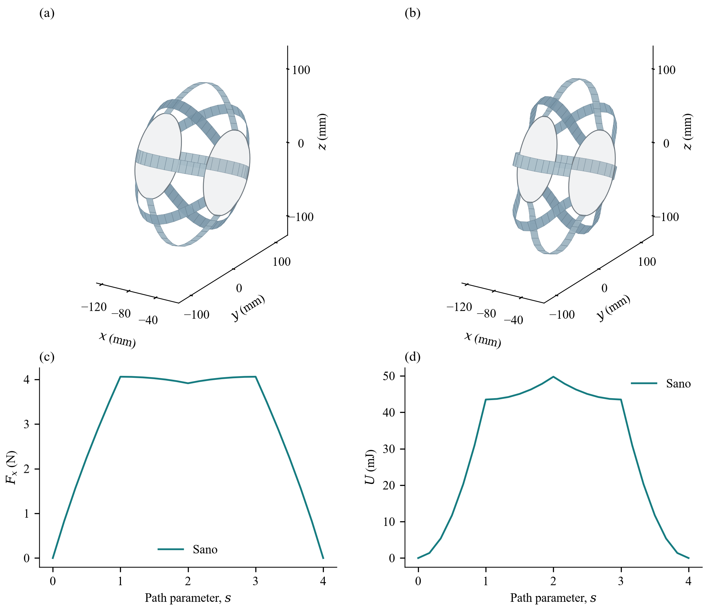
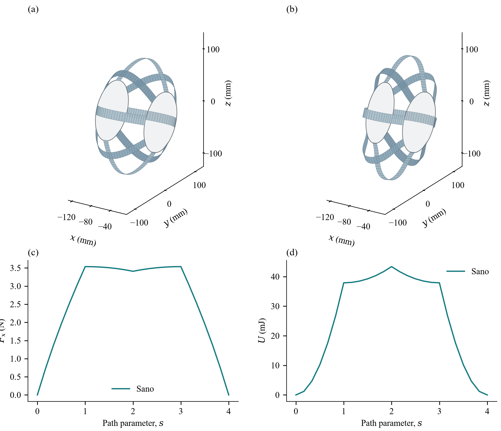
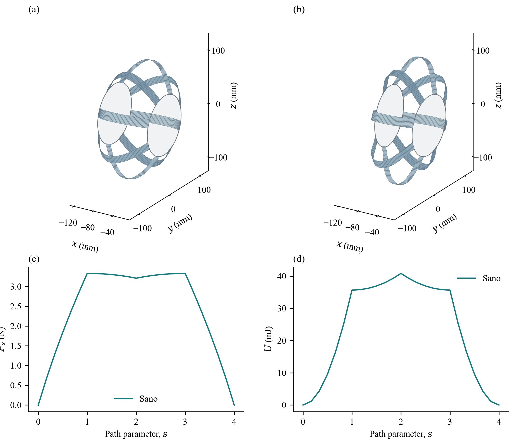
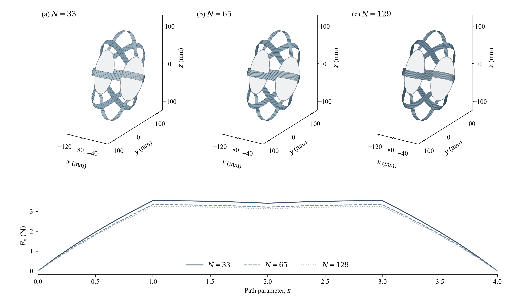
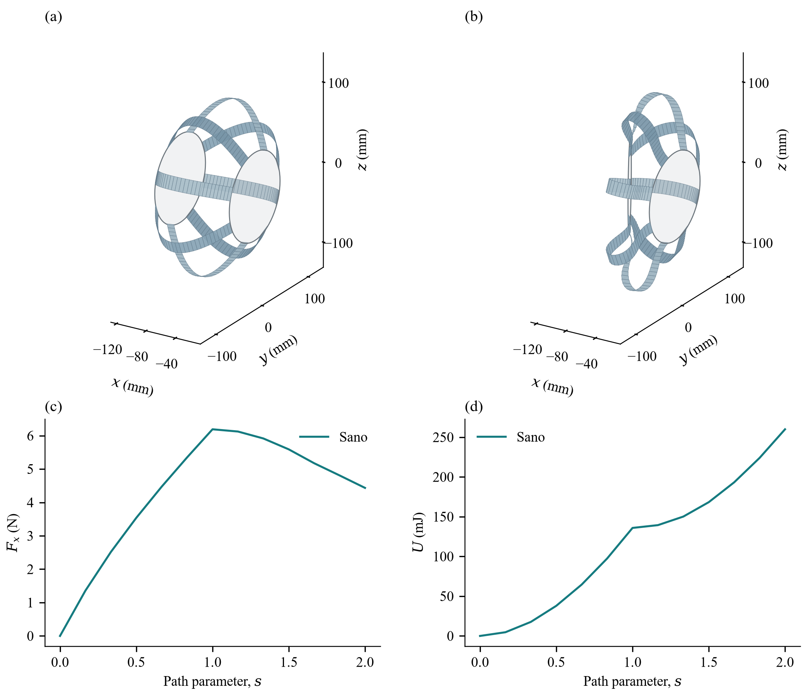

# 钢片蠕虫机器人准静态仿真：模型、实现与验证记录

**记录日期：2026-09-30。** 本文是项目技术报告，记录本地代码、原始数值结果和实现过程，不是已发表论文。配套图按照论文插图的方式重新排版，图中曲线仍来自原有计算结果，没有重新生成、补齐或美化数值数据。

项目目录：[ribbon_bench](.)。统一数据汇总见 [publication/results_summary.json](publication/results_summary.json)，归档文件及图像对应关系见 [publication/manifest.json](publication/manifest.json)。本发布副本使用仓库内相对链接。结果 JSON 中原工作区路径作为历史来源记录保留；复现使用包内冻结输入。

## 1. 研究目标与已经得到的结论

本阶段研究一个由两块隔板和八片预弯钢带组成的机器人单节：钢带在隔板靠近、偏转以及卸载时怎样变形，需要多大静态支承力，以及四根只受拉的理想绳能否支撑一个给定的隔板位姿。

实现包含两个层次。第一层由外部夹具规定隔板位姿，分别计算八片钢带平衡；第二层把后隔板的轴向平移和偏航释放为两个未知量，将八片钢带、四根理想收绳器和隔板止挡一起求平衡。二者不能混为一种驱动方式。

目前的主要结果是：

- 规定隔板压缩20 mm、偏航5°，17、33、65和129节点的八片钢带均已有完整25状态结果。
- 规定压缩40 mm、偏航15°，33节点的八片钢带完成加载与卸载，共25状态。
- 规定压缩40 mm、偏航30°，改进求解流程后完成了13个加载状态；随后尝试卸载未收敛，不能称为完整往返成功。
- 以40 mm、30°目标几何生成四根绳的放出长度，实际求得的峰值是47.585 mm、12.862°，完成25状态。目标几何长度不是闭环位姿命令。
- 在已得到的40 mm、30°钢带平衡分支上，所需力和力矩位于当前四根绳的非负张力集合之外。这个结论只针对该目标、该分支和当前假设，不等于整个工作空间内30°都不可达。

以上均为**数值验证，尚非实验验证**。本阶段没有模拟地面支撑、动态爬行、速度、惯性、回弹振动、松绳下垂或真实舵机控制。

## 2. 来源、坐标和输入数据

### 2.1 固定上游实现

钢带能量来自 [StructuresComp/discrete-elastic-ribbon 的固定提交](https://github.com/StructuresComp/discrete-elastic-ribbon/tree/c9d341164e2927fc24b2c43dff97fcfb492cf700)：

```text
c9d341164e2927fc24b2c43dff97fcfb492cf700
```

本地源码在 [vendor/discrete-elastic-ribbon](vendor/discrete-elastic-ribbon)，没有修改上游文件。许可证以该目录中的 [LICENSE](vendor/discrete-elastic-ribbon/LICENSE) 为准，当前项目记录为GPL-3.0。本文以本地实际执行代码为依据，不将仓库中的接口名称等同于已经实现的功能。

尤其需要说明：上游 `Environment` 中的 `selfContact`、`selfFriction`、`floorContact`、`floorFriction` 是占位分支；`pointForce` 虽保存参数，现有时间步装配未使用它。当前隔板接触由本地 [cable_loads.py](cable_loads.py) 实现，不是打开上游碰撞开关得到的结果。

### 2.2 几何来源和坐标约定

几何读取 [CAD导出的URDF](publication/data/cad_reference.urdf) 及 [冻结参数快照](output/parameters.snapshot.json)。程序使用连接到 `back2_Link` 的关节平移，并要求其参考旋转为零。世界X轴为两板的主要分离方向；前板固定，后板初始在其负X侧。

| 几何量 | 当前值与定义 |
|---|---|
| 前板中心 | `[-16.5, 0, 2.580447] mm` |
| 后板世界中心 | `[-117.5, 0, 2.580473] mm` |
| 初始板中心X向距离 | `101 mm` |
| 压缩坐标 $d$ | 后板沿世界+X方向移动，单位m |
| 偏航坐标 $a$ | 后板绕经过自身中心的世界Z轴转动，内部单位rad |
| 简化止挡半径、厚度 | `55 mm`、`3 mm` |

这里的偏航是绕世界Z轴的倾转，**不是绕机器人长轴X的扭转**。后板上的参考点 $x_0$ 按

$$
x(d,a)=c+R_z(a)(x_0-c)+d\,e_x
$$

变换，其中 $c$ 是后板初始世界中心。原CAD后板局部点先加URDF平移，再进行此变换。内部计算全部采用米、牛顿、弧度；绘图长度换算为毫米，能量通常换算为毫焦。

### 2.3 未实测假设和快照含义

八组钢带端部孔对来自项目CAD候选孔位；端部折线位置由孔对中点、厚度半值及径向4 mm偏移构造。孔位来自CAD不意味着夹具装配已经实测。钢带宽度、厚度、自由弓高、夹持跨度、折弯半径和装配预载仍需要测量。快照还保留了原整机模型的绳密度、绳半径、舵盘孔位等字段，但本地理想绳模块并没有使用这些字段来模拟实体绳或舵盘。因此快照中的 `rope_model: flexible` 不能作为本台架已经实现柔性绳动力学的依据。

七组正式结果的参数快照逐项相同，规范化参数哈希均为：

```text
b409deb75539fa1a1b32763255d554b6b05670b37c1108b1af5b4c9e6301e819
```

17节点初版记录的输入源字节哈希是 `d70ce4927be91e41fc10e974e3104529ae5b7c3c1d6840043f35497baa22e065`；后续重新序列化快照的字节哈希是 `a6f7f6bde60a8b3f6b47dab42d1267865351e02dbfb6557ca116ab411f0cafa1`。两者不能写成“所有原始哈希一致”。规范化内容比较用于确认参数内容一致；原始结果SHA、原输入字节SHA和规范化SHA分别保留在汇总与归档中。

CAD URDF的记录SHA-256为 `7d851880fe242c756c9771f2d195030f32a87edf81d5737b86512abc846fe818`。

## 3. 钢带模型和离散边界

### 3.1 自然曲线和等弦长节点

第 $i$ 片钢带的初始中心线采用暂定抛物线：

$$
r_i(u)=A_i+u(B_i-A_i)+4h_bu(1-u)n_i,
\qquad 0\le u\le1,\quad h_b=50.5\ \mathrm{mm}.
$$

$A_i,B_i$ 是从两端孔对推得的折线位置，$n_i$ 是前端径向方向。**这条安装状态曲线被假定为无应力自然曲线**，并不是根据拆下后的钢带形状标定得到的；当前模型没有推断装配预应力。

上游解析能量采用共同参考单元长度。为满足这个假设，[run.py](run.py) 先用密集弧长参数作初猜，再求解各离散线段长度相等的节点参数。使用等参数或仅等弧长采样并不能保证有限分辨率下的直线弦长相等。程序检查参数顺序和弦长离散度，不接受退化或逆序采样。

### 3.2 材料方向与自然应变

每片钢带有节点位置和每条边的材料转角。端部孔对方向投影到切线法平面后作为宽度方向 $m_2$，厚度法向为

$$
m_1=m_2\times t.
$$

实现先对齐材料帧，再构造时间步器、缓存自然伸长和弯扭应变。顺序不能颠倒，否则“无应力初态”可能包含由错误材料帧引入的人工应变。初态能量、材料方向和刚体变换不变性均有数值检查。

### 3.3 矩形截面参数

设宽 $w=0.016\ \mathrm m$，厚 $t=0.00015\ \mathrm m$，杨氏模量 $E=200\ \mathrm{GPa}$，泊松比 $\nu=0.3$，密度 $\rho=7850\ \mathrm{kg/m^3}$。当前截面计算为：

$$
A=wt,\quad I_1=\frac{wt^3}{12},\quad I_2=\frac{tw^3}{12},\quad G=\frac{E}{2(1+\nu)},
$$

$$
J=wt^3\left[\frac13-0.21\frac{t}{w}\left(1-\frac{t^4}{12w^4}\right)\right],\qquad w\ge t.
$$

| 量 | 当前计算值 |
|---|---:|
| $A$ | $2.4\times10^{-6}\ \mathrm{m^2}$ |
| $I_1$ | $4.5\times10^{-15}\ \mathrm{m^4}$ |
| $I_2$ | $5.12\times10^{-11}\ \mathrm{m^4}$ |
| $J$ | $1.78937\times10^{-14}\ \mathrm{m^4}$ |
| $EA$ | $480000\ \mathrm N$ |
| $EI_1,EI_2$ | $0.0009,\ 10.24\ \mathrm{N\,m^2}$ |
| $GJ$ | $0.00137644\ \mathrm{N\,m^2}$ |

Sano能量参数使用项目泊松比：

$$
\zeta=\sqrt{\frac{(1-\nu)w^4}{60t^2}}
=0.184341\ \mathrm m.
$$

没有沿用上游默认的 $1-\nu=0.5$。下文将钢带能量记为 $E_{\mathrm{Sano},i}(q_i)$，其具体函数、自然应变处理和导数以固定提交的 [GeneralElasticEnergySano](vendor/discrete-elastic-ribbon/src/dismech/elastics/general_elastic_energy_sano.py) 与 [AnalyticalSanosElasticEnergy](vendor/discrete-elastic-ribbon/src/dismech/elastics/analytical_sanos_elastic_energy.py) 为准，不把它误写为简单线性弯扭能量。

### 3.4 两节点夹持与网格比较的限制

两端各固定两个节点，并固定端边材料转角；前端保持参考状态，后端随板刚体变换。内部节点和内部材料转角最终均由平衡方程决定，没有人为规定中间弧形。

这一实现使每端的固定边长度等于一条网格边，**随着节点数增加，固定的物理长度也变短**。以第0片为例：

| 节点数 | 每条参考弦长/mm | 每端由两个固定节点代表的跨度/mm |
|---:|---:|---:|
| 17 | 9.31725 | 9.31725 |
| 25 | 6.21587 | 6.21587 |
| 33 | 4.66305 | 4.66305 |
| 65 | 2.33208 | 2.33208 |
| 129 | 1.16611 | 1.16611 |

因此节点加密同时改变离散精度和边界条件。下文的力下降不能全部归因于离散误差，33/65/129图也不是严格的网格收敛证明。定量驱动力预测前，应测量并固定实物夹持长度，再独立改变自由段网格。

## 4. 准静态载荷与数值求解

### 4.1 四阶段路径和时间含义

完整加载进度 $s\in[0,4]$ 分为：

| 进度 | 压缩 $d$ | 偏航 $a$ |
|---|---|---|
| $0\to1$ | $0\to d_{\max}$ | 0 |
| $1\to2$ | $d_{\max}$ | $0\to a_{\max}$ |
| $2\to3$ | $d_{\max}$ | $a_{\max}\to0$ |
| $3\to4$ | $d_{\max}\to0$ | 0 |

每阶段保存6个增量，加初态共25帧；自适应细分产生的中间平衡不全部进入动画。仅加载模式止于 $s=2$，保存13帧。动画5 fps是可视化播放设置，不是物理驱动频率；完整25帧约5秒一轮，13帧加载段约2.6秒一轮。加载段重复播放时末帧跳回初帧，不代表计算了卸载。

准静态计算要求每个载荷步满足力平衡，忽略加速度和惯性。虽然上游类名包含 `ImplicitEulerTimeStepper`，`static_sim=True` 时没有加入惯性项；代码中的 `dt` 不能当作这些动画的真实时间步。

### 4.2 规定板位姿的原始求解器

`run.py` 对八片钢带分别调用上游静态Newton求解。内部残差在无外载时是 $g=\nabla_qE$，Newton步为 $q\leftarrow q-H^{-1}g$。最终必须重新计算真实残差，所有自由自由度的绝对值最大值不大于 $10^{-6}$；位置项的单位是N，材料转角项的单位是N·m。失败时二分载荷增量，达到深度限制仍不满足则报错。

后续加入了仿射初值预测：将隔板增量刚体变换按节点位置线性混合到旧平衡形状，再精确施加端部夹具。它只改变Newton起点，**不是对内部节点施加额外约束**。第0片33节点旧结果与集成预测后的逐帧最大反力差为 $1.33\times10^{-8}\ \mathrm N$，最大节点差为 $2.03\times10^{-11}\ \mathrm m$。观测时间从67.43 s变为19.51 s，但两次后台竞争负载不同，不把这个比值当作受控性能实验。[预测回归记录](probe_prediction/integration/comparison.json)

还试过按初值弹性能二选一，以及在原RobustSolver外进行平移/转角变量缩放。第2片33节点分别用59.73 s/104次二分和71.87 s/100次二分，未显示稳定收益，因此没有接入 `run.py`。较低初值能量不保证更快Newton收敛；单次矩阵条件数分析也不能替代完整路径验证。对应记录为 [能量选择](probe_prediction/energy_select_strip2/comparison.json) 和 [缩放试验](probe_prediction/scaled33_strip2/comparison.json)。

规定板位姿时各片独立，可以用4个进程并行；BLAS等数值库每进程设为单线程，避免线程过量竞争。33和65节点完整八片的串并行结果逐元素相同；129节点没有另做完整串行复跑。

### 4.3 八片加两自由度的耦合求解

[actuate.py](actuate.py) 中，前板固定，后板只允许 $p=(d,a)$ 两个自由度，其余四个刚体自由度由理想导向机构限制。这种导向机构本身可提供其他方向的反力，模型不是自由空间六自由度隔板。

总势能为

$$
\Pi(\{q_i\},p;L_0)=\sum_{i=1}^{8}E_{\mathrm{Sano},i}(q_i(p))
+\sum_{j=1}^{4}\frac{k}{2}[L_j(p)-L_{0j}]_+^2+E_c(p),
\quad [x]_+=\max(x,0).
$$

端部节点由板位姿决定，钢带内部自由度和板位姿共同求解。设 $B_i=\partial q_i/\partial p$，则钢带对板的势能梯度包含 $B_i^Tg_i$，板Newton矩阵还包含位姿映射的几何二阶项。后端材料转角对世界Z偏航的一阶导数为端边切线的Z分量，因此板力矩不是只把节点力乘力臂而忽略端部转角反力。

消去各片内部增量后，板坐标的Schur系统为

$$
\left(H_{pp}-\sum_iH_{pi}H_{ii}^{-1}H_{ip}\right)\Delta p
=-g_p+\sum_iH_{pi}H_{ii}^{-1}g_i,
$$

再回代各片内部增量。实现使用位置0.05 m、转角1 rad的变量尺度；遇到困难时依次增加正则化，并用真实总势能的下降条件做回溯线搜索。远离平衡时，上游Hessian在这里作为Newton近似使用，不能把局部导数检查外推为全状态空间的严格Hessian证明。

最终接受标准分别是：钢带自由位置残差 $\le10^{-6}\ \mathrm N$，自由转角残差 $\le10^{-7}\ \mathrm{N\,m}$，自由板轴向残差 $\le10^{-5}\ \mathrm N$，自由板偏航力矩残差 $\le10^{-6}\ \mathrm{N\,m}$。`--prescribed` 模式下板坐标固定，其非零广义力是夹具必须提供的支承力，不是未收敛误差；仅钢带自由度接受平衡验收。

## 5. 绳索和接触的实际建模范围

### 5.1 四根单边受拉理想绳

每根绳连接一个固定前板锚点和一处移动后板孔出口。出口取 `tendon_guides_m` 每条路线的最后一点；顺序为快照中的“侧别、上/下”，展平后共4根。前板锚点直接来自 `tendon_anchors_m`。模型只保留跨两板的一段直线长度 $L_j$，不把孔后到舵盘的线路纳入这一段长度。

$$
T_j=k[L_j-L_{0j}]_+,\qquad k=20000\ \mathrm{N/m},
\qquad Q_{\mathrm{cable}}=-\sum_jT_j\nabla_pL_j.
$$

`CableLoads.evaluate()` 返回总势能、二维梯度/Hessian、长度、张力、端点路线、板间间隙、接触力及接触能。拉伸时的Hessian同时含 $k\nabla L\nabla L^T$ 和 $T\nabla^2L$，不是仅放入线性弹簧对角项；松弛时张力与绳势能均为零。绳和止挡的激活边界存在二阶不光滑性，代码在边界采用未激活侧的Hessian，导数自检在各光滑分支内进行。

四个 $L_{0j}$ 是**四个独立理想收绳器的控制量**。本阶段没有实现原机器人两个舵机、偏心舵盘、两端孔位与四条绳长之间的映射，也未检查电机扭矩、速度或行程约束。松弛绳在图中的虚线只表示端点路由，不是绳形、悬链线或接触后的真实路径。

### 5.2 简化圆盘止挡

记前板中心X坐标为 $x_f$，后板初始世界中心X坐标为 $x_b$，止挡半径为 $R$，厚度为 $t_p$。采用的间隙为

$$
g_c(d,a)=x_f-x_b-d-R|\sin a|-\frac{t_p}{2}(1+|\cos a|),
$$

$$
E_c=\frac{k_c}{2}\min(g_c,0)^2,
\qquad N_c=-k_c\min(g_c,0),\quad k_c=50000\ \mathrm{N/m}.
$$

激活时

$$
\nabla E_c=k_cg_c\nabla g_c,\qquad
\nabla^2E_c=k_c(\nabla g_c\nabla g_c^T+g_c\nabla^2g_c).
$$

物理广义力是 $-\nabla E_c$。该模型是同心实心圆盘包络的无摩擦罚接触，允许有限罚函数穿透，不是精确CAD碰撞，也不是严格无穿透约束。它不包含孔、绳—钢片、片—片、地面接触或摩擦。激活接触且偏航位于绝对值尖点时没有经典梯度，模块明确报错；零偏航但分离的普通初态可正常计算。

使用真实项目配置独立验证：30°时 $d=70.70096\ \mathrm{mm}$ 开始接触，再压入1 mm，得到反力50 N，物理广义力为 `[-50 N, -2.34407 N·m]`，正确阻止继续压缩和继续正偏航。正、负30°的激活/分离及解析梯度/Hessian均通过中心差分自检。

不过，正式绳驱演示的最小间隙为38.209 mm，**全程没有激活接触**。这份动画证明的是接触模块参与模型且在该工况保持分离，不能作为发生碰撞的演示；接触激活的证据来自独立数值自检。

## 6. 实现沿革和结果

### 6.1 17、25、33节点早期检查

最初完成17节点、八片Sano模型的完整25状态台架。之后的 [refinement/results.json](refinement/results.json) 是**第0片、25节点的Sano与Kirchhoff两个模型**，不是两片钢带；[refinement33/results.json](refinement33/results.json) 是第0片、33节点Sano模型。

| 第0片Sano节点数 | 轴向反力峰值/N | 相邻加密变化 |
|---:|---:|---:|
| 17 | 0.507418 | — |
| 25 | 0.461632 | 约−9.0% |
| 33 | 0.442172 | 约−4.2% |

这促使后续保留网格与夹持跨度耦合的限制说明，而不是把初版反力直接当作稳定的实物预测。小工况下Sano与Kirchhoff结果接近，只能作为实现交叉检查，不能推出两个本构在大变形下等价。

### 6.2 七组正式结果概览

以下均为八片钢带；“峰值轴向力”是总后端支承力沿世界X的最大值，“峰值钢带能”是八片钢带弹性能之和的最大值，二者不一定出现在同一帧。30°行中的6.19097 N是整个加载段的最大值，**不是30°终态所需的4.43534 N**。绳驱行的钢带能不含绳弹性能和接触能。

| 工况 | 节点/片 | 保存状态 | 最大压缩、偏航 | 峰值轴向力/N | 峰值钢带能/mJ | 最大自由节点力残差/N |
|---|---:|---:|---|---:|---:|---:|
| 初版规定姿态 | 17 | 25 | 20 mm、5° | 4.05934 | 49.7888 | $3.87\times10^{-8}$ |
| 网格组33 | 33 | 25 | 20 mm、5° | 3.53738 | 43.3820 | $1.03\times10^{-8}$ |
| 网格组65 | 65 | 25 | 20 mm、5° | 3.33294 | 40.8536 | $5.11\times10^{-8}$ |
| 网格组129 | 129 | 25 | 20 mm、5° | 3.24237 | 39.7277 | $4.15\times10^{-7}$ |
| 大动作规定姿态 | 33 | 25 | 40 mm、15° | 6.19097 | 168.282 | $5.17\times10^{-8}$ |
| 30°规定姿态，仅加载 | 33 | 13 | 40 mm、30° | 6.19097 | 259.950 | $4.34\times10^{-7}$ |
| 理想绳驱动，实际响应 | 33 | 25 | 47.585 mm、12.862° | 6.81291 | 207.301 | $9.62\times10^{-7}$ |

完整数值和原始文件SHA见 [统一结果汇总](publication/results_summary.json)。33→65→129节点的反力仍变化；即使变化幅度缩小，也没有消除夹持范围随网格变化的问题。

### 6.3 40 mm、15°规定姿态

八片33节点均完成25状态。最大自由力残差 $5.17\times10^{-8}\ \mathrm N$，最大自由转角残差 $1.26\times10^{-10}\ \mathrm{N\,m}$，两端力平衡误差 $2.52\times10^{-14}\ \mathrm N$。卸载末态与参考形状的最大节点偏差约 $2.08\times10^{-17}\ \mathrm m$，仅表示本算例沿此数值分支回到初态，不保证真实钢带无滞回、塑性或装配摩擦。[验证记录](large_motion_demo/validation.json)

快速几何筛查未看到明显折断或退化：最大相邻边转角约19°，材料方向保持正交，中心线筛查未发现隔板穿越；这些有限检查不是完整碰撞检测，也不替代带厚度表面的接触验证。

### 6.4 30°规定姿态的成功范围与失败记录

将原独立求解流程直接扩大到40 mm、30°时，没有得到完整八片结果；[large_motion_30/checkpoint.json](large_motion_30/checkpoint.json) 只保留了已完成的部分钢片。后来的早期耦合规定姿态试算同样只留下中间检查点。此类检查点不能作为完整工况绘制汇总图。

采用耦合求解器、能量线搜索，并将规定偏航内部增量限制在不超过0.5°后，完成了八片33节点的0→40 mm→30°加载，保存13帧。到达峰值用时446.9 s。随后从30°开始的卸载尝试未收敛，因此正式保存为 [loading_results.json](prescribed_30_refined/loading_results.json)，标记 `loading_path_complete=true`、`path_status=loading_only`、`unloading_converged=false`；没有把倒放加载帧包装成卸载，也没有生成冒充完整回程的 `results.json`。

后续一次30→29.99°的小步卸载诊断通过，但它只表明局部更小步长可能继续前进，不是完整卸载算法已经修复，也没有改变上述失败记录。新CLI支持 `--prescribed --loading-only`，只重放已验证加载；这种新运行的 `unloading_converged=null` 表示“未尝试”，与既有记录的 `false`（尝试但未收敛）不同。两种状态在报告和力锥检查中分别保留。

### 6.5 理想收绳驱动的实际响应

四条指令长度由40 mm、30°目标姿态的几何跨板距离生成，但平衡求解没有强制后板到达该目标。完成的25帧结果在峰值处为：

| 绳索序号 | 指令放出长度/mm | 实际跨板长度/mm | 张力/N |
|---:|---:|---:|---:|
| 1 | 75.3468 | 59.7628 | 0 |
| 2 | 75.3468 | 59.7628 | 0 |
| 3 | 46.9057 | 47.0760 | 3.40685 |
| 4 | 46.9057 | 47.0760 | 3.40685 |

实际后板位置为47.58545 mm、12.86152°。两根张紧绳合计提供约 `+6.81291 N` 轴向力和 `+0.188640 N·m` 偏航力矩；另两根绳被放长，不能推开其跨度。这里不能简单解释为“缺少反向力矩所以角度小”：松弛侧若张紧，其力矩方向反而是负偏航。关键是张力只能非负，目标几何长度也没有包含维持目标所需的弹性伸长。

完整路径的最大板轴向残差为 $1.70\times10^{-6}\ \mathrm N$，最大板力矩残差为 $8.04\times10^{-9}\ \mathrm{N\,m}$，最大回程形状误差为 $2.19\times10^{-14}\ \mathrm m$。这些量与接触未激活、实际峰值和张力均记录在 [actuated_demo/validation.json](actuated_demo/validation.json)。

### 6.6 40 mm、30°目标的非负张力可行性

使用规定姿态加载末态的钢带反力，而不是绳驱不足30°的现象，检查目标受力是否能由四根绳提供。该末态需要

$$
w_\mathrm{req}=\begin{bmatrix}4.43534169\ \mathrm N\\0.437504367\ \mathrm{N\,m}\end{bmatrix}.
$$

每根绳单位张力的物理广义力为 $-\nabla_pL_j$。在目标位姿，四列构成

$$
W=\begin{bmatrix}
0.998715&0.998715&0.996681&0.996681\\
-0.0253721&-0.0253721&0.0234398&0.0234398
\end{bmatrix},\qquad WT=w_\mathrm{req},\quad T\ge0.
$$

第一行的系数无量纲，第二行单位为m；乘以N单位的张力后分别得到N和N·m。检查以 $R=0.055\ \mathrm m$ 将力矩除以R，使两行拟合残差具有统一N量纲，避免把N与N·m直接混合最小化。

允许正负张力的精确最小范数解为

$$
T=(-3.409701,-3.409701,5.641715,5.641715)\ \mathrm N.
$$

负值意味着需要绳提供推力，无法实现。仅出现一个带负值的最小范数解还不足以证明不可行，因此进一步进行了非负最小二乘和分离平面检查：非负锥距离为5.57022 N，远大于 $10^{-5}\ \mathrm N$ 判据；归一化分离法向量为 `[-0.393163, 0.919469]`，它与所有缩放后的绳力列点积不大于数值零，而与目标点积为正。该证书确认目标在非负张力锥外。成对绳列在这个两自由度模型中相同，因此正负解中前两根的总张力必须为−6.81940 N，并非仅由最小范数分配偶然产生负数。

这个结论排除了“只调整当前四根理想绳的放出长度，就维持该40 mm、30°平衡分支”的可能性；它没有枚举其他压缩量、另一钢带平衡分支、不同穿绳位置或整个工作空间。检查脚本为 [check_target_wrench.py](check_target_wrench.py)，完整矩阵、残差、证书和加载状态标记在 [wrench_feasibility.json](prescribed_30_refined/wrench_feasibility.json)。

## 7. 数值验证与计时口径

### 7.1 已进行的验证

| 检查 | 证据与适用范围 |
|---|---|
| 无应力初态、刚体客观性、反力与能量差分 | [check.py](check.py)、[check.json](check.json)；Sano与Kirchhoff的小工况检查 |
| 绳松弛/张紧、坐标变换、接触激活/分离及导数 | `cable_loads.py --self-check`；解析势能与中心差分，不是实验接触测试 |
| 全系统虚功、耦合平衡、松绳释放 | [check_actuated.py](check_actuated.py)、[check_actuated.json](check_actuated.json)；9节点×8片的小规模检查 |
| 预测初值未改变最终解 | [predictor_probe.py](predictor_probe.py) 与33节点逐帧对照 |
| 完整条带集合、相同加载路径及串并行比较 | [compare_mesh.py](compare_mesh.py)、[timings.json](mesh_demo/timings.json) |
| 正式大动作和绳驱残差 | 各目录的 `validation.json` 与原始帧数据 |
| 目标力与力矩可实现性 | 非负拟合、允许正负张力精确解、分离平面证书 |
| 图像与动画 | 论文版图由同一原始JSON重绘；原图备份，图与数据对应关系列入manifest |

另一次针对33节点绳驱峰值的只读复核重建了已保存材料帧，能量重建差约 $2.78\times10^{-17}\ \mathrm J$。邻近平衡状态的板能量梯度中心差分误差约 `1.58e-7 N、6.15e-9 N·m`；板Hessian逐项相对差约 `2.52e-9`，近夹具位置/转角交叉块一致。相同正则化矩阵用全矩阵直接求解与Schur消元所得增量相对差为 `4.39e-10`。这些是指定状态的实现复核，不证明任意大变形下Newton矩阵都具有同样精度。

### 7.2 实测耗时

硬件记录为AMD Ryzen AI 9 HX 370。后台负载、导入和并行口径会影响时间，不提供实时性或跨设备速度保证。

| 工况 | 求解阶段/s | 说明 |
|---|---:|---|
| 17节点初版，8片 | 61.67 | 旧版独立求解；不含绘图 |
| 33节点，8片，4进程 | 110.23 | 主进程计时包含worker启动和导入，不含主进程导入与绘图 |
| 65节点，8片，4进程 | 553.52 | 同上 |
| 129节点，8片，4进程 | 853.80 | 同上 |
| 40 mm、15°规定姿态 | 296.21 | 33节点，4进程，完整25状态 |
| 40 mm、30°规定姿态加载 | 446.91 | 33节点，8片耦合实现，到13帧峰值；不包括失败卸载全过程 |
| 四绳驱动完整路径 | 63.29 | 33节点，8片共同求平衡及写检查点；不含模型初始化与绘图 |

33/65/129三组求解合计1517.55 s。原单组图像与GIF渲染分别为12.25、12.40、13.62 s，合成网格对比约28.07 s，总渲染约66.34 s。这些是首次生成记录，不是本次论文版重排的耗时。论文版重排只读取结果；渲染变快或变慢都不改变力学求解耗时。[原始计时](mesh_demo/timings.json)

不同求解器的状态路径和计时起点不同，不能用“63 s绳驱”对比“447 s规定30°”直接声称算法有七倍加速：它们实际到达的角度、自由度条件和困难程度不同。

## 8. 论文版图及完整图注

静态图以PNG便于预览，以SVG保存矢量版本；GIF用于观察已保存平衡态。论文版横轴统一使用原始加载进度 `s`，完整路径为0—4，仅加载为0—2，不再用百分比。规定姿态静态图的面板依次为(a)初态、(b)峰值、(c)总轴向力、(d)钢带弹性能；网格比较静态图为三栏几何加反力曲线。GIF只保留几何，网格比较GIF为三栏并标出节点数，工况解释以本节图注为准。迁移目录时，相对路径为 `publication/figures/<图名>.<扩展名>`。图注中的限制属于图的解释，应随图保留。

### 图1：17节点初版



**图1.** 八片Sano钢带、每片17节点，规定后板压缩20 mm并绕世界Z偏航5°，随后沿四阶段路径卸载。几何面板显示参考状态与最大压缩/偏航状态；响应曲线为八片后端支承力沿世界X的总和及总钢带弹性能。25个点均为求解得到的平衡态，横轴为加载路径进度，不是物理时间。峰值轴向力4.05934 N、峰值钢带能49.7888 mJ；本图不包含绳索或接触，也不证明17节点已收敛。数据：`output/results.json`。[SVG](publication/figures/fig01_baseline17.svg) · [GIF](publication/figures/fig01_baseline17.gif)

### 图2：33节点完整八片



**图2.** 八片Sano钢带、每片33节点，20 mm压缩/5°偏航及卸载，共25个平衡态。峰值总轴向支承力3.53738 N、峰值钢带能43.3820 mJ。与图1相比，每端两个固定节点的实际跨度也变短，因此反力变化同时包含离散和边界条件变化。数据：`mesh_demo/n33/results.json`。[SVG](publication/figures/fig02_mesh33.svg) · [GIF](publication/figures/fig02_mesh33.gif)

### 图3：65节点完整八片



**图3.** 与图2相同参数及规定加载路径，每片增加到65节点。峰值总轴向支承力3.33294 N、峰值钢带能40.8536 mJ，25个平衡态均通过最终残差检查。八片四进程求解记录为553.52 s，动画播放速度不代表求解速度。数据：`mesh_demo/n65/results.json`。[SVG](publication/figures/fig03_mesh65.svg) · [GIF](publication/figures/fig03_mesh65.gif)

### 图4：129节点完整八片


**图4.** 每片129节点的八片Sano规定姿态结果，加载与图2相同。峰值总轴向支承力3.24237 N、峰值钢带能39.7277 mJ；最大自由节点力残差为 $4.15\times10^{-7}\ \mathrm N$。本组没有另做完整串行复跑，不能把其他两组的串并行一致性检查算作本组的独立验证。数据：`mesh_demo/n129/results.json`。[SVG](publication/figures/fig04_mesh129.svg) · [GIF](publication/figures/fig04_mesh129.gif)

### 图5：分辨率与响应比较



**图5.** 33、65、129节点三组完整八片结果在同一加载进度下的几何与总轴向反力比较，规定压缩20 mm、偏航5°。本图读取三份独立结果文件，没有把低分辨率曲线插值伪装成高分辨率计算。由于两节点夹持的物理跨度随网格变化，这是一项分辨率、响应和计算成本比较，**不是严格的网格收敛证明**。对比动画按同一保存进度同步显示三组。数据：`mesh_demo/n33|n65|n129/results.json`。[SVG](publication/figures/fig05_mesh_comparison.svg) · [GIF](publication/figures/fig05_mesh_comparison.gif)

### 图6：40 mm、15°大动作规定姿态


**图6.** 八片33节点钢带在规定40 mm压缩、15°世界Z偏航下的25状态准静态响应。完整加载与卸载均通过残差检查，峰值总轴向支承力6.19097 N，峰值钢带能168.282 mJ。几何变化更明显，但隔板位姿仍由外部夹具直接规定，不能据此断言实物舵机或绳索能达到这一行程。数据：`large_motion_demo/results.json`。[SVG](publication/figures/fig06_large_motion15.svg) · [GIF](publication/figures/fig06_large_motion15.gif)

### 图7：30°规定姿态，仅验证加载



**图7.** 八片33节点钢带在外部夹具规定下，从零载荷压缩到40 mm，再偏航到30°，共13个已验收的加载状态。绳长度设为松弛，图中的支承力由外部夹具提供。本图只覆盖进度0→2；之后的卸载尝试未收敛，未用倒放或插值生成回程。峰值钢带能259.950 mJ；加载段最大总轴向力6.19097 N与30°终态轴向力4.43534 N不是同一量。GIF重复播放时的末帧到初帧跳转不是求解的卸载。数据：`prescribed_30_refined/loading_results.json`，状态 `loading_only`、`unloading_converged=false`。[SVG](publication/figures/fig07_prescribed30_loading.svg) · [GIF](publication/figures/fig07_prescribed30_loading.gif)

### 图8：四根理想收绳器驱动的平衡响应


**图8.** 四个放出长度指令由40 mm、30°目标几何生成，八片33节点钢带与后板的轴向位移、世界Z偏航一起求平衡。几何面板展示初态与最大实际偏航状态，下方曲线展示实际压缩、实际偏航和四条绳的张力。实际峰值为47.585 mm、12.862°，两条绳各张紧3.40685 N，其余两条松弛。**松绳虚线仅表示前锚点到后孔出口的路由，不表示真实下垂形状。** 最小圆盘止挡间隙38.209 mm，整个演示没有发生接触；该图也未模拟两个舵机的偏心舵盘映射。数据：`actuated_demo/results.json`。[SVG](publication/figures/fig08_cable_driven.svg) · [GIF](publication/figures/fig08_cable_driven.gif)

## 9. 复现与重新检查

### 9.1 环境与检查

现有环境为本地Python 3.12虚拟环境，使用NumPy、SciPy、Matplotlib、Pillow和上游依赖。上游导入另外需要 `torch`、`tqdm`；发布时读取的具体版本和线程设置见 [publication/environment.json](publication/environment.json)。它记录发布环境，不是此前每次历史求解的独立环境采样。本次报告编写与论文版渲染没有重新运行力学仿真。

在PowerShell中：

```powershell
Set-Location ribbon_bench
$py = '.\.venv\Scripts\python.exe'
$env:OPENBLAS_NUM_THREADS = '1'
$env:OMP_NUM_THREADS = '1'
$env:MKL_NUM_THREADS = '1'
$env:NUMEXPR_NUM_THREADS = '1'
$env:PYTHONDONTWRITEBYTECODE = '1'

& $py check.py
& $py cable_loads.py --self-check
& $py check_actuated.py
& $py check_target_wrench.py --self-check
& $py render.py --self-check
```

`check.py` 和 `check_actuated.py` 会更新各自的检查JSON，不改写原始仿真结果。若只审阅已有证据，可直接打开本文链接的检查JSON，无需重跑。

### 9.2 在新目录复跑，保留原始结果

以下命令建立带时间戳的新输出目录；若同名已存在，创建操作报错，避免无意覆盖。历史旧版求解时间不应期待由当前代码逐秒复现；这里复现的是冻结模型和指定工况。

```powershell
$reproRoot = Join-Path (Get-Location) ('reproduction_' + (Get-Date -Format 'yyyyMMdd_HHmmss'))
New-Item -ItemType Directory -Path $reproRoot -ErrorAction Stop | Out-Null

& $py run.py --parameters output/parameters.snapshot.json --nodes 17 --workers 1 --steps 6 --compression-mm 20 --yaw-deg 5 --output "$reproRoot/baseline17" --render

foreach ($nodes in 33, 65, 129) {
    & $py run.py --parameters output/parameters.snapshot.json --nodes $nodes --workers 4 --steps 6 --compression-mm 20 --yaw-deg 5 --output "$reproRoot/n$nodes" --render
    if ($LASTEXITCODE -ne 0) { throw "Mesh $nodes did not complete" }
}
& $py compare_mesh.py "$reproRoot/n33/results.json" "$reproRoot/n65/results.json" "$reproRoot/n129/results.json" --output "$reproRoot/mesh_comparison"

& $py run.py --parameters output/parameters.snapshot.json --nodes 33 --workers 4 --steps 6 --compression-mm 40 --yaw-deg 15 --output "$reproRoot/large_motion15" --render

& $py actuate.py --parameters output/parameters.snapshot.json --prescribed --loading-only --nodes 33 --steps 6 --compression-mm 40 --yaw-deg 30 --output "$reproRoot/prescribed30_loading" --render
& $py check_target_wrench.py "$reproRoot/prescribed30_loading/loading_results.json"

& $py actuate.py --parameters output/parameters.snapshot.json --nodes 33 --steps 6 --compression-mm 40 --yaw-deg 30 --output "$reproRoot/cable_driven" --render
```

最后两条仿真命令不同：规定姿态仅加载对照输出 `loading_results.json`，其 `unloading_converged=null`；实际绳驱完整路径输出 `results.json`。不要为了获得25帧而倒放13帧加载结果，也不要把运行中的 `checkpoint.json` 改名充当完整结果。

单片25节点的两模型对照可另存到新目录：

```powershell
& $py run.py --parameters output/parameters.snapshot.json --strips 0 --models sano kirchhoff --nodes 25 --steps 6 --compression-mm 20 --yaw-deg 5 --output "$reproRoot/strip0_n25_models" --render
```

## 10. 文件、数据和归档索引

| 内容 | 本地入口 |
|---|---|
| 规定位姿模型与几何 | [run.py](run.py) |
| 两自由度板—八片耦合求解 | [actuate.py](actuate.py) |
| 绳与止挡势能、解析导数 | [cable_loads.py](cable_loads.py) |
| 网格比较入口 | [compare_mesh.py](compare_mesh.py) |
| 规定姿态/绳驱渲染器 | [render.py](render.py)、[render_actuated.py](render_actuated.py) |
| 17节点原始结果 | [output/results.json](output/results.json) |
| 25节点第0片双模型对照 | [refinement/results.json](refinement/results.json) |
| 33节点第0片旧基准 | [refinement33/results.json](refinement33/results.json) |
| 33/65/129节点完整八片 | [n33](mesh_demo/n33/results.json)、[n65](mesh_demo/n65/results.json)、[n129](mesh_demo/n129/results.json) |
| 40 mm、15°完整结果 | [large_motion_demo/results.json](large_motion_demo/results.json) |
| 40 mm、30°加载段 | [prescribed_30_refined/loading_results.json](prescribed_30_refined/loading_results.json) |
| 四绳驱动完整结果 | [actuated_demo/results.json](actuated_demo/results.json) |
| 目标受力检查 | [check_target_wrench.py](check_target_wrench.py)、[wrench_feasibility.json](prescribed_30_refined/wrench_feasibility.json) |
| 正式数值汇总与源哈希 | [publication/results_summary.json](publication/results_summary.json) |
| 归档清单与图/数据对应 | [publication/manifest.json](publication/manifest.json) |
| 发布环境记录 | [publication/environment.json](publication/environment.json) |
| 原始结果、快照和验证副本 | [publication/data](publication/data) |
| 本地适配代码与检查脚本快照 | [publication/code](publication/code) |
| 不重跑物理的归档脚本 | [publish_results.py](publish_results.py) |
| 重排前原图备份 | [publication/original_figures](publication/original_figures) |
| 论文版PNG/SVG/GIF | [publication/figures](publication/figures) |

结果JSON的 `cases[*].frames` 保存节点、材料宽度方向、能量、端部支承力和自由残差；耦合文件的 `actuation_frames` 另存绳长、指令长度、张力、止挡间隙与板广义力。规定姿态对照中的板广义力是外部夹具所需力；绳驱模式中的同名量是应该接近零的自由板残差，读取时必须结合 `metadata.loading`。

## 11. 当前限制与下一步

最优先的工作是测量钢带拆下后的自然曲线、实际宽厚、夹持长度和装配预载，并做单片压缩/偏转的力—位移实验。只有这样才能把“程序求得一个收敛平衡”推进为“模型可靠预测实物”。随后应固定物理夹持范围重新做网格加密，不能继续把每端两个节点当作与网格无关的夹持长度。

若下一步目标是真正两舵机驱动的30°姿态，应先建立两个偏心舵盘到四条孔出口绳长的可实现映射，再检查张力、扭矩、行程和目标力锥。当前目标分支的非负力锥不可行，说明仅增大绳刚度或改变数值容差不能解决该受力配置；可研究穿绳位置、导向方式、允许的压缩量或其他平衡分支，但本报告没有宣称这些方案已经验证。

若要模拟松弛、下垂和穿孔滑动，需要具有质量和适当弯曲/张力描述的实体绳离散、孔边几何以及摩擦状态。若要预测钢带互碰或绳—钢带接触，需要把相互作用双方的力和耦合导数真正装配到求解系统中，不能仅绘制相交曲面。圆盘罚接触也应通过接触刚度与步长敏感性试验或更严格的接触方法验证穿透误差。

30°完整卸载仍是开放问题。后续应保存困难状态、分离局部方向矩阵误差与平衡分支转变，并验证完整回程；一次小步成功不能替代这一工作。要研究爬行、冲击、振动或强化学习控制，还需加入时间积分、惯性、阻尼、真实驱动和地面接触，并重新设计时间步、稳定性与实验验证。当前结果适合作为这个后续工作的准静态力学起点。
