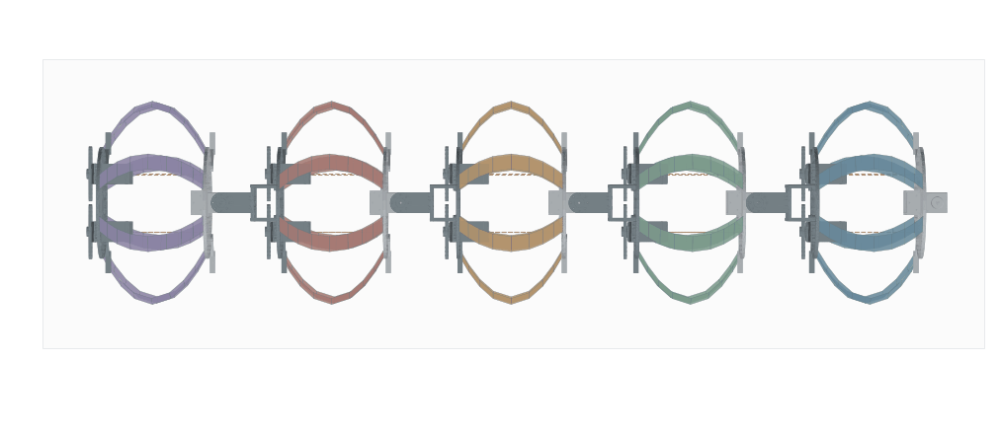
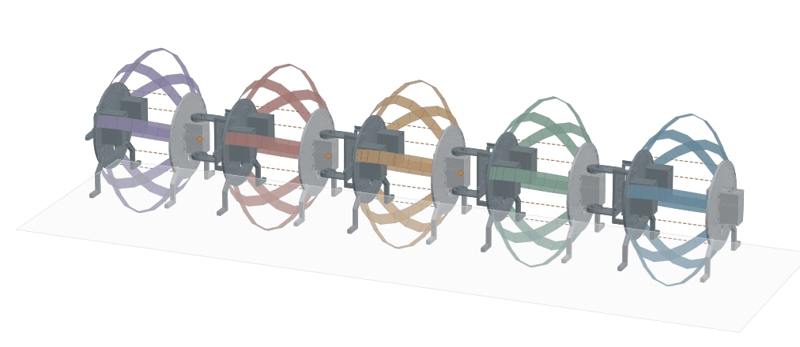

# 蛇形行波摆动：五模块 Sano/CUDA 算例

日期：2026-10-02。目标是在已接入 CAD 摆动关节的钢带机器人上计算连续蛇形行波：四个关节按顺序左右摆动，钢带形变、刚体惯性、绳索力与地面接触共同决定实际姿态。此次只施加偏航目标，不叠加主动收绳，以便单独检查蛇形关节驱动的效果。

**已完成 RTX 5090 上 4 s、两个输入周期的计算并通过保存轨迹审计：四关节实际绝对角峰值均约 29.7°–29.9°，计算循环耗时 30 分 54.31 秒。** 30° 是目标幅度，实际角度来自耦合动力学求解。此前 0.24 s 的 V6 锚点短验证和 0.4 s 的 N33 收绳算例属于不同条件，不作为本次结果。

## 模型与配置

| 项目 | 此次设置 |
| --- | --- |
| 模型范围 | 原 CAD 第 2–6 个伸缩模块；五模块子链 |
| 钢带 | 每模块 8 片，共 40 片；每片 9 节点、8 段，即 N9 粗网格 |
| 材料／截面 | Sano 带状弹性能；200 GPa、泊松比 0.3、密度 7,850 kg/m³；宽 16 mm、厚 0.15 mm |
| 刚体／关节 | 10 个独立刚体；`front3`、`front4`、`front5`、`front6` 四个 CAD 偏航铰链 |
| 关节约束 | 每关节 3 条支点重合约束、2 条轴方向约束；偏航角由动力学求得 |
| 偏航输入 | 连续正弦行波，幅度 30°，周期 2 s，相邻关节相位差 −90° |
| 启动 | 前 0.4 s 线性增加目标幅度；目标连续，但启动结束处速度不连续 |
| 电机抽象 | kp = 200 N·m/rad，PD 速度增益 = 0，电机力矩限幅 ±20 N·m |
| 被动关节阻尼 | 5 N·m·s/rad，独立于电机力矩限幅 |
| 绳索 | 共 20 根，仅受拉，等效刚度 20,000 N/m；自由长度缩短指令为 0 mm |
| 接触 | 当前形变下的钢带表面与端板圆周采样，水平地面、单边罚接触及有历史的黏着／滑移摩擦，μ = 0.4 |
| 时间 | 4 s，即 2 个输入周期；200 个主步，主步长 20 ms；保存 201 帧 |
| 求解 | 隐式 Euler、Newton／Schur 消元；CUDA FP64 钢带材料、几何接触与局部求解；仍含 CPU 调度和装配 |
| 平台 | 远程 NVIDIA GeForce RTX 5090；计算循环 1,854.310647 s，不含模型构建和绘图 |

原完整 V6 含六个伸缩模块、五个偏航关节。本算例仍缺少首模块及 `front2` 关节，不能称为完整 V6 整机。轮质量已并入所属刚体，轮自转、轮接触和舵机／连接臂 STL 碰撞尚未实现；CAD 实体仅用于重放真实求解位姿。模型没有原 V6 的刚性 slide 导向约束。

N9 是钢带的数值离散：钢片并没有切成八个互不相连的刚体。每条带的中心线节点、边扭转角和材料方向共同参与弹性能及恢复力计算。N9 用于先验证两个摆动周期，不代替后续 N17/N33 网格与时间步收敛分析。当前两端各固定两个节点，离散夹持跨度会随节点数改变；后续网格比较还需保持相同的物理夹持长度。

## 蛇形波怎样施加

复用 [full_robot.py](full_robot.py) 的既有 `_joint_command`，没有添加动画摆角。四个关节按头部至尾部排列，令 j = 0、1、2、3：

\[
\theta_j^*(t)=30^\circ\,\min(1,t/0.4)\,
\sin\!\left(2\pi t/2-j\pi/2\right).
\]

相邻关节延迟 0.5 s；启动后第一组正向目标峰值分别出现在 0.5、1.0、1.5、2.0 s。经过一个周期，目标继续按原相位演化，没有将时间对 1 s 取模。启动幅度为零，因此初始四个目标均为零。4 s 末的目标约为 `[0°, −30°, 0°, +30°]`，与启动零目标不同；不能将包含启动过程的 GIF 首尾拼接当成稳态闭合轨迹。

本次选择 `--joint-drive phase-sine`。它是新实验配置，**不声称逐值复现原 CMA-ES serpentine 锚点**。此前 `v6-snake` 直接复用原动作适配器，在 1 s 相位回绕处存在目标跳变；此次沿用现有连续正弦驱动来计算多周期摆动，电机参数仍参考原 [V6 电机抽象](../src/v6/motor_contract_v6.py)。这些增益、阻尼及力矩上限尚未用真实舵机实验标定。

电机对父子刚体施加等大反向的轴向力矩，不能直接给整机施加外部推力。钢带恢复力、惯性、被动阻尼、绳索张力和地面反力共同决定实际角度，实际角度可能滞后、过冲或达不到 30°。`--command-mm 0` 只停止主动改变绳索自由长度；转动和形变仍可能拉紧绳索，因此绳索力仍在求解。

每个主步允许自动分成更短的子步，关节目标变化上限为 2°；未收敛的候选步回滚后进行二分重试。输入检查显示启动阶段有 6 个主步超过 2°，仅由命令变化产生的接受子步预计至少为 206；接触和求解恢复可能继续增加子步数。这不是已经测得的运行迭代次数。

## 可复现入口与保存内容

[command_config.json](snake_wave_20261002/command_config.json) 保存输入公式、关节名、目标相位、参数、输入连续性检查和实际启动命令。该文件的 `command_checks_passed` 仅表示输入检查通过；完整动力学检查另见 [validation.json](snake_wave_20261002/validation.json)，运行元数据见 [summary.json](snake_wave_20261002/snake_n9_cuda/summary.json)。

在已配置项目依赖的环境中，从 `ribbon_bench` 目录执行：

```bash
env PYTHONPATH=vendor/discrete-elastic-ribbon/src OPENBLAS_NUM_THREADS=1 \
  python full_robot.py \
  --segments 5 --nodes 9 --steps 200 --dt 0.02 --duration 4 \
  --period 2 --command-mm 0 --gait backward-wave --unlocked-joints \
  --joint-drive phase-sine --joint-amplitude-deg 30 \
  --joint-kp 200 --joint-kd 0 --joint-torque-limit 20 \
  --joint-passive-damping 5 --max-command-step-mm 1 \
  --solve-backend cuda --cuda-device 0 \
  --output snake_wave_20261002/snake_n9_cuda
```

`phase-sine` 的启动时间固定为周期的 20%，本配置即 0.4 s。`--joint-startup-s` 仅用于 `v6-snake`，不改变本次启动。实际命令的 `--gait backward-wave` 是收绳函数的选项名；因 `--command-mm 0`，20 根绳索保持各自固定自由长度，**此次没有施加收缩波**，不能用该字段声称后退蠕动输入。输入展示只使用四关节的真实目标和实际摆角。

保存与核验顺序：

1. 保存 `summary.json`、`trajectory.npz`、求解日志和执行源码快照／哈希。
2. 根据保存时间重算四关节目标，检查有限值、主帧数、刚体旋转、夹持关系、CAD 支点／轴误差及源码一致性。
3. 分别统计实际摆角、目标跟踪误差、角度限位超出、电机／被动阻尼力矩、绳索张力、穿透、接受子步和墙钟耗时。
4. 由保存的钢带坐标和刚体姿态重放原 CAD 舵机、连接臂外形，导出无多余文字的俯视／斜视 GIF、PNG、SVG 和关节曲线，并核查全帧不裁切。

使用 [render_full_robot.py](render_full_robot.py) 的 `--cad-meshes` 渲染；`--mesh-lod-m 0.001` 仅简化显示 STL，和 N9 钢带力学网格无关，也不改变动力学轨迹。完整 201 帧原始结果保留；演示动画以 `--frame-stride 4` 每四个主帧取一帧，两种 GIF 均编码为 51 帧，包含末态停留，实际每轮播放 6.1 s。物理过程仍是 4 s，GIF 包含启动过程，首尾回放不代表周期稳态。

静态图选择原始第 85 帧，即 1.70 s，并非 4 s 最终姿态，也不是 GIF 的四步抽样帧。该帧五模块中心相对头尾连线的最大偏移约 45.606 mm，用于展示整体蛇形弯曲；这个量不是钢带局部形变或净前进距离。两种视角 GIF 已完成全帧边界、编码帧数和来源哈希核验，主体无裁切，见 [visual_validation.json](snake_wave_20261002/snake_n9_cuda/visual_validation.json)。

## 本次实际结果

下列数值来自本次 201 帧轨迹及接受子步的保存指标，[独立审计](snake_wave_20261002/validation.json) 状态为 `passed`。主帧统计与全部接受子步统计分别列明，不使用上一段短算例的数值。

| 核验项 | 本次实测结果 |
| --- | --- |
| 完成状态／保存帧数 | `completed`；201 帧，0–4 s |
| 四关节实际绝对角峰值 | 29.798°、29.736°、29.775°、29.874°；按 `front3` 至 `front6` 顺序，保存主帧 |
| 四关节最大绝对跟踪误差 | 2.605°、2.389°、2.720°、2.386°；保存主帧 |
| 电机／被动阻尼峰值力矩 | 9.495／8.996 N·m；保存主帧，电机未达到 20 N·m 上限 |
| CAD 角度限位超出 | 0；保存帧均位于 ±1.57 rad 内 |
| 峰值绳索张力 | 全部接受子步 5.299 N；保存主帧 5.277 N |
| 最大地面穿透／峰值总法向力 | 22.876 µm／38.484 N；穿透覆盖全部接受子步，法向力为保存主帧 |
| 支点重合／轴方向最大误差 | 4.438×10⁻¹³ m／1.905×10⁻¹¹；保存主帧 |
| 钢带夹持节点／宽度方向最大误差 | 1.110×10⁻¹⁶ m／3.497×10⁻¹⁵；保存主帧 |
| 接受子步／二分恢复增加子步 | 285／79；对应 200 个主步，恢复数不是失败主步数 |
| 最大验收残差／缩放残差 | 9.940×10⁻⁶／0.994；200 个接受主步端点，未单独保存中间子步残差 |
| 计算循环墙钟耗时 | 1,854.310647 s，即 30 分 54.31 秒；不含模型构建与绘图 |
| 总质心位移 X、Y、Z | (−0.805、+0.098、−2.601) mm；含钢带和刚体质量，总质量 3.296473 kg |

完整原始记录位于 [`snake_wave_20261002/snake_n9_cuda/`](snake_wave_20261002/snake_n9_cuda/)。6 份执行源码快照的 SHA-256 与结果元数据匹配，参数和 URDF 哈希已记录。按执行源码独立重算的目标角与保存角最大差为 5.551×10⁻¹⁷ rad，保存实际角与刚体旋转重算值最大差为 1.110×10⁻¹⁶ rad。显示的关节摆动不是后处理附加角度。

五个模块的实际最大收缩分别为 2.087、2.845、7.267、7.556、0.885 mm。虽然没有主动收绳，偏航、弹性、接触与固定自由长度绳索仍导致模块形变；不能把这些最大值排列当成已经施加或验证了收缩行波。

初始头部方向是 +X，本启动过程总质心有 −0.805 mm 的微小净后移。两个输入周期包含启动和接触沉降，尚未证明稳定周期运动或有效后退爬行；也未进行实验验证与网格收敛检查。





俯视、斜视和关节曲线均使用同一保存轨迹，图外说明作为图注保存。

## 对后续计算与论文的意义

本算例先回答“原 CAD 偏航关节能否在钢带、惯性和接触耦合下连续摆动两个输入周期”。输入波、实际关节角、钢带形变与整机位移必须分别呈现；输入连续不等于动力学已到稳态，蛇形摆动也不自动证明有净前进或后退。

两个周期已完成并通过保存轨迹数值审计。下一步在统一物理夹持跨度后，对同一输入比较 N9/N17/N33 和更短主步，检查摆角、能量、张力、接触和位移的变化，再决定是否延长到周期稳态。之后再叠加收绳波、补齐首模块与轮接触。可作为论文材料保存的内容包括目标与实际角曲线、钢带弹性能、驱动力矩及饱和比例、接触切换、步长恢复和计算成本；失败、异常穿透、限位超出及相位误差同样应保留。

此前算例、原锚点接入和模型范围详见 [JOINT_BACKWARD_WAVE.zh-CN.md](JOINT_BACKWARD_WAVE.zh-CN.md)。代码与结果沿用 [GitHub PR #2](https://github.com/Kitjesen/worm-sim/pull/2) 管理。
