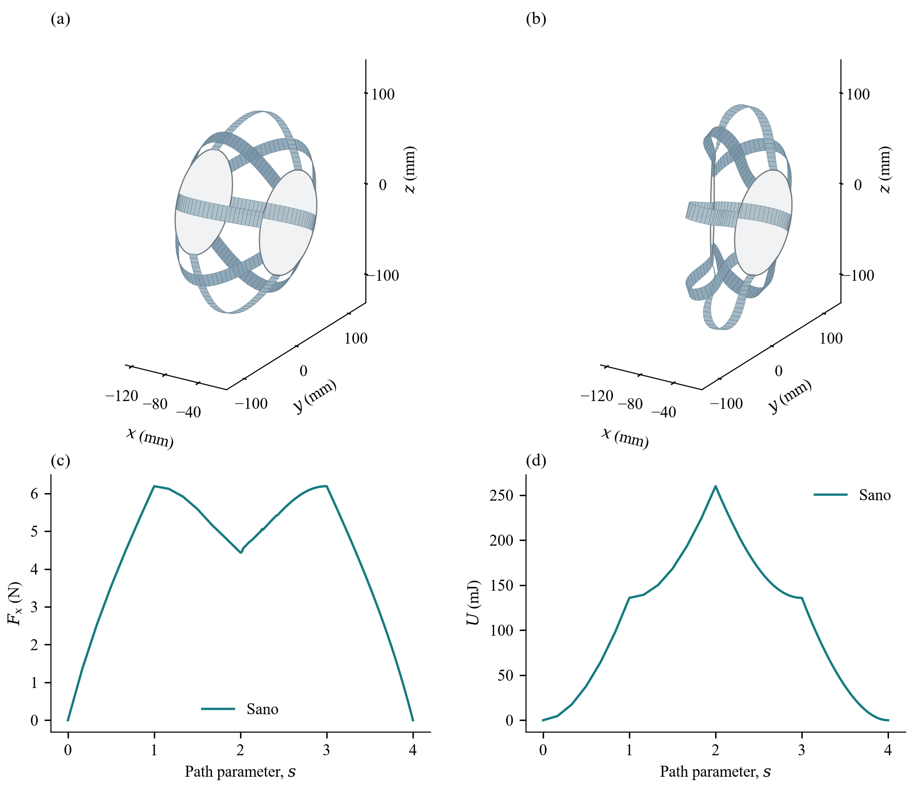

# 30°完整卸载：2026-09-30 后续计算

本目录作为原论文归档后的独立补充，文件和复现依赖的 SHA-256 见 [manifest.json](manifest.json)。原 [报告](../REPORT.zh-CN.md) 和 `publication/` 内容保留当时的加载段结果；本目录不覆盖它们。

8 片钢带、每片 33 节点，已从压缩 40 mm／偏航 30°，依次卸载偏航至 0°、解压至 0 mm。这里保留 **205 个真实平衡状态/片**：原 13 个加载状态 + 4 个原预测器卸载状态 + 188 个切线预测器卸载状态。卸载步长为偏航 0.3125°、解压 0.416667 mm；没有倒放或插值生成平衡状态。

| 核验项 | 结果 |
|---|---:|
| 全帧最大自由位置力残差 | 7.421e−7 N（阈值 1e−6 N） |
| 全帧最大自由扭转力矩残差 | 1.567e−10 N·m（阈值 1e−7 N·m） |
| 终态重新恢复并计算的力残差 | 3.662e−7 N |
| 终态相对初始节点最大误差 | 1.770e−13 m |
| 终态弹性能 | 5.558e−19 J |
| 成功卸载段实测耗时 | 416.576 s = 67.609 s 原预测 + 348.967 s 切线预测 |
| 原加载历史耗时 | 446.913 s，单独保留 |

上述回程误差衡量数值模型的回到初态程度，不代表实物精度。时间是不同会话成功路径段的实测相加，不包含失败重试、导数诊断及渲染；当时有并行任务，不能当作受控性能对比。`validation.json` 保存精确值，`diagnostic.json` 保存 188 个切线延拓步骤的实测时间、迭代数和残差。

`metadata.adaptive_subdivisions=95` 继承原加载阶段的细分计数，不是新增卸载细分数；本次卸载采用上述固定增量。

## 方法与失败历史

原求解器在 28.75°→28.4375° 卸载步失败。该非平衡迭代点存在负曲率，正则化最大 +100 不足以生成下降方向；单独将正则化按最小特征值增加到 160.145 后，该步收敛。另一单因素试验只采用平衡切线预测 `H_ff du_f = -H_fp dp`，保留原 Newton、正则化、线搜索及容差，也收敛到同一平衡（两者节点最大差 1.37e−12 m）。完整回程使用后一方案；未修改 `actuate.py` 或 vendor 的能量模型。

−158.56 是未收敛迭代点的缩放 Hessian 特征值，不是已确认的物理分岔证据。自适应正则化的单因素验证仅覆盖这一困难步，未单独验证整段回程。

完整诊断和对照脚本位于 [../prescribed_30_unload_diagnostic/DIAGNOSIS.md](../prescribed_30_unload_diagnostic/DIAGNOSIS.md)。原 30°仅加载结果和原论文图保留，以记录当时的失败状态。

## 复现

工作目录为 `ribbon_bench`，使用既有虚拟环境。脚本按自身位置解析路径，不依赖 D 盘。

```powershell
.\.venv\Scripts\python.exe prescribed_30_unload_diagnostic/tangent_trial.py
.\.venv\Scripts\python.exe prescribed_30_tangent_unload/validate.py
```

所需输入为原 `prescribed_30_refined/checkpoint.json`、其参数快照，以及保留的 `prescribed_30_unload_diagnostic/checkpoint.json`（28.75°种子）。两份检查点均有 SHA-256 断言；可选的原预测器诊断重跑会写入 `baseline_reproduction/`，保留种子。原检查点 SHA-256 为 `dfe56c6a5e9ebcbdfa21b1e45d326c5c7bc362c1e6356ce5d546b007304dd845`，种子为 `8103bc4c6226f1994e0c8cbf1e2acaff20fb1de971b207ce725361547ed26928`。依赖其上级已有的 `actuate.py`、`run.py`、参数/CAD 输入和锁定的 vendor；两条命令只重算这份后续结果，不改旧论文结果。

## 模型与图注

这是规定端板运动的准静态弹性回程，不是绳驱动达到 30° 的证明；四绳保持松弛，端板反力由外部约束承担。沿用既有材料、预弯自然形状和边界条件，未加入钢带自接触、摩擦、重力或惯性。

若随附 `simulation.gif`：205 个已求解状态原序列以 5 fps 显示，41 s 只是播放时长，不是物理仿真时长。加载和卸载采样密度不同，因此画面速度也不能当作运动速度。`preview.png`／`preview.svg` 使用相同数据与既有论文风格。



[矢量图 SVG](preview.svg) · [完整回程 GIF](simulation.gif)
