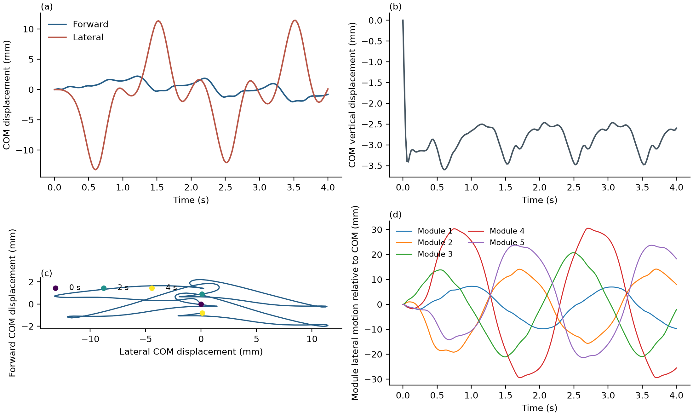
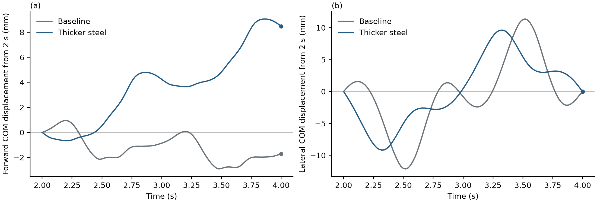
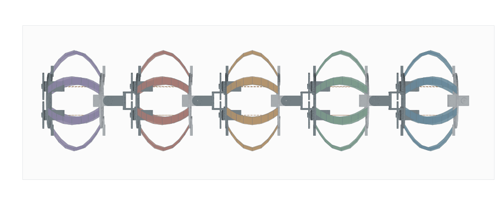

# 钢片加厚与纯蛇形摆动的整机位移核验

本次针对两个问题做可复核对照：动画中的钢片是否出现实际局部弯曲，以及提高钢片刚度后整机位移如何改变。0.15 mm 基准与 0.20 mm 加厚钢片均已完成 4 s GPU 动态轨迹及审计。加厚后钢片局部弯曲和模块压缩减小；同相位的第二周期，整机由基准后移约 1.714 mm 变为前移约 8.487 mm。这说明此数值模型的推进方向对厚度敏感，尚不构成网格/时间步收敛或实物行走结论。

## 条件与对照方法

- CAD 第 2–6 模块组成五模块子链，40 片钢片，每片 N9（9 节点、8 段），四个自由摆动关节 front3–front6。
- 沿用 `phase-sine` 指令：幅值 ±30°、周期 2 s、相邻关节相位差 90°、起始 0.4 s 线性幅值爬升。物理时间 4 s，主步长 0.02 s，共 201 保存帧。
- 纯关节驱动：主动收绳量为 0；20 根无质量、仅受拉绳索的自由长度保持不变，变形时仍可能被动产生张力。`backward-wave` 元数据不能解释成已施加收缩波。
- 同一 Sano 弹性钢带、CAD 刚体惯性、绳索和钢片表面/隔板边缘地面接触求解。关节位置增益 200 Nm/rad，速度反馈增益 0，电机力矩限制 20 Nm，被动关节阻尼 5 Nms/rad。这些驱动参数尚未实验标定。
- 独立配置只将 `strip_thickness_m` 从 0.00015 改为 0.00020；保留宽度 16 mm、杨氏模量 200 GPa、泊松比 0.3、钢密度 7850 kg/m³。原 `output/parameters.snapshot.json` 不修改。

## 加厚配置已证实的变化

| 指标 | 0.15 mm 基准 | 0.20 mm 加厚 | 比值 |
| --- | ---: | ---: | ---: |
| 轴向刚度 EA（N） | 480000 | 640000 | 1.33333 |
| 弱轴弯曲刚度 EI1（Nm²） | 0.000900 | 0.00213333 | 2.37037 |
| 强轴弯曲刚度 EI2（Nm²） | 10.2400 | 13.6533 | 1.33333 |
| 扭转刚度 GJ（Nm²） | 0.00137644 | 0.00325621 | 2.36568 |
| 40 片钢片总质量（kg） | 0.111920 | 0.149191 | 1.33301 |
| CAD 刚体总质量（kg） | 3.184552 | 3.184552 | 1 |

弱轴刚度遵循 EI1=Ewh³/12，因此增加厚度比单纯提高 E 更有针对性。Sano 的非线性弯扭耦合项和尺度参数也按新厚度重新构建；完整能量不能统一乘以 2.37037。厚度改变夹持表面半厚度偏置，初始钢片参考总长约由 148.5144 mm 变为 148.4779 mm，因此实际质量比稍偏离固定长度下的 4/3。地面刚度、摩擦系数与 CAD 刚体质量不变，钢片接触表面按新厚度更新。

`check_parameters.py` 已构建基准与加厚两套五模块模型，核验全部 40 片材料参数、零加载自然态能量、节点质量与边转动惯量，并比对加厚参数下的 CPU/CUDA 材料及表面几何公式。该公式对照在本地 CPU 上执行；加厚完整 GPU 动态轨迹另外通过 [stiff_validation.json](stiff_validation.json) 审计。[stiffness_config.json](stiffness_config.json) 保存参数哈希与材料检查结果。

## 基准钢片是否“折”

[bending_metrics.json](bending_metrics.json) 直接读取基准全部 201 帧的中心线节点，没有补帧、插值或重新求解。相邻线段夹角的初始最大值为 38.396°，全程最大值为 56.057°，出现在 t=2.16 s、模块 4（CAD 第 5 模块）第 8 片钢片的中间顶点 4，不在夹持过渡处。相对初始同一顶点的夹角最大变化为 36.340°。

所有保存帧中没有达到报告阈值 165° 的近 180° 折叠；当前边长与各自参考边长的比值为 0.999984206–1.000004405，没有显著轴向塌缩。钢片确有局部弹性弯曲，N9 约 18.56 mm 的分段也使动画中线显得有棱角。

这些是离散几何指标，包含初始无应力弓形，并非材料曲率、应变或屈服判据。当前模型没有屈服应力、硬化和塑性内变量，不能据此说钢片已产生永久折痕；夹持端原有理想化安装折边也不是此次求解预测的新塑性折叠。加密网格能改善几何分辨率，但必须保持物理夹持长度一致，才能做有效的网格收敛比较。

当前参考弓形和零装配预载仍是未测量的假设。如果实物是平直钢片被隔板弯起，需重新设置材料自然曲率并计算装配预应力；本次弓形参考态的结果不能直接用于判断该实物是否屈服。真实永久折痕还需要钢材牌号、屈服/硬化参数与安装折边半径。

## 基准整机移动的独立核验

[baseline_movement.json](baseline_movement.json) 将全部 CAD 刚体质量与全部钢片平动节点质量纳入总质心，绳索无质量；计算使用保存的惯性世界坐标，没有相机跟随、居中或视图变换。逐点加权与独立求和的质心误差为 1.11×10⁻¹⁵ m，同时检查了整体平移不变性、summary/NPZ 坐标一致性与模块长度重建。

| 时间窗 | 质心纵向位移（mm） | 质心横向位移（mm） | 质心竖向位移（mm） | 解释 |
| --- | ---: | ---: | ---: | --- |
| 0–2 s | +0.909302 | +0.067601 | −2.601914 | 包含起始落地与形状建立，首末指令形状不同 |
| 2–4 s | −1.714177 | +0.030674 | +0.000956 | 同目标相位、不含起始爬升的一个周期 |
| 0–4 s | −0.804875 | +0.098275 | −2.600958 | 整段含起始过程的净变化 |

2 s 与 4 s 的关节目标一致，实际角最大差只有 0.000572°；去掉整体平面平移和偏航后，五模块中心形状 RMS 差为 0.013218 mm。五个模块中心的纵向位移分别为 −1.720109、−1.723714、−1.722998、−1.713618、−1.700028 mm，首末隔板也同向移动。因此保存轨迹中确实存在整机一致的小幅后移，不能仅凭整体动画看起来原地摆动而否定它。

这一周期平均纵向速度为 −0.857089 mm/s。全程质心水平累计路程为 120.3815 mm，净水平位移仅 0.810852 mm，表示大部分运动仍是往复摆动。只有一个启动后周期，尚不能证明长期稳态推进。基准轨迹未保存完整切向地面合力、冲量与速度历史，无法独立闭合动量账；加厚运行已加入这些只读观测量，不改变求解力学。



## 0.20 mm 完整动态结果

加厚运行目录为 [t020_n9_cuda](t020_n9_cuda/)，包含 201 帧原始 `trajectory.npz`、`summary.json`、执行日志和六份执行源码快照。完整审计核对参数/CAD/源码哈希、目标波形、关节轴线与枢轴、夹持端与绳索附着、力矩律及主步收敛，全部通过；接触力、动量等新增字段仅为已接受步的观测。

| 动态指标 | 0.15 mm 基准 | 0.20 mm 加厚 |
| --- | ---: | ---: |
| 最大实际关节峰值（°） | 29.8739 | 29.9136 |
| 全关节最大目标跟踪误差（°） | 2.7201 | 2.7578 |
| 最大模块压缩（mm） | 7.5556 | 3.6660 |
| 最大相邻钢片线段转角（°） | 56.0574 | 47.7550 |
| 同一顶点相对初始的最大转角变化（°） | 36.3401 | 14.9208 |
| 最小边长/参考边长 | 0.999984206 | 0.999983039 |
| 最大边长/参考边长 | 1.000004405 | 1.000007040 |
| 保存帧电机峰值力矩（Nm） | 9.4948 | 9.6265 |
| 保存帧被动阻尼峰值力矩（Nm） | 8.9955 | 9.0327 |
| 全部已接受子步峰值绳索张力（N） | 5.2990 | 5.0316 |
| 全部已接受子步最大地面穿透（µm） | 22.8757 | 27.4069 |
| 保存帧最大地面法向合力（N） | 38.4839 | 35.6768 |
| 已接受子步总数 / 恢复细分次数 | 285 / 79 | 255 / 49 |
| 主步末最大归一化残差 | 0.994019 | 0.963546 |
| 4 s 物理过程的步进墙钟时间（s） | 1854.3106 | 1796.4483 |

加厚运行四个关节峰值依次为 29.7876°、29.7375°、29.8442°、29.9136°；最大跟踪误差依次为 2.5835°、2.4464°、2.7578°、2.3667°，均未超出 CAD 关节限位。五模块最大压缩依次由基准的 2.0873、2.8450、7.2672、7.5556、0.8853 mm 降为 0.7342、1.4046、3.6660、3.1361、0.0978 mm。

加厚后局部转角最大值 47.755° 出现在 t=3.88 s、模块 3（CAD 第 4 模块）第 8 片钢片顶点 4；相对初始的最大夹角变化 14.921° 出现在 t=0.92 s、模块 4（CAD 第 5 模块）第 6 片钢片顶点 3，两处均非夹持过渡。所有保存帧无 ≥165° 近折叠，边长没有明显塌缩。因此本工况的钢片形变明显减小，但仍会弯曲。两组初始最大相邻边转角为 38.396° 和 38.420°，均包含假设的自然弓形，不能当作新发生的折痕。

加厚耗时约 29 分 56 秒，基准约 30 分 54 秒，不含模型构建和动画渲染。两组只有各一次运行，步进细分数量不同，并非专门性能基准；不能把约 3% 的墙钟差解释为已经完成 GPU 加速优化。主步残差审计限于全部 200 个保存的已接受主步末端，中间子步未逐一保存完整残差。

## 加厚后的整机位移与动量核验

[stiff_movement.json](stiff_movement.json) 沿用基准的独立世界坐标质心算法；逐点加权与独立求和误差为 9.44×10⁻¹⁶ m。2–4 s 的同目标相位、实际关节最大差为 3.10×10⁻⁶°，模块中心最佳平面对齐后的 RMS 差为 0.0001624 mm。全部钢片节点最佳三维刚体对齐后的 RMS 差为 0.0001928 mm、最大差为 0.0003787 mm。后者表明保存离散形状在相位端点高度复现，不能代替网格和时间步收敛。

| 时间窗 | 加厚质心纵向位移（mm） | 加厚质心横向位移（mm） | 加厚质心竖向位移（mm） |
| --- | ---: | ---: | ---: |
| 0–2 s，含启动 | +8.710450 | −4.795224 | −0.575384 |
| 2–4 s，同相位 | +8.486895 | −0.045058 | +0.000007 |
| 0–4 s | +17.197345 | −4.840281 | −0.575377 |

同相位第二周期的五模块前移依次为 8.486906、8.486879、8.486910、8.486868、8.486898 mm；首末隔板分别前移 8.486931、8.486933 mm，整机移动一致，平均纵向速度为 +4.243447 mm/s。基准该周期为 −1.714177 mm、−0.857089 mm/s，而加厚为正向移动。全程加厚质心水平累计路程为 85.2597 mm、净水平位移为 17.8655 mm；整体往复运动仍存在。

新增观测记录全部刚体和钢片平动节点总动量，以及每个已接受子步的地面与重力冲量；被拒绝的试算不计入冲量。200 个主步的 `ΔP − J_ground − J_gravity` 最大分量误差为 1.93×10⁻¹³ N·s，全部通过由求解器力残差上界推导的动量误差界 `Δt × 10⁻⁵ × 210` N·s，并未放宽求解阈值。150 个只包含一个子步的主步还以 `M·ΔCOM/dt` 独立重建端点动量，最大误差 2.62×10⁻¹⁴ kg·m/s。多子步主步不能用一个主步的平均速度代表最后子步端点速度，故没有用该错误关系作判据。

全程累积地面冲量为 [−0.0242433, −0.0897832, +130.811176] N·s，重力冲量为 [0, 0, −130.816079] N·s，整段动量差与外部冲量差为 [−4.71×10⁻¹³, −8.85×10⁻¹⁵, +2.84×10⁻¹⁴] N·s。净位移是速度历史的积分，与最终动量或总切向冲量不是同一物理量，不能只用总切向冲量正负解释前进方向。

法向合力与合力 Z 分量一致，法向力/冲量非负，μ=0.4 下合力和累计接触冲量的 Coulomb 锥检查通过。此核验的范围是保存的最后子步端点地面合力与已接受子步累计冲量，不包含逐采样点接触历史，也不证明摩擦参数实验正确。基准没有这些新增记录，无法追溯完成同样的动量核验。



俯视与斜视动画均由同一完整轨迹重放；各编码 51 帧，含末态停留，每轮播放 6.1 s。201 帧原始数据全部保留，物理过程仍为 4 s。静态 PNG/SVG 取第 85 帧、1.70 s，便于和薄钢片算例比较。CAD 的 1 mm 显示 LOD 不改变力学网格或接触模型。[视觉核验](t020_n9_cuda/visual_validation.json) 已通过全帧裁切、播放时长、参数及来源哈希检查。



[斜视动画](t020_n9_cuda/robot_motion.gif) 和同目录 PNG/SVG、关节及能量指标图均已保存。

## 解释、局限与后续验证

这组对照支持“钢片加厚后局部变形减小，整机在同相位周期中产生一致前移”的有限结论。厚度同时改变 EA、两轴 EI、GJ、Sano 非线性参数、钢片质量和表面几何，接触/滑移过程也随求解改变，不能把推进变化孤立归为某一个刚度参数。推进方向从基准后移转为加厚前移，提示后续需要做厚度、步长、网格和摩擦敏感性对照，保留无驱动控制组并计算更多启动后周期。

动量闭合说明所记录的数值轨迹在本离散模型中满足整体平动力学账，并不等于实物模型已经可信或长期稳态行走已证实。所有结论限于五模块子链；完整 V6 首模块、轮子滚动/接触、钢片间自接触和 CAD 舵机/连接件网格碰撞尚不在本模型内。参考自然弓形、零装配预载、钢材牌号和屈服参数仍未测量，应按实物补齐后再判断真实钢片是否产生永久折痕。

## 复跑与审计入口

从 `ribbon_bench` 执行，先设置 `PYTHONPATH=vendor/discrete-elastic-ribbon/src` 与 `OPENBLAS_NUM_THREADS=1`。本次远程为 Python 3.11.16、NumPy 1.26.0、SciPy 1.15.3、Torch 2.7.0+cu128，详见 [environment.json](t020_n9_cuda/environment.json)。NumPy 1.x 缺少 `np.concat`，实际执行前使用 alias wrapper；[remote_run_wrapper.snapshot.py](t020_n9_cuda/remote_run_wrapper.snapshot.py) 保存了实际远程入口，哈希与环境记录一致。仓库通用 `remote_run_wrapper.py` 与该快照字节不同，在此次环境下提供相同兼容处理。

GPU 完整计算的复跑命令为：

```text
python remote_run_wrapper.py --parameters stiff_snake_20261002/parameters_t020mm.json --segments 5 --nodes 9 --unlocked-joints --joint-drive phase-sine --joint-amplitude-deg 30 --joint-kp 200 --joint-kd 0 --joint-torque-limit 20 --joint-passive-damping 5 --gait backward-wave --command-mm 0 --period 2 --duration 4 --steps 200 --dt 0.02 --max-command-step-mm 1 --solve-backend cuda --output stiff_snake_20261002/t020_n9_cuda
```

同路径重跑会覆盖该运行的输出；保留归档结果时，将 `--output` 换成新的目录。计算完成后执行以下审计与绘图命令：

```text
python stiff_snake_20261002/check_parameters.py
python snake_wave_20261002/check.py snake_wave_20261002/snake_n9_cuda --output stiff_snake_20261002/baseline_validation.json
python snake_wave_20261002/check.py stiff_snake_20261002/t020_n9_cuda --parameters stiff_snake_20261002/parameters_t020mm.json --output stiff_snake_20261002/stiff_validation.json
python stiff_snake_20261002/check_bending.py snake_wave_20261002/snake_n9_cuda stiff_snake_20261002/t020_n9_cuda
python stiff_snake_20261002/movement.py snake_wave_20261002/snake_n9_cuda --output stiff_snake_20261002/baseline_movement.json
python stiff_snake_20261002/movement.py stiff_snake_20261002/t020_n9_cuda --output stiff_snake_20261002/stiff_movement.json --compare stiff_snake_20261002/baseline_movement.json
python stiff_snake_20261002/render_and_check.py
```

完整轨迹审计已新增可选 `--parameters`，默认仍使用原参数，没有放松 201 帧、N9、关节约束、刚体夹持、力矩与收敛阈值。加厚运行应传入 `--parameters stiff_snake_20261002/parameters_t020mm.json`，并将结果另存 `stiff_snake_20261002/stiff_validation.json`，原实验结果与审计保持原样。
