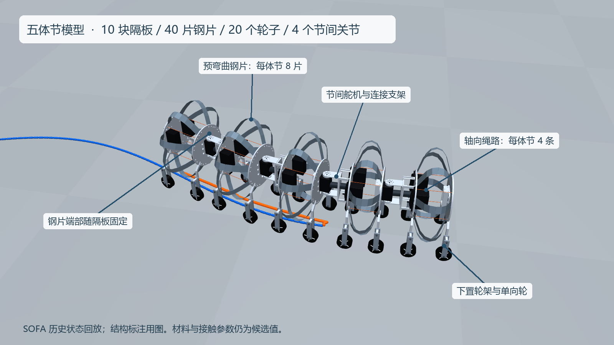

# 与参考会话一致的五体节机器人

本目录将用户在另一会话中已经调整好的 SOFA 整机、CAD 资源和历史运动记录同步到当前仓库，作为当前结构展示入口。来源会话：`01a0eeb1-5542-73d1-9b1c-f2da9e0926c3`。原目录未修改；逐文件来源、复制时刻和 SHA-256 见 [upstream_snapshot.json](upstream_snapshot.json)。



[16 秒正常速度视频](sofa_dr_runs/retrograde_wave_20261002T050058Z/whole_sofa_follow.mp4) · [1× GIF](sofa_dr_runs/retrograde_wave_20261002T050058Z/whole_sofa_follow.gif) · [无标注截图](sofa_dr_runs/retrograde_wave_20261002T050058Z/whole_sofa_follow_400.png) · [原始状态](sofa_dr_runs/retrograde_wave_20261002T050058Z/whole_rollout.npz)

## 本次具体调整

- 将首页主展示从六体节 V6 切到用户指定的五体节模型；旧结果单独保留。
- 同步 10 块隔板、40 片钢片、20 条绳跨、20 个轮子和 4 个节间关节；带入舵机、连接支架、末端裁剪后的 CAD 外观及下置轮架。
- 钢片端部使用隔板上的夹持孔对中点作为局部连接位置，随隔板一起运动。物理模型的两端截面直接使用隔板刚体自由度和固定局部变换；显示也使用同一连接位置。没有沿用旧 V6 的缩短显示跨度。
- 重新渲染完整历史状态序列，保留 1× 时间，生成结构标注与可运行的数据检查。**本次没有重新求解动力学，也没有重新训练策略。**

## 现在用什么算钢片

这套整机采用 **SOFA + BeamAdapter 的矩形截面预弯曲梁**，不是之前 `ribbon_bench/` 中的 Sano Discrete Elastic Ribbons。`sofa_worm_env.py` 建立耦合刚体／梁系统，使用隐式 Euler 积分和稀疏 LDL 求解。MuJoCo 在此仅用于姿态工具和 CAD 回放渲染，没有调用它重新计算运动。

| 项目 | 本次记录实际采用的配置 |
| --- | --- |
| 体节／隔板 | 5／10 |
| 钢片 | 每体节 8 片，总计 40 片 |
| 离散 | 每片 8 个梁单元、9 个节点位置；两端共用隔板刚体自由度 |
| 总状态 | 10 个隔板 + 280 个梁内部节点，共 290 个刚体截面姿态 |
| 钢片基准参数 | 宽 16 mm、厚 0.15 mm、杨氏模量 200 GPa、自然拱高候选 50.5 mm |
| 绳索 | 每体节 4 条，只承拉的无质量弹性绳；舵盘接触以圆周切线／包角收绳量近似 |
| 接触 | 平地轮接触，切向记忆、黏着／滑动切换、轮转动及单向离合近似 |
| 驱动 | 10 路体节收绳驱动 + 4 路节间转向输入 |

配置 JSON 来自共用的单体节候选文件，其中 `elements_per_strip=12`、柔性绳等字段不等于本整机程序的实际设置：整机构造器默认 `elements=8`，保存数据也明确为 9 节点。以上材料值是基准候选值；环境支持随机化，历史运行的全部材料倍率没有写进该 NPZ，因此不能仅凭当前 JSON 完全恢复当次材料实例。

## 已保存的演示结果

回放文件夹 `retrograde_wave_20261002T050058Z` 是另一会话已经完成的 SOFA 计算。这里复制的是随后取到的代码快照；保留哈希可核对来源，但不能证明此代码快照就是当次运行的逐字版本。

| 原报告指标 | 数值 |
| --- | ---: |
| 物理时长／视频时长 | 16 s／16 s |
| 原计算墙钟时间 | 274.79 s（来自原报告，本次没有重新计时） |
| 头部前进距离 | 0.9223 m |
| 路径横向误差 RMS／最大 | 17.64／31.00 mm |
| 长度跟踪误差 RMS | 1.80 mm |
| 收缩波周期／相邻体节延迟 | 4.00／0.65 s |

控制器是“头到尾收缩波 + 长度反馈 + 关节／路径反馈”，不是新训练出来的 RL 策略。后退波描述收缩波传播方向，不表示整机向后行走。这段历史回放也不是后来提出的四状态、每次切换 1 秒的控制实验。

数据包含 800 个 50 Hz 状态，视频每隔一个状态取一帧，以 25 fps 播放，共 400 帧；动画没有放大运动幅度。标注图单独保存，视频不加上下说明文字。

## 复现与检查

仅重放不需要 SOFA。使用 Python 环境中的 `numpy`、`mujoco`、`Pillow`、`imageio-ffmpeg`，在仓库根目录运行；原渲染器使用 Windows 微软雅黑字体：

```powershell
python single_segment/record_sofa_policy.py single_segment/sofa_dr_runs/retrograde_wave_20261002T050058Z --whole --clean --follow
python single_segment/check_snapshot.py
```

检查程序核对复制文件哈希、状态有限性、截面四元数、40 片钢片端点与隔板索引、内部节点完整性、轮子和驱动数量、实测隔板间距，以及 MP4 全帧解码、尺寸和时长。结果写入 [snapshot_check.json](sofa_dr_runs/retrograde_wave_20261002T050058Z/snapshot_check.json)。这能验证数据与回放连接关系，不能替代力平衡、接触收敛和实物实验。

重新求解需要可用的 SOFA Python、BeamAdapter、Gymnasium 环境；`sofa_path_demo.py` 还导入 stable-baselines3 和 PyTorch。此目录不包含原会话训练脚本／策略权重；旧渲染器的单片 `collect` 功能依赖未迁入的 `train_sofa_dr.py`，请使用上述已验证的整机回放命令。

## 下一阶段的边界

先以这套结构做单体节收紧／松开／左右差动和整机短距离回归，再重跑短路径。旧 V6 的 FDU BSRL 和 A* 距离、误差、速度不转移到本模型。

自然曲率、装配预载、钢材与轮胎参数、45 mm 下置轮架和绳路仍需实物标定。当前整机使用等效绳索与轮接触，**不包含钢片碰地、钢片自接触或完整绳索与舵盘的接触求解**；记录中的非轮部件间隙只是代理检查。原渲染器将钢片显示为 0.30 mm 厚，而物理基准厚度为 0.15 mm，此处保留来源外观，不能从图量取钢片厚度。后续如比较 Sano 与 SOFA，必须先统一端部约束、自然形状、材料和接触条件。
