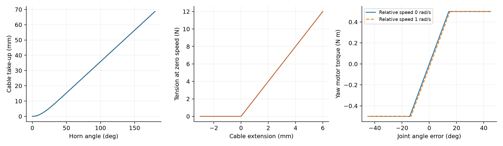
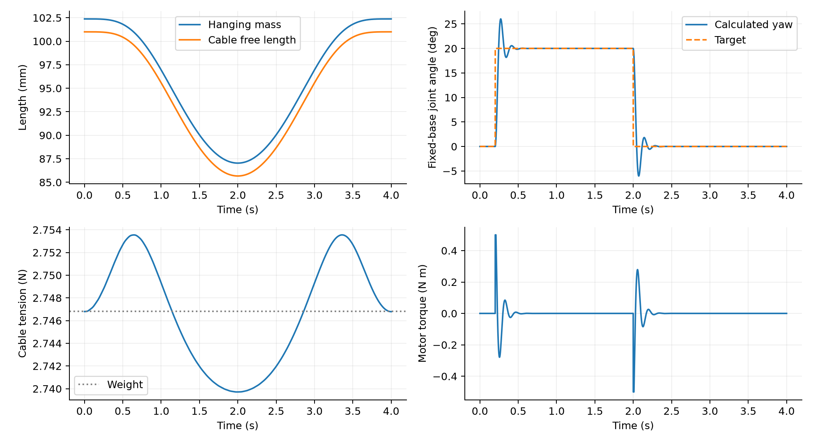
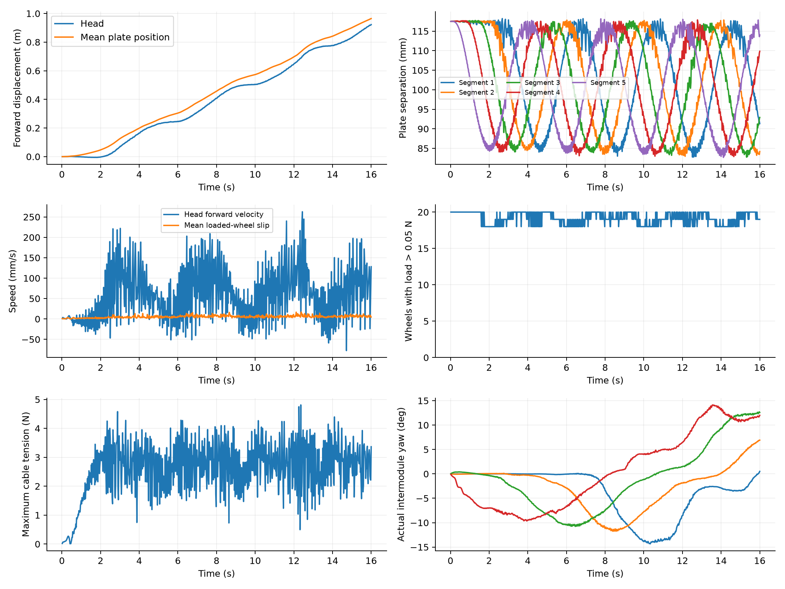

# 绳索、节间关节、轮地接触：代码方程与可复现实验

本报告针对当前五体节 SOFA 候选模型，依据冻结的 [sofa_worm_env.py](../sofa_worm_env.py)。原文件 SHA-256：add2b651e1e8d6215172dde091fbaf1c6ad680792249df9ec004579b00fd2bd4。

本次新计算：单轮接触试验、绳索吊载试验、固定基座关节试验。整机部分重新分析和渲染已有 16 秒数据，**没有重新求解五体节动力学，也没有运行新的 PPO 或纯蛇形整机实验**。

## 1. 模型清单

| 部件 | 状态 | 计算方式 | 重要近似 |
| --- | --- | --- | --- |
| 10 块隔板 | 位置、姿态、线速度、角速度 | SOFA 刚体截面 | 集总硬件质量与惯量 |
| 40 片钢片 | 每片 7 个内部截面，两端共用隔板自由度 | BeamAdapter 预弯矩形梁，8 单元／片 | 未标定自然形状、材料及预载；无钢片碰地／自接触 |
| 20 条绳 | 端点距离、10 个舵盘角度 | 单边弹簧＋阻尼、几何收绳 | 无质量、无绳形自由度、无完整绕盘接触 |
| 4 个节间连接 | 相对位置、方向和偏航角 | 平移罚弹簧／阻尼，轴线对齐力矩，偏航 PD | 非精确刚性铰链 |
| 20 个轮子 | 轮速、轮角、切向接触记忆 | 解析轮平面接触与转动更新 | 理想单向离合、规则平地 |
| 控制器 | 10 路收绳＋4 路关节目标增量 | 本段采用设计波形和反馈 | 没有加载 RL 权重 |

## 2. 绳索的方程

两隔板位置为 $\mathbf x_a,\mathbf x_b$，转动矩阵为 $R_a,R_b$，绳端局部坐标为 $\mathbf a,\mathbf b$：

$$
\mathbf p_a=\mathbf x_a+R_a\mathbf a,\quad
\mathbf p_b=\mathbf x_b+R_b\mathbf b,\quad
\ell=\|\mathbf p_b-\mathbf p_a\|,\quad
\mathbf n=(\mathbf p_b-\mathbf p_a)/\ell .
$$

端点速度包含隔板转动：

$$
\dot\ell=\mathbf n^\mathsf T[
\mathbf v_b+\boldsymbol\omega_b\times R_b\mathbf b
-\mathbf v_a-\boldsymbol\omega_a\times R_a\mathbf a].
$$

当前用“直线弦长，随后切线＋圆弧”计算增加的舵盘绳路长度，即等效收绳量；不是恒定半径卷筒：

$$
\alpha=\arccos(r/g),\qquad
s(\theta)=
\begin{cases}
\sqrt{g^2+r^2-2gr\cos\theta}-(g-r),&\theta\le\alpha,\\
\sqrt{g^2-r^2}+r(\theta-\alpha)-(g-r),&\theta>\alpha.
\end{cases}
$$

$r=23.5\rm\,mm,\ g=35\rm\,mm$，轴向自由长度：
$$
\ell_0(\theta)=0.101-s(\theta)\quad[\rm m].
$$

每台收绳舵机同时改变同侧两条绳的自由长度。实际舵盘轮廓、绳路导向与绑定点仍需实物确认。张力严格按当前代码写成：

$$
T=
\begin{cases}
0,&\ell<\ell_0,\\
\max[0,\ k_c(\ell-\ell_0)+c_c\dot\ell],&\ell\ge\ell_0,
\end{cases}
\qquad
k_c=2000\rm\,N/m,\quad c_c=0.5\rm\,Ns/m.
$$

静止时绳被拉长 1 mm，张力为 2 N；松弛时为 0。当前阻尼使用端点间距变化率 $\dot\ell$，**不是** $\dot\ell-\dot\ell_0$；不能把实现误写成对全部时变伸长求导的 Kelvin–Voigt 模型。弹性储能为 $U_c=\tfrac12 k_c\max(\ell-\ell_0,0)^2$，舵机改变 $\ell_0$ 可向系统输入或取走能量。

两个绳端承受等大反向力及偏心力矩：
$$
\mathbf F_a=T\mathbf n,\quad \mathbf F_b=-T\mathbf n,\qquad
\boldsymbol\tau_a=(R_a\mathbf a)\times\mathbf F_a,\quad
\boldsymbol\tau_b=(R_b\mathbf b)\times\mathbf F_b.
$$

舵机采用带负载降速的角度执行器，不是完整转子动力学。物理子步的收紧增量：
$$
\Delta\theta=
\operatorname{clip}(\theta^*-\theta,-2h,2h)
\operatorname{clip}(1-\tau_{\rm load}/0.5,0,1).
$$

最后一个因子只在收紧时使用；$\tau_{\rm load}=(T_{\rm upper}+T_{\rm lower})s'(\theta)$。放松仍受角速度限制。0.5 Nm 是候选堵转参数。

## 3. 柔性连接约束

偏离连接位置会产生恢复力，并非刚性铰链精确锁定。父隔板局部连接向量
$\mathbf a_J=(-0.058,0,-0.0010452742534)\rm\,m$：

$$
\mathbf e=\mathbf x_b-\mathbf x_a-R_a\mathbf a_J,\qquad
\mathbf v_e=\mathbf v_b-\mathbf v_a
-\boldsymbol\omega_a\times(\mathbf x_b-\mathbf x_a),
$$
$$
\mathbf F_b=-10000\,\mathbf e-10\,\mathbf v_e,\qquad
\mathbf F_a=-\mathbf F_b.
$$

代码速度项使用**实际隔板间距向量**，不是严格的 $\dot{\mathbf e}$；连接误差小时二者接近。父隔板还接收
$-(\mathbf x_b-\mathbf x_a)\times\mathbf F_b$ 补偿力矩，使这组内力合力矩闭合。误差 1 mm、相对速度为零时，恢复力为 10 N。

令 $R=R_a^\mathsf T R_b$，偏航角 $q=\operatorname{atan2}(R_{21},R_{11})$，父隔板轴线 $\mathbf z_a=R_a(0,0,1)^\mathsf T$：

$$
\tau_{\rm yaw}=
\operatorname{clip}
\{2(q^*-q)-0.03[(\boldsymbol\omega_b-\boldsymbol\omega_a)\cdot\mathbf z_a],
-0.5,\ 0.5\}\quad[\rm Nm].
$$

轴线对齐还单独加入：
$$
\boldsymbol\tau_{\rm align}
=20(\mathbf z_b\times\mathbf z_a)
-0.1[\Delta\boldsymbol\omega-\mathbf z_a(\Delta\boldsymbol\omega\cdot\mathbf z_a)] .
$$

$\boldsymbol\tau_b=\tau_{\rm yaw}\mathbf z_a+\boldsymbol\tau_{\rm align}$，另一侧取反。**0.5 Nm 只限制偏航电机项，不限制轴线对齐项或全部连接反力矩。** 视频记录的最大连接位置误差为 0.701 mm，不能称为严格刚性铰接。

新计算的独立台架：左侧为 0.28 kg 吊载由绳索牵引，舵盘角在 4 秒内按 0–50°–0 变化；右侧为固定基座、转动惯量 $0.0009\rm\,kg\,m^2$ 的单关节接受 20° 阶跃后回到 0°。采用上述本构式、0.5 ms 半隐式速度更新。**台架没有钢片，不是整机收缩或转弯性能。**

## 4. 轮地接触、黏着和滑动

**黏着**指接触处近似不滑；**黏性阻尼**指与速度相关的阻力。滚动时接触点可以近似黏着，但轮心照样前进。

轮半径 $r_w=18\rm\,mm$。根据轮轴方向求最低轮缘到地面的高度，得到压入量 $\delta$。离地时不施加接触力，并清空切向记忆；接触时：

$$
N=\max(0,5000\,\delta-8\,v_n).
$$

这是允许微小压入的罚接触，不是精确不可穿透约束。以滚动方向、横向作为局部二维坐标，记轮缘随隔板运动的速度为 $\mathbf v=(v_\parallel,v_\perp)$，轮速为 $\omega$，则滑移速度：

$$
\mathbf u=(v_\parallel-r_w\omega,\ v_\perp).
$$

不能直接把轮心速度当成打滑速度：只要 $v_\parallel\approx r_w\omega$，纵向就接近纯滚动。

切向弹簧记忆为 $\boldsymbol\xi$，$k_t=2000\rm\,N/m,\ c_t=8\rm\,Ns/m$；摩擦上限为 $\mu N$，基准 $\mu=0.8$，随机化运行还乘候选倍率。

下面是代码每步 $h$ 的预测／投影／修正次序。轮惯量 $I=\tfrac12(0.009)r_w^2$，滚阻矩：
$$
\tau_r=\min[0.015Nr_w+2\times10^{-6}\omega_n,\ I\omega_n/h].
$$
$$
A=k_th+c_t,\quad \mathbf b=-k_t\boldsymbol\xi_n-A\mathbf v,
$$
$$
\widetilde\omega=
\max\left[0,\frac{\omega_n-h(r_w b_\parallel+\tau_r)/I}
{1+h r_w^2 A/I}\right],\qquad
\widetilde{\mathbf F}=\mathbf b+A(r_w\widetilde\omega,0).
$$

超出摩擦圆时投影：
$$
\mathbf F=
\begin{cases}
\widetilde{\mathbf F},&\|\widetilde{\mathbf F}\|\le\mu N,\\
\mu N\,\widetilde{\mathbf F}/\|\widetilde{\mathbf F}\|,&\text{否则}.
\end{cases}
$$

再计算轮速，并通过单向离合限制反转：
$$
\omega_{\rm free}=\omega_n-h(r_wF_\parallel+\tau_r)/I,\qquad
\omega_{n+1}=\max(0,\omega_{\rm free}).
$$

黏着分支累积 $\boldsymbol\xi_{n+1}=\boldsymbol\xi_n+h\mathbf u$；滑动分支重置为
$\boldsymbol\xi_{n+1}=-(\mathbf F+c_t\mathbf u)/k_t$，避免记忆无限增长。离合反力矩 $I(\omega_{n+1}-\omega_{\rm free})/h$ 和滚阻反作用传回隔板。

这是有弹性记忆的正则化黏着／滑动近似。代码预测轮速、限幅摩擦后只修正一次轮速，没有迭代求解严格的库仑互补约束；摩擦限幅分支也不能等同于零／非零滑移的完美分类。

### 新运行的单轮实验

固定法向载荷 1.4 N、承载质量 0.14 kg、基准摩擦 0.8，摩擦上限 1.12 N。每组运行 2.5 秒，步长 0.5 ms，直接使用原源码的轮接触函数。

| 输入 | 计算结果 |
| --- | --- |
| 反向外力 0.5 N | 锁止，最终位移 −0.25 mm，最终速度约 0；小位移来自接触弹簧建立支撑 |
| 反向外力 1.15 N | 超过 1.12 N 上限，持续滑动，最终速度约 −0.583 m/s |
| 正向外力 0.05 N | 被动滚动，最终轮心速度约 0.477 m/s，而滑移约 $5.4\times10^{-7}$ m/s |
| 初始向前速度 0.1 m/s，撤去外力 | 滚阻使其停下，总前进约 33.7 mm |

持续外力是诊断输入，不是机器人电机推力，也不是整机试验。动画各格使用独立标尺、放大轮子显示半径，以 1× 播放。

[单轮实验动画](wheel_tests.gif) · [完整曲线](wheel_tests.png) · [原始数据](wheel_tests.npz)

## 5. 为什么看起来滑得猛、蠕动却不前进

补充的固定镜头与先前跟随视角使用完全相同的 800 个 SOFA 状态，没有修改轨迹、速度或摩擦：

[16 秒固定镜头 MP4](../sofa_dr_runs/retrograde_wave_20261002T050058Z/whole_sofa_studio.mp4) · [固定镜头 GIF](../sofa_dr_runs/retrograde_wave_20261002T050058Z/whole_sofa_studio.gif)

| 16 秒记录 | 数值／含义 |
| --- | --- |
| 头部净前进 | 0.9223 m |
| 头部平均向前速度 | 57.64 mm/s |
| 头部最大保存步速度 | 262.75 mm/s，为 20 ms 位移差分值 |
| 每 4 秒的头部净前进 | 163.8、243.7、239.5、275.3 mm |
| 承重轮平均滑移的时间平均 | 5.51 mm/s |
| 最大一帧的承重轮平均滑移 | 16.96 mm/s，不是最差单轮滑移 |
| 承重轮数 | 每帧 18–20 个，平均 19.14 个，以载荷 > 0.05 N 计数 |
| 最大记录绳张力 | 4.81 N |

数据有实际前进，也有真实滑移；“全部是镜头错觉”不成立。“整机前进快”等同于“轮子打滑严重”同样不成立。

头部速度曲线还存在明显的快速振荡，保存步速度最低为 −77.50 mm/s，最高为 262.75 mm/s。它同时包含体节变形与整体平移，不能直接当成整机质心速度。目前无法仅凭 50 Hz 保存数据判定振荡来自真实柔性振动、接触／控制抖振还是采样影响；应以 0.5 ms 与 0.25 ms 物理步长对照，并保存逐轮子步接触数据，再判断是否要调整阻尼或接触求解。不要靠提高摩擦系数或加速播放掩盖问题。

轮子大多持续承重，允许方向是低滚阻的被动滚动，不会形成锚定脚式的整块体节长时间不动。跟随相机抵消了大部分整体平移。因此需要同时看固定地面、轮辐转动和滑移数值。速度起伏也表明推进并不匀速。

原始记录没有逐轮保存法向力、切向力、瞬时轮速、接触记忆和限幅分支，尚不能可靠指出哪一帧哪个轮达到摩擦极限或给出精确黏着时间比例。累计轮角有保存，但按 20 ms 差分反推不是物理子步的原始轮速。下一次整机运行应直接记录这些量，并以颜色标明滚动、黏着、滑动、离地。

## 6. 有没有做纯蛇形

当前五体节回放是**设计蠕动波＋路径转向**：4 秒收缩周期、相邻延迟 0.65 秒；节间角来自路径反馈。它不是传播的纯蛇形正弦波，也没加载 PPO。

过去的 V6 刚体、Sano 模型做过蛇形实验，但结构、轮子、弹性与控制条件不同，不能据此认定当前 SOFA 模型的蛇形一定更快。此次检查的当前导入数据中没有同模型的纯蛇形对照。

下一个整机对照应固定材料、轮子、摩擦、初态和时长：A 组仅蠕动，节间目标为零；B 组固定收绳命令，仅施加小幅节间相移正弦波；C 组二者组合。固定收绳命令不等于锁死钢片或体节长度。统一比较净位移、稳态速度、逐轮滑移、能耗、峰值张力和横向漂移，并记录失败。当前混合路径回放不能替代这个实验。

## 7. 求解次序与复现

每个 0.5 ms 子步：从当前状态计算绳力、连接力矩和轮地接触 → 写入 SOFA 外力 → 隐式 Euler／稀疏 LDL 更新刚体与梁。梁内力由 SOFA 提供；外部接触和绳力在子步起点计算，**不是把所有非线性接触也放进同一个完全隐式牛顿求解器**。每 20 ms 更新一次控制，共 40 个物理子步。

在仓库根目录：

~~~powershell
python single_segment/explain_dynamics.py
python single_segment/record_sofa_policy.py single_segment/sofa_dr_runs/retrograde_wave_20261002T050058Z --whole --clean
~~~

第一条只需 NumPy、Matplotlib、Pillow，通过 AST 从冻结源码加载舵盘／单轮函数，不需要本机 SOFA。它保存本构曲线、两种台架响应、四种单轮试验、整机记录统计与 [audit.json](audit.json)，检查单向轮速、摩擦限幅、有限状态、锁止／滑动／滚停响应。第二条需要原渲染器依赖，只回放整机，不新算动力学。
