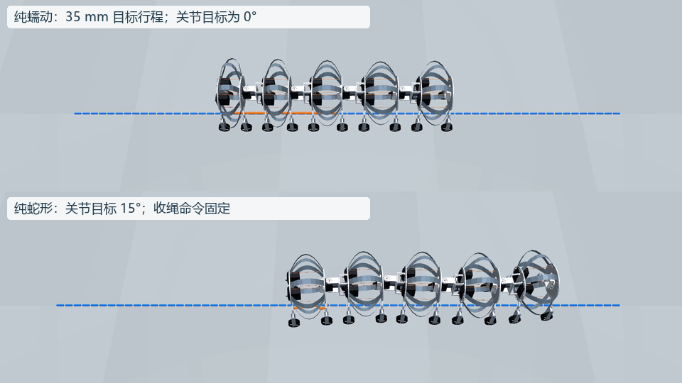
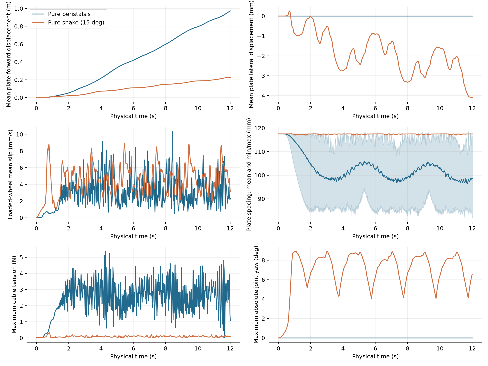
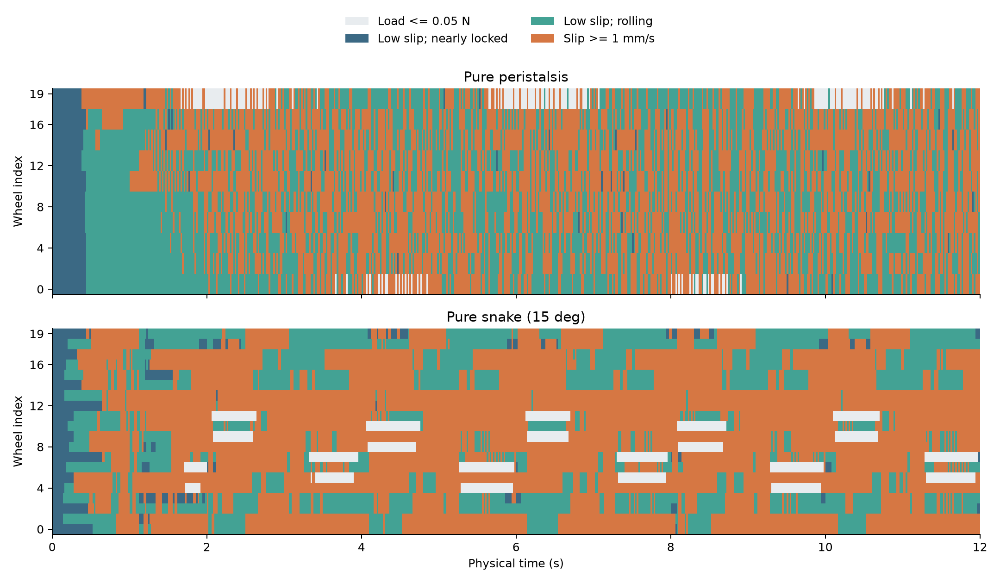

# 五体节 SOFA：同条件纯蠕动／纯蛇形对照，以及实际训练观测

本次在服务器上**重新计算**了纯蠕动和纯蛇形各 12 秒，并增加 4 秒静止基线。使用本仓库冻结的五体节 SOFA 模型，未修改钢片、接触或舵机参数。两组没有加载 PPO。不是上一段路径演示的改名或重新剪辑。

[12 秒正常速度并排 MP4](gait_comparison.mp4) · [GIF](gait_comparison.gif) · [统计检查](audit.json) · [完整接触方程](../dynamics_explained_20261002/REPORT.zh-CN.md)

## 1. 公平条件与控制输入

| 共同条件 | 设置 |
| --- | --- |
| 几何与拓扑 | 5 体节、10 隔板、40 条预弯钢片、20 绳跨、20 被动单向轮、4 节间关节 |
| 材料基准 | E = 200 GPa，泊松比 0.3，密度 7850 kg/m³，钢片宽 16 mm、厚 0.15 mm |
| 初态 | 同样的 0.25 秒承重稳定过程，位置／速度／舵机／轮速／接触记忆 SHA-256 完全一致 |
| 随机化 | 关闭，四个倍率均为 1；重置种子 7 |
| 物理步／控制步 | 0.5 ms／20 ms |
| 时长 | 两组均 12 秒，周期均 4 秒，启动包络均为 1 秒 |
| 地面 | 同一平面、同样重力，名义滑动摩擦 0.8，滚阻系数 0.015 |
| 关节与绳索 | 同一连接刚度、阻尼、舵机角速度和力矩限制 |
| 路径控制 | 无路径反馈、无外加整机推进力、无位置强制移动 |

纯蠕动：沿头到尾传播的目标隔板间距从 117.5 mm 缩至 82.5 mm，相邻体节延迟 0.65 秒；长度反馈调整收绳，四个节间偏航目标均为零。

纯蛇形：十路收绳命令固定在初始角度；四个节间目标为

$$
q_j^*(t)=15^\circ\,r(t)\sin\left(2\pi t/4-(3-j)\pi/2\right),\quad j=0,\ldots,3 .
$$

$r(t)$ 为第一秒内从 0 平滑增加到 1 的半余弦包络。代码关节索引从尾到头，波相位从头到尾延迟。固定收绳不等于固定钢片或体节长度：全部柔性自由度仍参与动力学。

这是**相同物理条件下的两个选定控制器**，不是等输入功率、等能耗或各自最优步态的比较。35 mm 行程与 15° 摆角不能直接视为等效驱动强度。

## 2. 新计算结果

位移主指标取十块隔板中心的平均位置，**不是严格质量加权质心**。另保存头尾位置，避免只用头部收缩误判整机推进。

| 指标 | 纯蠕动 | 纯蛇形 |
| --- | ---: | ---: |
| 物理时长 | 12 s | 12 s |
| 隔板平均位置净前进 | 0.97249 m | 0.22603 m |
| 头部净前进 | 0.94042 m | 0.22554 m |
| 尾部净前进 | 1.03645 m | 0.22688 m |
| 后 4 秒净前进 | 0.37456 m | 0.07665 m |
| 后 4 秒前进位置线性拟合速度 | 88.60 mm/s | 19.76 mm/s |
| 承重轮子步平均滑移 | 2.99 mm/s | 4.43 mm/s |
| 承重轮单子步最大滑移 | 302.64 mm/s | 65.96 mm/s |
| 承重轮触发摩擦限幅的比例 | 0.523% | 44.758% |
| 实际关节最大绝对角 | 约 0° | 8.93° |
| 隔板间距范围 | 81.98–118.70 mm | 116.44–117.63 mm |
| 最大保存步绳张力 | 5.37 N | 0.326 N |
| 最大连接位置误差 | 1.231 mm | 0.381 mm |
| 计算墙钟时间，含子步记录、不含重置与最终压缩 | 209.46 s | 208.65 s |
| 触发环境失败条件 | 否 | 否 |

两组并行运行，物理求解为 SOFA CPU；没有使用 CUDA 来求解梁或接触。静止基线 4 秒的隔板平均漂移为 4.32 微米。

**在这组选定参数下，纯蠕动前进更多。不能把结果推广成“蠕动本质上比蛇形快”。** 蛇形目标为 15°，实际最大只有 8.93°；有限增益／力矩关节、地面负载和驱动相位共同决定响应。其更频繁的摩擦限幅与横向运动受阻相符，但本轮没有做因果分离或步态优化。

## 3. 轮子怎样接触地面，摩擦如何配置

此模型没有把轮子交给 MuJoCo 碰撞求解，也没有使用 SOFA 通用碰撞流水线计算这些轮接触，而是在 Python 中逐轮求解析轮缘／平面接触，再把接触力和反力矩交给 SOFA。

轮半径 $r_w=18$ mm，轮轴世界方向 $\mathbf a=R(0,1,0)^T$。最低轮缘相对轮心的向量：

$$
\boldsymbol\rho=-r_w
\frac{\mathbf e_z-\mathbf a(\mathbf a\cdot\mathbf e_z)}
{\|\mathbf e_z-\mathbf a(\mathbf a\cdot\mathbf e_z)\|}.
$$

轮心由隔板姿态和固定轮架位置确定，接触点为轮心加 $\boldsymbol\rho$。地面为 $z=0$，压入量 $\delta=-z_{\rm contact}$。若 $\delta\le0$，轮子离地，不施加接触力，清空切向记忆；否则

$$
N=\max(0,\ 5000\delta-8v_n).
$$

| 参数 | 名义值 | 作用 |
| --- | ---: | --- |
| 法向刚度 | 5000 N/m | 压入后产生支撑 |
| 法向阻尼 | 8 Ns/m | 抑制法向速度 |
| 切向记忆刚度 | 2000 N/m | 接触微变形建立静态支撑 |
| 切向阻尼 | 8 Ns/m | 速度相关的切向阻力 |
| 滑动摩擦系数 | 0.8 | 切向摩擦圆半径为 $\mu N$ |
| 滚阻系数 | 0.015 | 滚阻矩中的 $0.015Nr_w$ 项 |
| 轴承黏性系数 | $2\times10^{-6}$ Nms | 随轮速增加的阻力矩 |
| 轮转动惯量 | $\frac12(0.009)r_w^2$ | 候选 9 g 轮质量对应的转动惯量 |
| 单向离合 | $\omega\ge0$ | 阻止反向转动；超过摩擦极限仍可滑 |

滑动摩擦圆在滚动方向和横向使用同一个 0.8。允许方向的低阻来自轮速自由度和滚阻；**0.015 不是另一方向的滑动摩擦系数**。完整预测／投影／修正方程见前一份报告。

相对滑移为 $\mathbf u=(v_\parallel-r_w\omega,\ v_\perp)$。轮心前进不等于接触点打滑，黏着也不意味着轮心被固定。

这次按 **0.5 ms 子步**保存了每个轮子的法向力、二维切向力、二维滑移、轮速、摩擦限幅标记、承载速度、切向记忆和接触标记。原始数据在各组的 wheel_substeps.npz 中。

接触钩子只在轮缘压入地面时写入该轮一行；离地行以零占位并标记 in_contact = 0。因此离地行的零轮速不能解释为真实轮子停止转动。这里的统计只采用法向力超过 0.05 N 的记录，轮角另保存在整机轨迹中。

下图按 50 Hz 抽样显示，统计仍使用全部物理子步。低滑移阈值人为取 1 mm/s，近锁止轮速阈值取 0.05 rad/s；这些是展示分类，不是新的物理约束。载荷不超过 0.05 N 的轮子显示为轻载／未承重，不一定严格离地。

蠕动组最大瞬时滑移出现在 4.073 秒的 0 号轮：法向力仅 0.0680 N，切向力约 0.0544 N，达到摩擦上限，属于很轻载时的反向滑移。不能用平均 2.99 mm/s 隐藏这个峰值，也不能把它当成整机持续以 302.64 mm/s 打滑。

蛇形组最大滑移出现在 0.7695 秒的 19 号轮，法向力 0.519 N，主要是横向滑移。滑移中位数／95 分位／99 分位分别为：蠕动 1.11／12.63／32.51 mm/s，蛇形 1.94／17.27／31.42 mm/s。

## 4. 钢片真的提供力吗

**提供。** 每片钢片有 8 个矩形梁单元，七个内部截面可以运动，两端位置及截面方向通过局部变换绑定隔板。SOFA 的 BeamInterpolation 和 AdaptiveBeamForceFieldAndMass 根据预弯参考形状、材料与当前变形计算弹性内力、刚度和质量贡献。MuJoCo 只显示保存的形状。

概念上，弹性内力来自 $\mathbf f_{\rm steel}=-\partial U_{\rm steel}/\partial\mathbf q$；简化的一个弯曲储能项可写为 $\frac12\int EI(\kappa-\kappa_0)^2\,ds$。这只是解释储能机制，不是替代 BeamAdapter 的完整三维梁公式。

因此收绳会使钢片储能，放松后弹性恢复；钢片也是有质量的动态部件，不是视觉装饰。纯蛇形组收绳角不变，隔板间距仍在 116.44–117.63 mm 之间变化，说明体节保持了被动柔性。

钢片内力本身不会凭空产生整机净推进；必须通过轮地反力交换动量。当前没有钢片碰地／自接触响应，非轮部件低于安全间隙会终止回合。

## 5. 五体节模型的求解流程

总计 10 个隔板刚体截面和 280 个梁内部截面，即 290 个截面姿态；每个截面以位置／四元数保存，但四元数不是四个独立旋转自由度。

每个控制步：

1. 接收十路收绳角增量和四路关节角目标增量。
2. 在每个 0.5 ms 子步更新有负载降速的舵机角。
3. 按当前状态计算绳张力、连接恢复力／力矩、轮地接触和轮转动。
4. 将上述外力写入 SOFA；梁力场提供内部弹性力和质量项。
5. 隐式 Euler＋SparseLDLSolver 更新运动，重复 40 次后返回观测和奖励。

绳力与解析轮接触在子步起点显式计算；不是所有非线性接触都放进同一个完全隐式牛顿系统。当前结果通过有限状态、接触摩擦限幅、初态一致、输入隔离和视频完整性检查，尚未建立网格／时间步收敛或实物校准。

## 6. SOFA 怎么与强化学习配合

SOFA 是物理环境；训练的是策略网络，不是训练 SOFA 的力学方程。已有流程是 Gymnasium 的 SofaWormEnv 加 Stable-Baselines3 PPO：策略输出动作 → SOFA 推进 → 返回观测／奖励 → PPO 更新网络。

本轮两种纯模式都是人工设计控制器，**没有调用 PPO**。但来源会话确实已完成一次同物理代码的 PPO 训练，保存的配置、状态、最终评估和检查点元数据在 [rl_reference](rl_reference/)：

- 16 个环境进程，物理 CPU，策略网络也配置为 CPU。
- 最终累计 996,384 个环境步；训练阶段墙钟 30,891.63 秒，约 8.58 小时。
- PPO：MLP policy，采样长度 256、批量 256、每轮 5 个 epoch、学习率 0.0003、gamma = 0.999。
- 训练每回合 12 秒，控制频率 50 Hz，物理频率 2000 Hz。
- 回合随机化：E 倍率 0.85–1.15、刚度比例 Rayleigh 阻尼倍率 0.8–1.2、隔板质量倍率 0.9–1.1、摩擦倍率 0.8–1.2。因此训练摩擦范围为 0.64–0.96；本次对照固定为 0.8。
- 这些随机化区间是候选设定，不是实测置信区间。配置中的物理代码与材料文件哈希和当前模型一致。

训练的 77 维观测严格按代码拆解如下：

| 观测 | 维数 | 实际定义 |
| --- | ---: | --- |
| 参考隔板位置 | 3 | 索引 0 隔板；x 减去回合初始 x，y/z 保留世界值 |
| 参考隔板姿态 | 4 | 四元数 |
| 参考隔板线／角速度 | 6 | 仿真刚体速度 |
| 五体节形状与速度特征 | 10 | 每节隔板距离除以 0.12；两隔板世界 x 速度差除以 0.1 |
| 收绳舵机角 | 10 | 除以 pi |
| 节间偏航角 | 4 | 从相对转动矩阵计算 |
| 节间角速度特征 | 4 | 两侧世界 z 角速度差 |
| 被动轮轮速 | 20 | 乘以 0.01 |
| 上一步动作 | 14 | 上一步归一化动作 |
| 时钟相位 | 2 | 固定 4 秒周期的 sin/cos |
| 合计 | **77** | |

“世界 x 速度差”不等于精确的隔板间距导数；“世界 z 角速度差”在倾斜时也不等于精确偏航角导数。这些是现有实现，而不是理想化的观测描述。

策略**没有直接观察 280 个钢片内部节点、绳张力、逐轮接触力或摩擦系数**。世界位置和速度属于仿真真值，当前策略不能直接宣称可部署到只有 IMU／编码器的实物；后续必须替换为可测量／可估计状态，或者明确采用教师／学生策略。

动作 14 维，先裁剪到 [-1,1]：前十维每控制步改变收绳角目标最多 0.08 rad；后四维改变偏航目标最多 0.03 rad，偏航目标总范围 [-0.4,0.4] rad。执行器还有角速度和负载限制。

奖励为：

$$
r=v_{\rm head,forward}-0.1|v_{\rm head,lateral}|
-0.001\|\mathbf a_t-\mathbf a_{t-1}\|^2-\mathbb 1_{\rm bad}.
$$

间隙过低、体节间距过小或节间连接误差过大会终止。当前奖励没有直接惩罚电机能耗、逐轮滑移或强制形成低频蠕动波。来源训练评估的回弹事件计数较多，不能把该计数直接当作完整整机蠕动周期，也不能据其速度宣称物理可靠或实物有效。那次 PPO 评估没有混入本次纯模式对照。

## 7. 复现

仿真脚本为 [compare_gaits.py](../compare_gaits.py)，复用未改动的物理环境。服务器安装 SOFA/BeamAdapter 后，在脚本目录：

~~~bash
source /root/autodl-tmp/sofa/sofa_env.sh
OMP_NUM_THREADS=1 OPENBLAS_NUM_THREADS=1 python compare_gaits.py --mode worm --seconds 12 --out NEW_worm
OMP_NUM_THREADS=1 OPENBLAS_NUM_THREADS=1 python compare_gaits.py --mode snake --seconds 12 --out NEW_snake
~~~

输出目录必须不存在，避免覆盖旧结果。轮日志只包装原接触函数的返回值，不改变接触计算。保存数据包含原始整机状态、每个物理子步的逐轮记录、控制输入、元数据和源码哈希。原服务器目录为 /root/autodl-tmp/codex_gait_compare_20261002_01；原会话目录未修改。

仓库根目录的本地分析与回放：

~~~powershell
python single_segment/analyze_gaits.py
python single_segment/record_sofa_policy.py single_segment/gait_compare_20261002/worm --whole --clean
python single_segment/record_sofa_policy.py single_segment/gait_compare_20261002/snake --whole --clean
python single_segment/make_gait_demo.py
~~~

视频各 300 帧／25 fps，组合 GIF 150 帧／每帧 80 ms，均为 12 秒、1×。组合仅裁剪空白地面区域、缩放和加入模式标签；没有放大摆角、改变物理时间或移动机器人。蓝线是绘图参照线，不是本次控制器在跟踪的路径。
