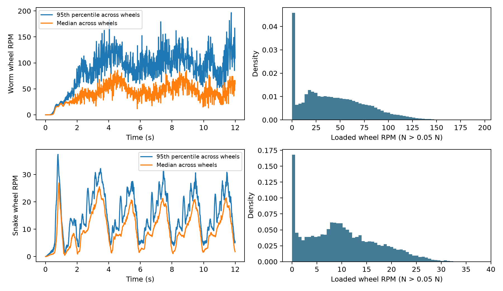
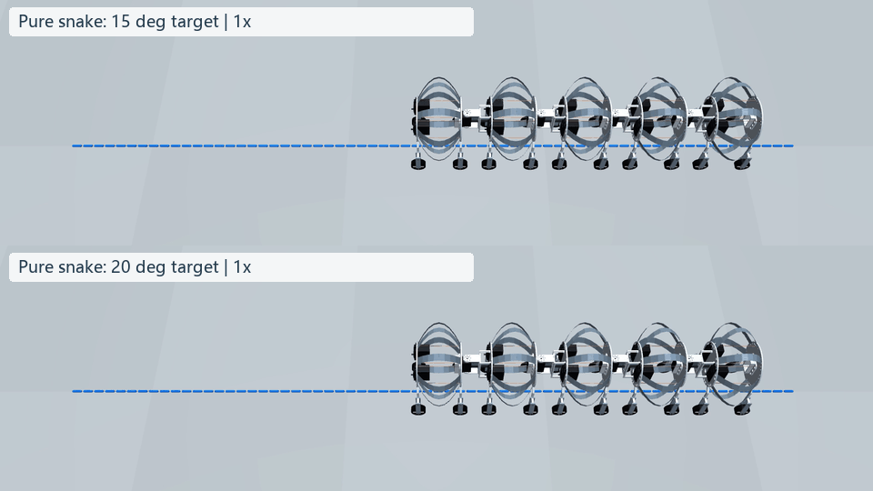

# 轮速核查、可测观测与蛇形摆角修订

## 为什么蠕动时轮子看起来转得快

轮子是带单向约束的被动轮，未施加轮毂驱动力矩。当前模型已经有三类耗散：

| 位置 | 当前参数 | 作用 |
|---|---:|---|
| 轮轴黏性阻尼 | $b=2\times10^{-6}$ N·m·s/rad | 力矩随轮速增加；离地后仍衰减 |
| 滚动阻力 | $c_r=0.015$ | 阻力矩 $c_rNr$，随载荷变化 |
| 轮胎法向、切向接触阻尼 | 各 8 N·s/m | 抑制压入和接触相对运动，不等于轮轴阻尼 |

轮子半径 $r=18$ mm，转动惯量 $I=1.458\times10^{-6}$ kg·m²。原接触函数中正向转动阻力为：

$$\tau_r=\min(c_rNr+b\omega,\ I\omega/\Delta t).$$

第二项用于防止本步阻力把轮子反向加速；单向约束另外处理反向趋势。接触摩擦上限仍为 $\|F_t\|\le0.8N$。钢带还包含原有 Rayleigh 阻尼，绳索和节间连接也有阻尼。

对先前 12 s 的完整物理子步数据核查，载荷大于 0.05 N 的轮子：

| 转速统计 | 纯蠕动 | 15° 目标纯蛇形 |
|---|---:|---:|
| 中位数 | 38.78 rpm | 9.37 rpm |
| 95% 分位 | 105.27 rpm | 23.14 rpm |
| 最大值 | 196.77 rpm | 38.13 rpm |

动画累计轮角差分也给出相近数量级，并不是另行人为加快了轮子。原视频保持 1 倍物理时间；十字轮辐和视频采样仍可能产生视觉混叠。无滑动时 $\mathrm{rpm}=60v/(2\pi r)$，0.1 m/s 对应约 53 rpm。这里应使用每个轮架的局部前向速度，而非整机平均速度；收缩/回弹时两者不同。

蠕动工况名义滚阻力矩中位数约 0.382 mN·m，轮轴黏性力矩中位数仅约 0.00812 mN·m。这说明当前轮轴阻尼较弱，阻力主要来自滚阻；**这些尚未经过实机标定，不能凭动画断言转速真实，也不能只增加接触阻尼来代替轮轴阻力。**

建议用实机空转衰减拟合轴阻尼/轴承干摩擦、负载拖曳拟合滚阻、反向推拉测量单向机构的锁止/回差，再核验蠕动速度。此次保留已有参数，避免把猜测参数当成标定结果。



## 只使用实机可获得的策略输入

用户已确认：能够读取舵机/关节角度，并有 IMU。新增 `../sensor_observation.py` 的 `make_env()` 为新策略提供 **50 维**输入：

| 维度 | 输入 | 获取方式 |
|---:|---|---|
| 14 | 10 个收绳舵机角度 + 4 个节间角度 | 实测角度；须校准零位、方向、单位 |
| 14 | 上述角速度估计 | 相邻收到的角度差分；节间角差做周期处理 |
| 3 | IMU 角速度 | 陀螺仪，机体传感器坐标 |
| 3 | IMU 比力 | 加速度计，包括重力对应的静止读数 |
| 14 | 上一拍动作 | 控制器自身记录 |
| 2 | 周期相位 sin/cos | 控制器时钟，周期 4 s |

**没有提供**仿真真实位置、线速度、姿态四元数、钢片节点、体节长度、轮速、张力或地面反力。角度差分是有噪声的估计，不是调用仿真真实关节速度。IMU 加速度不经过积分伪装成可靠的全局位置或速度。

接口默认角度噪声标准差 0.002 rad，陀螺仪 0.01 rad/s，加速度计 0.1 m/s²，测量延迟 20 ms；这些是可配置的初始假设，须用实际传感器日志标定。差分会放大角度噪声，后续应依据实测带宽决定滤波或历史窗口，而非直接加入不可测状态。

仿真 IMU 暂位于编号 0 隔板坐标原点：陀螺仪转换为局部角速度；比力为 $R^T(a-g)$，其中 $a$ 由每 20 ms 的线速度差分近似。它包含动态加速度，不把重力方向真值冒充加速度计。尚未建模真实安装偏置、零偏漂移和硬件频响；复位第一拍使用静止加速度初始化。输入适配器与物理环境分离，实机可以直接把传感器数据交给同一个 `SensorObservation.sample()`。

原 77 维环境保留用于复现实验和旧权重，**旧策略不兼容新 50 维输入，必须重新训练**。新训练入口应使用：

```python
from sensor_observation import make_env
env = make_env(randomize=True)
```

训练奖励/评估可以读取仿真真值，策略观测不能读取。此次接口沿用原奖励（前进、横向漂移、动作变化和失败惩罚），尚未重新训练，也尚未解决原奖励缺少能耗/打滑惩罚的问题。上一轮纯蠕动基准控制器使用真实体节长度反馈，仍属于仿真基准，不能宣称已能直接部署到这套传感器硬件。

## 更大蛇形摆角

对照采用冻结的同一个 SOFA 模型和脚本：目标幅值从 15° 增加到 20°，周期仍为 4 s，相邻关节相位差仍为 90°，物理步长 0.5 ms，控制步长 20 ms，舵机收绳目标保持初始值，不使用 PPO。

原环境目标限幅为 ±0.4 rad（约 ±22.9°），电机偏航力矩限幅 ±0.5 N·m。扩大输入并不保证实际跟踪同样幅值；30° 需要先修改并验证机械限位、碰撞间隙和执行器能力。当前模型没有整机自碰撞，不能只凭仿真没报错便确认更大角度实机安全。

运行结果记录在 `snake20/comparison.json`，对照数据来自 `../gait_compare_20261002/snake/`。两次初始状态与物理源文件的 SHA256 完全一致。

| 指标（12 s） | 15° 目标 | 20° 目标 |
|---|---:|---:|
| 实际关节最大绝对角度 | 8.93° | 18.17° |
| 隔板位置平均值的前进距离 | 0.226 m | 0.627 m |
| 最后 4 s 的前进距离 | 0.0766 m | 0.2401 m |
| 承重轮平均滑移速度 | 4.43 mm/s | 8.08 mm/s |
| 承重样本达到摩擦上限的比例 | 44.76% | 49.91% |
| 横向位移 | −4.09 mm | −13.42 mm |
| 最大连接误差 | 0.381 mm | 0.375 mm |
| 模型失败终止 | 无 | 无 |

20° 工况推进明显增加，同时滑移增加；尚未按输入功或能耗公平化，也不能从两个幅值推断“越大越好”。隔板位置平均值不是质量加权质心。20° 仿真主循环耗时 213.35 s；此次是 CPU 上实际 SOFA 动力学计算，非给模型指定前进轨迹。



## 验证与复现

- `python single_segment/sensor_observation.py`：检查输入维度、测量延迟、角度差分、复位和非法输入。
- `python single_segment/audit_wheel_speed.py`：从完整子步数据重新统计转速，并检查局部速度、轮缘速度和滑移的关系。
- 在 SOFA 环境执行冻结脚本：`python compare_gaits.py --mode snake --amplitude 20 --seconds 12 --out snake20`。输出目录须不存在。
- 新接口在 SOFA 中的短程集成验证见 `sensor_check.json`；不是训练完成证明。
- 动画来自实际记录的 SOFA 状态，MuJoCo 只负责渲染；300 帧 / 25 fps 与 150 帧 / 12.5 fps 均为 12 s。
