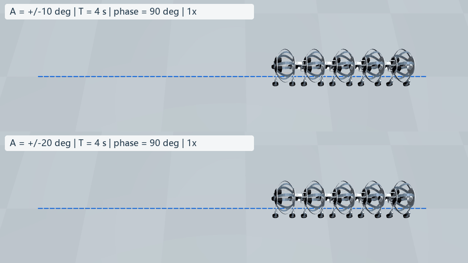
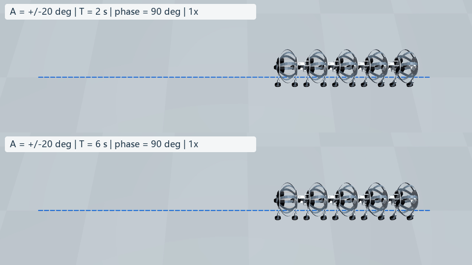
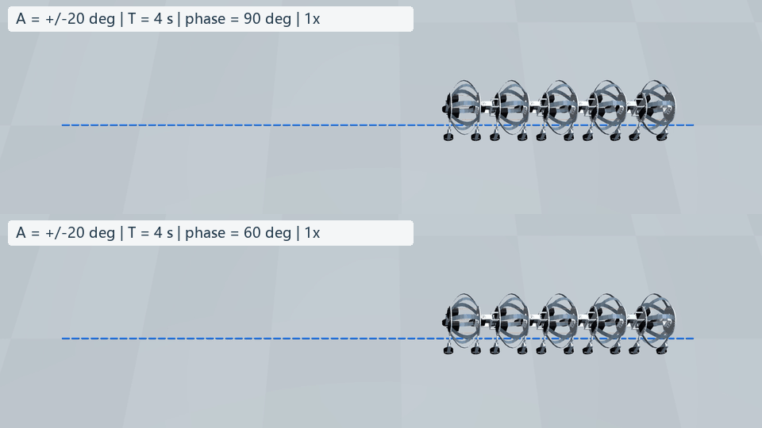
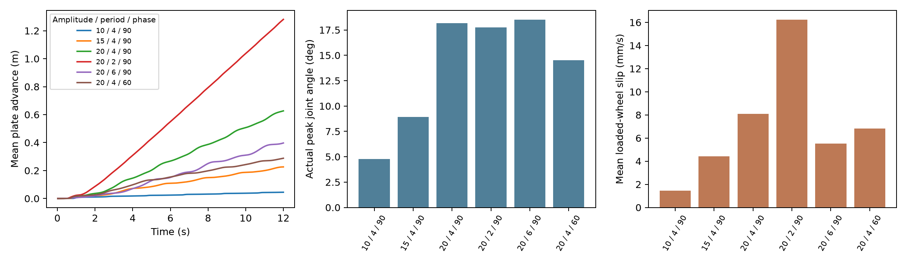

# 纯蛇形：幅值、周期与相位差条件对照

## 当前演示的周期与角度

上一轮的两个演示均为周期 **4 s**、频率 **0.25 Hz**，相邻关节相位差 **90°**，对应相邻关节错开 **1 s**。目标幅值为 **±15°** 和 **±20°**，目标峰峰值分别是 30°、40°；实际全程最大关节绝对角度分别为 8.93° 和 18.17°。

这里的角度是相邻体节之间的偏航关节角，不是单片钢带的弯曲角，也不是整机朝向。关节目标为：

$$q_j^*(t)=A\,r(t)\sin\left(\frac{2\pi t}{T}-(3-j)\phi\right),\quad j=0,1,2,3.$$

启动包络 $r(t)=\tfrac12[1-\cos(\pi\min(t/1\mathrm{s},1))]$，在 1 s 内平滑增大。目标经过每控制步增量限制和 ±0.4 rad 角度限幅，再由有限力矩反馈驱动，因此**目标幅值不等于实际幅值**。四个关节沿身体依次产生相位错开；周期 T 是单个关节完整往返一次的时间。

## 六组条件

| 条件 | 目标幅值 A | 周期 T | 频率 | 相邻相位差 | 相邻延迟 |
|---|---:|---:|---:|---:|---:|
| 小幅摆动（新增） | ±10° | 4 s | 0.25 Hz | 90° | 1 s |
| 原始基准 | ±15° | 4 s | 0.25 Hz | 90° | 1 s |
| 大幅基准 | ±20° | 4 s | 0.25 Hz | 90° | 1 s |
| 快摆（新增） | ±20° | 2 s | 0.50 Hz | 90° | 0.5 s |
| 慢摆（新增） | ±20° | 6 s | 0.167 Hz | 90° | 1.5 s |
| 相位对照（新增） | ±20° | 4 s | 0.25 Hz | 60° | 0.667 s |

新增四组均从同样的复位状态计算 12 s，沿用原钢带、绳索、轮地摩擦、阻尼和执行器参数。物理步长 0.5 ms，控制步长 20 ms，偏航力矩限值 ±0.5 N·m。收绳舵机固定在初始位置，钢带仍参与弹性动力学。

这是同样时长的输入对照，并非相同周期数或相同能耗：快摆包含 6 个周期，4 s 条件包含 3 个周期，慢摆包含 2 个周期，且都包含启动阶段。单个确定性名义工况不能代表随机地面成功率、最优步态或实机性能。

## 正常速度演示

每段均展示完整 12 s 物理时间。MP4 为 300 帧、25 fps，GIF 为 150 帧、每帧 80 ms。上下两组共用固定视角和比例，不缩放运动幅度，也不加速播放。

幅值对照：上 ±10°，下 ±20°，周期均 4 s，相位差均 90°。



周期对照：上 2 s，下 6 s，幅值均 ±20°，相位差均 90°。



相位对照：上 90°，下 60°，幅值均 ±20°，周期均 4 s。



## 新观测接口是否已经训练

**没有。** 新 50 维接口完成了输入检查与 SOFA 短程集成检查；没有对应的新 PPO 权重，也没有新策略成功率。之前保存的 996,384 步 PPO 使用的是旧 77 维输入，含有不可直接测量的仿真状态，不能当作新接口的训练结果。

本页所有动作都由上面的正弦公式生成，不调用神经网络，因而既不是旧 PPO 的效果，也不是新观测 PPO 的效果。原环境仍返回旧观测供兼容，但本次控制不读取它来决定动作。可测观测接口另见 [轮速与传感器报告](../sensor_gait_revision_20261002/REPORT.zh-CN.md)。

下一次训练应从 `sensor_observation.make_env()` 创建 50 维环境；训练和测试应保持可测输入边界。角度差分和 IMU 不能直接给出可靠全局速度，可能需要带历史的策略。训练前还应明确目标是低滑移推进、速度跟踪还是路径跟踪，并标定传感器噪声、延迟及轮轴阻力。

## 验证与数据说明

- 冻结的 `sofa_worm_env.py` 和材料参数文件保持一致；六组初始状态 SHA256 相同。
- 新试验脚本在 ±20° / 4 s / 90° 下重算前 20 步，与旧脚本的姿态和动作逐项完全相同，检查脚本改动未改变基准物理结果。
- 检查全部状态有限、四元数归一、600 帧完整、收绳命令为零、目标波形匹配参数、位移可由原始姿态重算。
- 新四组在每个物理子步累计载荷 >0.05 N 的滑移和摩擦饱和统计；原始整机姿态、轮角和轮速按 50 Hz 保存，未额外保存全部子步接触数组。旧两组仍保留原完整子步日志。
- 接触/材料参数尚未实机标定，且没有整机自碰撞与钢带地面碰撞；没有因增加摆角而宣称机械安全。

运行示例（SOFA 主机）：

```bash
python snake_conditions.py --amplitude 20 --period 2 --phase 90 --out snake_conditions_20261002/a20_t2_p90
```

本地复核：`python single_segment/review_snake_conditions.py`。加 `--render --videos` 可从保存的物理状态重新渲染并生成三组对照；需安装原渲染器所用依赖。为了使快摆的较大位移也适合画面，所有对照的地面参考线统一为 x∈[−2.3,0.15] m，并据此使用同一相机。原始物理轨迹未更改。

## 定量结果

详见 `audit.json`。位移采用隔板位置平均值，不是质量加权质心；实际角度是全程峰值，滑移采用承重子步的平均相对速度。

| 目标幅值 / 周期 / 相位差 | 实际最大角度 | 12 s 前进 | 平均接触滑移 | 达到摩擦上限比例 |
|---|---:|---:|---:|---:|
| ±10° / 4 s / 90° | 4.77° | 0.0448 m | 1.44 mm/s | 27.68% |
| ±15° / 4 s / 90° | 8.93° | 0.2260 m | 4.43 mm/s | 44.76% |
| ±20° / 4 s / 90° | 18.17° | 0.6268 m | 8.08 mm/s | 49.91% |
| ±20° / 2 s / 90° | 17.77° | 1.2812 m | 16.22 mm/s | 51.31% |
| ±20° / 6 s / 90° | 18.50° | 0.3971 m | 5.54 mm/s | 49.37% |
| ±20° / 4 s / 60° | 14.53° | 0.2880 m | 6.84 mm/s | 42.90% |

这组名义条件下，2 s 快摆在相同时长内前进最多，同时接触滑移也最大；并不能据此认为它效率最高。6 s 慢摆跟踪幅值略大、滑移较小，但单位时间推进较少。相位差从 90° 改为 60° 后，实际摆角和推进都下降，表明相位改变不仅改变视觉形状，也改变整个机身受力和角度跟踪。±10° 指令下的实际摆幅明显受限，推进很少；具体原因仍需对关节力矩、地面反力矩和跟踪误差作分解，不能仅归因于某一个参数。

四组新增计算各耗时约 205–208 s（CPU 仿真主循环），此次并行计算。全部完成 12 s，未触发模型失败阈值；没有把“无失败”解释为已经验证真实机械碰撞和耐久性。


